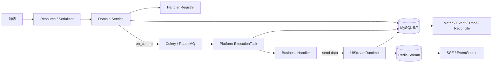

# AI 助手平台会话能力

`services.web.ai_assistant` 提供 AI 助手的一期平台底座：会话与侧栏、类型化消息、派生产物、
反馈、同步/异步执行、UI 流式传输、导出以及执行可观测性。日志检索、自然语言检索、统计和
AI 分析等业务只实现 Handler，不在平台层耦合具体协议。

## 1. 核心模型

| 模型 | 职责 | 关键边界 |
| --- | --- | --- |
| `Conversation` | 用户历史会话容器 | 软删除；删除后一期不恢复 |
| `ConversationSidebarNode` | 分组与会话的混排、层级、置顶 | 物理删除；`position` 越大越靠前 |
| `Message` | 一次用户输入及其直接输出 | 父消息只表达因果关系，不决定 UI 合并方式 |
| `Attachment` | 从成功消息派生的分析、统计等产物 | 可同步、异步或流式；产物协议由类型 Handler 定义 |
| `Feedback` | 用户对消息或附件的当前评价 | 动态来源；覆盖更新，不保存反馈历史 |

Message 是交互时间线，Attachment 是消息上的产物。分析、统计和报告不再伪装成新消息，
这样消息因果关系、产物生命周期和编辑/导出能力可以独立演进。

## 2. 总体架构



分层职责：

- `resources` / `serializers`：HTTP 协议、权限入口和 OpenAPI；对外只使用 UID。
- `services`：用户边界、领域事务、状态编排和查询优化。
- `handlers`：业务类型声明、Pydantic 快照协议和扩展点注册。
- `tasks`：Celery 调度适配、task ID fencing、成功/失败/Retry 生命周期。
- `streaming`：Redis 实时尾流、MySQL UI 快照和 SSE 编码。
- `observability.py` / `services/reconciliation.py`：生命周期观测和长期 PROCESSING 收敛。

## 3. 执行模型

同步类型先执行 Handler，输出校验成功后才创建 `SUCCESS` 对象。异步类型先创建
`PROCESSING` 对象，并在事务提交后投递绑定的 Celery Task。平台 Task 负责：

1. 按数据库主键和 `task_id` 加载当前执行；
2. 把类型化 `MessageExecution` 或 `AttachmentExecution` 传给业务 Task；
3. 校验返回值并通过 CAS 写入 `SUCCESS`；
4. 最终异常写入脱敏 `FAILED`；Celery `Retry` 保持 `PROCESSING`；
5. 忽略旧 task ID 和已终态对象；同一有效 task ID 的重复投递允许并发执行，只由终态 CAS
   决定唯一有效结果。

业务仍直接使用 Celery 的 `queue`、`acks_late`、`autoretry_for`、`retry_kwargs` 等配置。
平台不包装另一套调度 DSL，也不替业务保证外部调用幂等。

## 4. 一致性边界

- MySQL 是对象状态、最终产物和历史快照的事实源；Redis、Celery Result Backend 和观测数据
  都不能决定业务终态。
- 会话删除与消息/附件最终写入锁定同一 Conversation 行；分组删除与移动锁定同一 Group
  Node，避免删除成功后继续产生隐藏对象或孤立节点。
- Message 显式父消息由平台校验同用户、同会话；状态、类型、先后关系和省略参数时的兜底
  由具体 Handler 在 `prepare()` 中决定。平台不做第二次业务校验。
- 手动重试复用原 Message/Attachment，生成新 `task_id`，不重新执行 `prepare()`；业务 Task
  需要自行重新校验易变权限或外部条件。
- 编辑重跑通过 `PATCH /api/v1/ai_assistant/messages/{message_uid}/` 提交完整 `input_data`，
  重新调用原类型 Handler 的 `prepare()`，沿用原父消息绑定构造上下文，覆盖当前消息的输入、
  上下文、输出和执行状态；UID、创建时间及历史位置保持不变。仅 `SUCCESS` / `FAILED` 可编辑。
  同步准备或执行失败时原内容不变；异步准备成功后清空旧输出和错误、生成新 `task_id`，
  返回 `PROCESSING`，继续轮询原消息。并发编辑冲突返回 `InvalidMessageState`。
- 编辑重跑保留已有子消息、附件和反馈，不重算它们的快照；自然语言消息仍按新输入中的
  `auto_execute` 决定是否新增日志检索子消息。例如请求体
  `{"input_data":{"query_text":"查询 bob 的操作日志","auto_execute":true}}`。
- 会话历史是快照。权限变化不重算存量消息内容，敏感字段必须在首次查询结果进入快照前处理。

## 5. 侧栏与查询

侧栏使用统一 Node 表表达根级分组、根级会话和组内会话。普通列表排除置顶会话，置顶列表独立
一次性返回；根列表和组内列表支持分页。排序采用稀疏整数和稳定键 `(-position, -id)`，移动
优先只更新来源节点，没有整数空位时才平移受影响前缀。

Node 移动支持互斥的 `before_node_*` 和 `after_node_*` 锚点。`after` 按完整目标容器的物理顺序
计算直接后继，置顶节点仍参与邻接判断但只作为隐式后继，不能作为显式普通列表锚点；例如物理顺序为
`A、pinned、tail` 时，`source after A` 得到 `A、source、pinned、tail`。取消置顶只恢复普通列表展示，
不改变移动后的物理顺序；`after` 锚点已在容器末尾时来源进入容器末尾。

消息历史使用 UID 锚点读取 `BEFORE` / `AFTER` 窗口，无锚点时返回最新 N 条并按时间正序输出。
附件列表按产品一期约定一次性返回，前端自行按会话和时间分组；后续数量基线超过预期时再引入
稳定游标分页。

## 6. 开发入口

- [Handler 接入指南](docs/handler_integration.md)：新增消息或附件类型的最短路径。
- [流式传输设计](streaming/README.md)：Redis、MySQL、SSE、重试和降级协议。
- [可观测性架构](docs/observability.md)：生命周期、指标边界和巡检设计。
- [运维与 Runbook](../../../docs/ai_assistant_observability.md)：SLO、BKM 和故障处置。

常用验证命令：

```bash
.venv/bin/python -m pytest tests/test_ai_assistant -m 'not special'
make test-special
.venv/bin/python manage.py makemigrations --check --dry-run
```

`special` 测试使用真实 MySQL、Redis、RabbitMQ 和 Celery Worker，环境准备见项目 `AGENTS.md`
及测试依赖说明。
