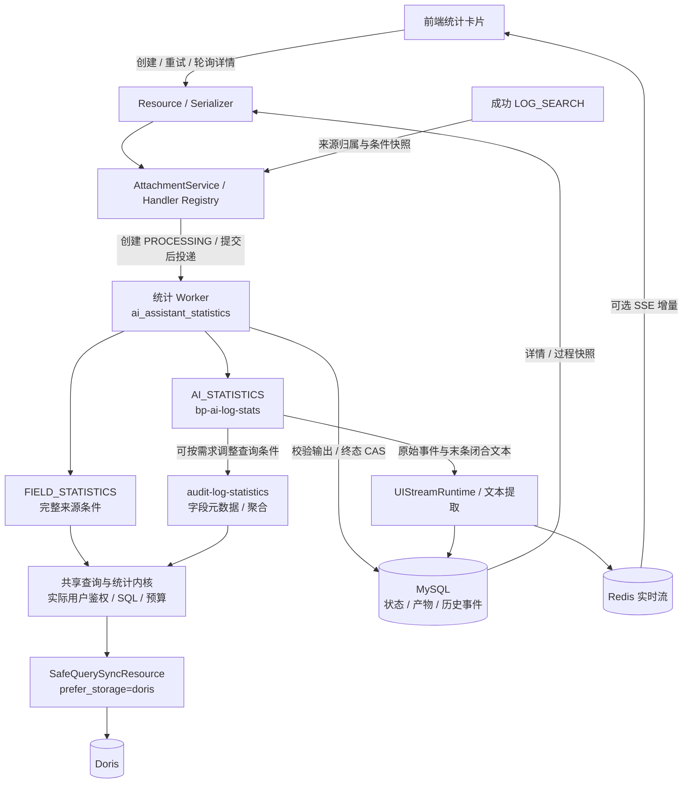
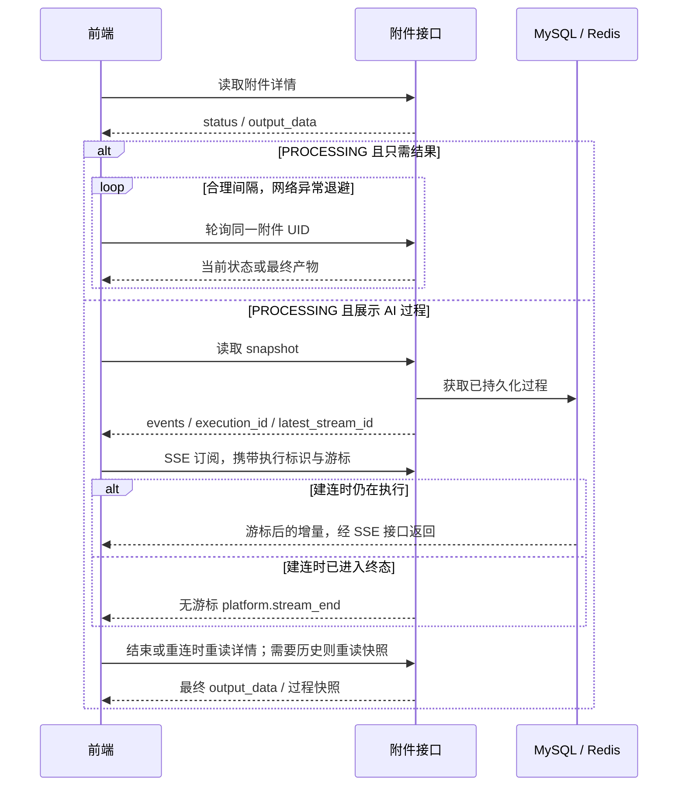

# AI 助手模块功能与架构设计

面向维护 `services.web.ai_assistant` 的开发者。本文描述当前实现的模块边界、执行模型和稳定性约束。接口使用见[公共前端指南](frontend_integration.md)和[统计联调指南](frontend_statistics.md)。

## 1. 功能与领域边界

平台管理会话、侧栏、消息、附件、反馈以及执行生命周期。日志检索、AI 分析和统计通过 Handler 接入；日志查询与聚合算法位于 `services.web.query.ai_assistant.log_tools`，不放进平台任务基类。

| 对象/能力 | 职责 | 边界 |
| --- | --- | --- |
| Conversation / SidebarNode | 用户会话、分组、排序、置顶 | 用户隔离，删除会话后不可继续写入产物 |
| Message | 一次输入及直接输出，表达消息因果关系 | LOG_SEARCH 成功消息是分析和统计的来源 |
| Attachment | 来源消息上的独立产物 | 同一消息可派生多个附件，各自执行、重试 |
| Handler Registry | 类型注册、输入/上下文/输出模型及能力声明 | 新类型复用平台服务，不复制 HTTP 生命周期 |
| Feedback | 消息或附件的当前用户评价 | 是否支持由 Handler 声明 |
| 执行与流服务 | 异步投递、状态提交、流恢复、异常收敛 | MySQL 是最终状态事实源，SSE 只是过程 |

| 附件类型 | 业务入口 | 最终输出 | 执行方式 |
| --- | --- | --- | --- |
| AI_ANALYSIS | 日志分析 Agent | 报告 Markdown，支持现有编辑/导出能力 | 异步流式 |
| FIELD_STATISTICS | FieldStatisticsService | 概览、类别分布、时序、可选数值摘要 | 异步非流式 |
| AI_STATISTICS | bp-ai-log-stats | `output_data.content` 原文 | 异步流式 |

程序统计严格复用来源检索的完整条件，不统计预览行。AI 统计把来源条件作为初始上下文，Agent 可以按用户需求调整实际查询范围；每次工具调用独立鉴权。AI 输出标记、ECharts 格式及渲染协议由前端和 Agent skills 协同维护，后端只保存最终文本。

## 2. 分层与调用链

| 代码入口（相对本模块） | 应在这里修改的内容 |
| --- | --- |
| `views.py`、`resources/`、`serializers/` | HTTP 路由、请求响应及 OpenAPI |
| `services/attachment.py`、`services/attachment_execution.py` | 创建、归属检查、事务、重试及终态提交 |
| `handlers/audit_statistics.py` | 两种统计类型注册、来源解析、可信上下文准备 |
| `handlers/log_search_source.py` | 成功 LOG_SEARCH 的归属与快照一致性校验 |
| `schemas/audit_statistics.py` | 前端输入、内部上下文、持久化输出协议 |
| `tasks/attachment.py`、`tasks/base.py`、`tasks/audit_statistics.py` | 平台生命周期、统计业务执行及异常重试 |
| `streaming/` | 原始事件归档、快照、Redis 尾流及 SSE |
| `services/reconciliation.py` | 长期 PROCESSING 的巡检与失败收敛 |
| `../query/ai_assistant/log_tools/` | 元数据、权限、SQL 生成、预算、聚合结果解析 |

字段探索 Web 路由复用 `MCPGetLogFieldMetadata` Resource、服务与 DTO，仅使用不同认证入口。聚合 MCP 统一增强请求协议，没有另建旧模式分支；现有分析 Agent 同样可以使用增强能力。

## 3. 生命周期与一致性

1. 创建附件时，平台校验用户和来源消息；Handler 校验类型输入并生成可信上下文，用户、租户、时区和来源条件不能由附件请求覆盖。
2. 事务内创建 PROCESSING 附件，提交后投递任务。输入与上下文固化，便于重试和追踪。
3. Worker 按附件及当前 task_id 加载执行；业务执行重新校验来源或实际工具权限。
4. 输出通过类型模型校验后，以条件更新（CAS）提交 SUCCESS；最终异常提交脱敏 FAILED。自动重试期间保持 PROCESSING。
5. 人工重试只允许符合平台约束的 FAILED 异步对象，保留 UID，生成新 task_id。两种统计都支持，不存在 `supports_retry` 开关。

旧 task_id 的结果不能覆盖新任务；并发重复投递可能重复执行外部查询，终态 CAS 只保证有效结果唯一，不等同于外部调用恰好一次。会话删除与最终写入共享锁边界。

两种统计直接使用 `AttachmentExecutionTask`。基类持久化业务结果后只向 Celery 返回轻量状态，避免把大结果再次写入成功事件；无需为这一通用规则创建统计专属任务父类。业务数据从附件详情读取。

自动重试处理暂时性故障，参数、权限等确定性错误不自动重试。人工重试仍重新经过当前状态与权限检查。巡检按附件类型采用与任务超时、重试退避相匹配的不活跃阈值，避免长任务被平台提前判失败；巡检、候选查询和指标使用一致口径。

## 4. 查询领域与统计内核

日志详情、字段探索、聚合和程序统计属于 query 领域，独立于附件生命周期。AI 助手只负责准备可信上下文、调度执行与保存产物。本文统一说明模块关系并索引实现专题；细节文档随对应代码维护，不再设置 query/docs 中间索引。

实现细节统一维护在 [日志查询与统计实现架构](../../query/ai_assistant/log_tools/README.md)，包括权限与脱敏的不同处理、字段类型、全范围 TopN、OTHER 重聚合、时间预算及结果完整性。程序统计与 Agent 聚合共用内核及 Top10 默认配置，显式参数和历史附件快照保持不变。前端固定包补齐时间轴，MCP 使用稀疏桶；两者比例统一保留四位小数，响应结构按消费方优化，统计口径保持一致。

## 5. AI 文本与流式执行

AI 统计把用户需求、初始条件和轻量查询摘要交给 `bp-ai-log-stats`。统计 Agent 绑定 `audit-log-statistics` 工具集，仅包含字段探索和聚合；日志分析 Agent 使用 `audit-log-analysis`，额外提供明细取证。两套工具集在 stag/prod 均有网关声明，部署时仍需核对实际网关发布和 Agent 工具绑定。

任务先将原始 Agent 事件交给平台流服务，再提取最后一条闭合的 assistant 消息作为 `content`。中间说明和工具结果不拼进最终产物；末条消息未闭合、运行错误、空文本或超限不能以之前的消息冒充成功。

MySQL 保存最终产物与历史过程快照，Redis 提供实时尾流。所有异步附件均可直接轮询详情获取最终产物，is_stream=true 仅表示支持过程订阅。选择展示过程时，前端通过快照恢复，再携带 execution_id 和游标订阅；流结束后重新读详情确定业务终态。`archive_status=COMPLETE` 仅表示已归档内容未降级/截断，不代表任务终态；运行中的快照可落后于实时流。任务在快照读取后、SSE 建连前结束时，新连接只返回无游标的 `platform.stream_end`，不会补发历史。需要完整过程时重新读取终态快照，最终产物始终读取详情。详见[流式设计](../streaming/README.md)。

## 6. 扩展、排障与验证

新增业务类型从 [Handler 指南](handler_integration.md) 开始；新增聚合能力先调整 query 领域协议、权限/类型规则、SQL 与解析器，再更新消费者。只有多个业务共有的生命周期规则才上移到平台基类。不要在任务层再定义一套图表格式。

排障依次核对附件 UID/状态、task_id、execution_id、Worker 队列、流快照和查询错误。对外错误脱敏；指标使用有界维度，不把用户、字段 key 或附件 UID 作为无限增长的指标标签。详见[可观测性](observability.md)。

测试分层：协议/权限/类型/SQL/结果闭合单测；Resource 完整序列化链路测试；任务重试、CAS 和流恢复测试；special 使用真实 Worker、MySQL、Redis、RabbitMQ 与本地模拟 Agent，但部分外部边界仍使用替身。真实查询引擎、Agent、IAM、跨用户权限、并发容量、基础设施故障和前端渲染应在对应环境独立验收。
