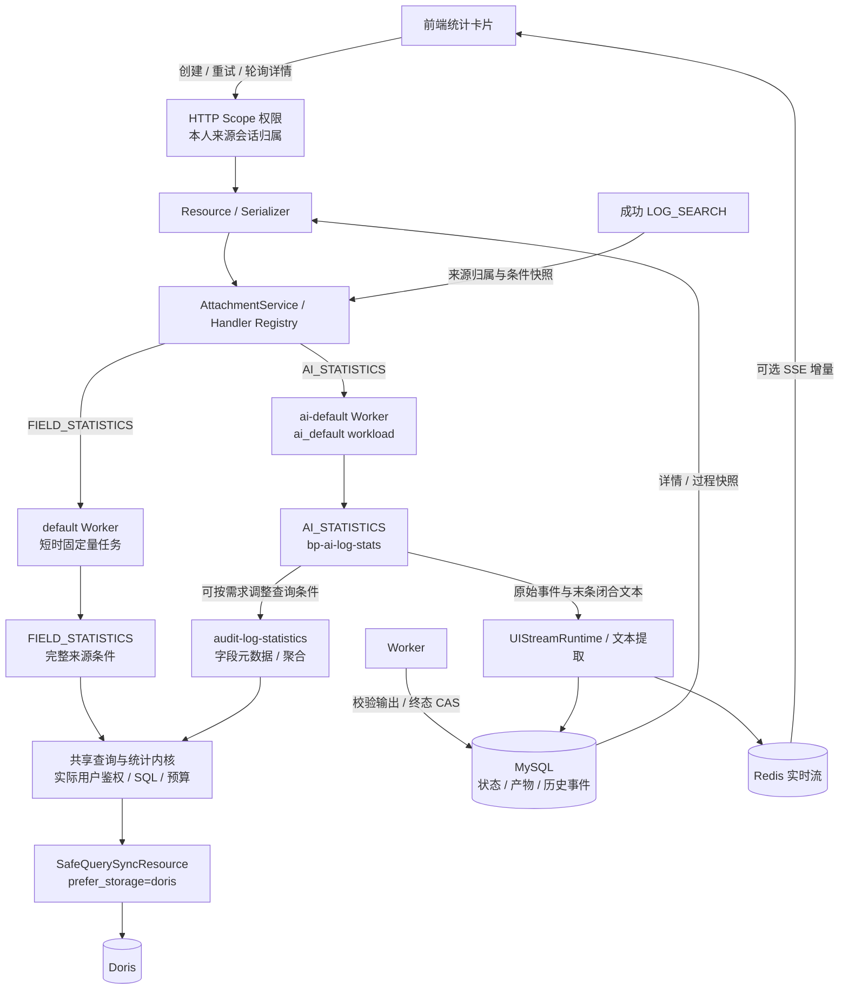
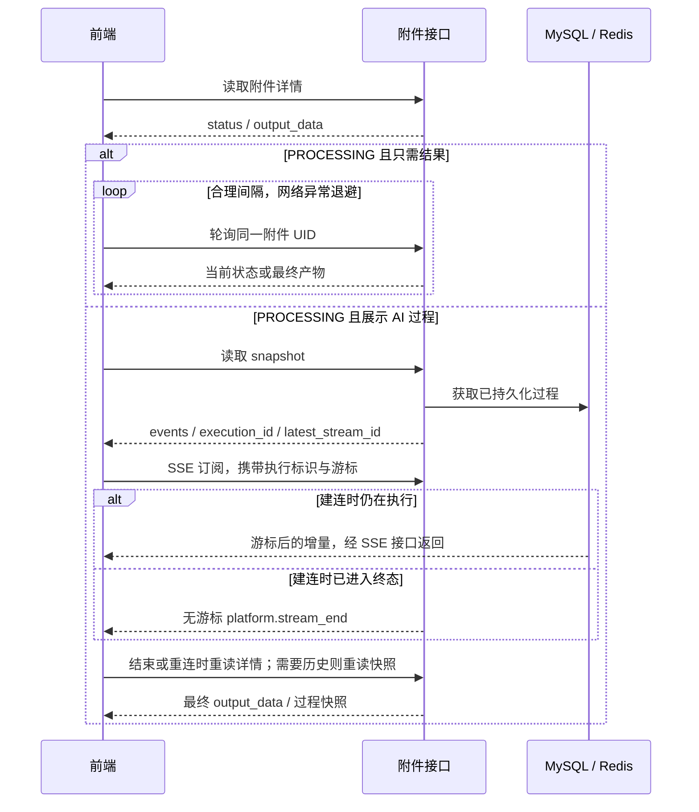

# AI 助手模块功能与架构设计

面向维护 `services.web.ai_assistant` 的开发者。本文描述当前实现的模块边界、执行模型和稳定性约束。接口使用见[公共前端指南](frontend_integration.md)和[统计联调指南](frontend_statistics.md)。

## 1. 功能与领域边界

平台管理会话、侧栏、消息、附件、反馈以及执行生命周期。日志检索、AI 分析和统计通过 Handler 接入；日志查询与聚合算法位于 `services.web.query.ai_assistant.log_tools`，不放进平台任务基类。

| 对象/能力 | 职责 | 边界 |
| --- | --- | --- |
| Conversation / SidebarNode | 用户会话、分组、排序、置顶 | 用户及 concrete scope 隔离，删除会话后不可继续写入产物 |
| Message | 一次输入及直接输出，表达消息因果关系 | LOG_SEARCH 成功消息是分析和统计的来源 |
| Attachment | 来源消息上的独立产物 | 同一消息可派生多个附件，各自执行、重试 |
| Handler Registry | 类型注册、输入/上下文/输出模型及能力声明 | 新类型复用平台服务，不复制 HTTP 生命周期 |
| Feedback | 消息或附件的当前用户评价 | 是否支持由 Handler 声明 |
| 执行与流服务 | 异步投递、状态提交、流恢复、异常收敛 | MySQL 是最终状态事实源，SSE 只是过程 |

| 附件类型 | 业务入口 | 最终输出 | 执行方式 |
| --- | --- | --- | --- |
| AI_ANALYSIS | 日志分析 Agent | 报告 Markdown，支持现有编辑/导出能力 | 异步流式 |
| FIELD_STATISTICS | FieldStatisticsService | 概览、类别分布、时序、可选数值摘要 | 异步非流式 |
| AI_STATISTICS | bp-ai-log-stats | `output_data.content` 原文 | 异步流式 |

程序统计严格复用来源检索的完整条件，不统计预览行。AI 统计把来源条件作为初始上下文，Agent 可以按用户需求调整实际查询范围；每次工具调用独立鉴权。AI 输出标记、ECharts 格式及渲染协议由前端和 Agent skills 协同维护，后端只保存最终文本。

会话、分组与侧栏节点创建时绑定具体 `scene/system`，不提供改绑入口；消息和附件沿来源会话继承资源归属。`views.py` 的 action 声明 Scope 来源，`permissions.py` 定位本人对象后复用公共 `ScopePermission` 鉴权。按消息/会话查询附件、展开分组、组内创建会话及移动节点时，UID 已限定归属，直接使用资源真实 Scope，前端无需重复传入。无资源 UID 的会话、侧栏和附件集合查询经 `services/scope.py` 计算可见 ID；cross 仅聚合当前有权限的同方向资源。根创建和清空仍显式选具体 Scope；移动的目标与锚点必须与来源同属一个 Scope。

会话归属与日志查询范围用途不同：附件列表按会话绑定隔离，统计查询条件仍按实际操作用户鉴权。程序统计复用成功 LOG_SEARCH 的条件，AI 统计可按需求调整条件，不通过会话 scope 额外锁定统计范围。

SYSTEM_SELECTION 的常用及历史操作由 OperationContextService 按当前用户、会话 Scope 和所选系统共同过滤。常用操作使用 v4 Redis 天桶，增加系统维度，多选时合并所选系统的衰减频次；旧 v3 桶按 TTL 自然过期。历史操作先按会话 Scope 查询最近有效检索，再按所选系统过滤及去重。这一榜单范围不改变会话归属或日志查询鉴权。

### 权限与范围判断分工

| 层次 | 执行内容 | 是否调用权限服务 |
| --- | --- | --- |
| HTTP Permission | 从请求或本人资源 UID 解析具体 Scope，检查访问权限；撤权返回 403 | 具体 Scope 调用一次 `check_scope_entry` |
| Resource / Serializer | 校验 UID、字段类型、成对参数及请求语义 | 不鉴权 |
| Service 具体范围查询 | 使用已经通过入口鉴权的 Scope 构造 SQL 范围；继续限定本人、未删除资源 | 不重复调用 IAM |
| Service cross 查询 | 枚举当前有权的场景/系统 ID，再过滤列表；无权限集合为空 | 调用 `get_scene_ids/get_system_ids`，不额外做 cross 入口检查 |
| Service 移动与组内创建 | 保证 Node、业务对象、父容器、目标与锚点的 Scope 一致；移动在锁定后检查最新状态 | 数据一致性校验，不是权限判定 |
| 日志查询内核 | 每次统计/检索按实际用户校验查询系统与敏感字段，把授权系统写入 SQL 条件 | 独立日志数据鉴权 |

AI 平台 Service 不是独立的接口鉴权入口。对外 Resource 必须经 `AIAssistantScopeViewSet` 的 Permission 调用；新增内部调用时，由调用入口承担授权。已有可信内部流程可以复用 Service，但不能据此绕过 HTTP 或 MCP 的权限入口。

移动请求只声明来源、目标与锚点 UID，不声明 `scope_type/scope_id`；Scope 在事务内从来源节点派生。重复的旧 Scope 字段按普通未知参数忽略，不参与鉴权或移动。组内创建会话以 `group_uid` 决定归属，合法的重复 Scope 值不改变归属。SQL 中的 Scope 条件和锁定后的同范围检查仍保留，它们分别保证结果范围与写入一致性。

## 2. 分层与调用链

```mermaid
flowchart TD
    UI[前端统计卡片] -->|创建 / 重试 / 轮询详情| Permission[HTTP Scope 权限<br/>本人来源会话归属]
    Permission --> API[Resource / Serializer]
    API --> Service[AttachmentService / Handler Registry]
    Source[成功 LOG_SEARCH] -->|来源归属与条件快照| Service
    Service -->|FIELD_STATISTICS| DefaultWorker[default Worker<br/>短时固定量任务]
    Service -->|AI_STATISTICS| AIWorker[ai-default Worker<br/>ai_default workload]
    DefaultWorker --> Program[FIELD_STATISTICS<br/>完整来源条件]
    AIWorker --> AI[AI_STATISTICS<br/>bp-ai-log-stats]
    Program --> Kernel[共享查询与统计内核<br/>实际用户鉴权 / SQL / 预算]
    AI -->|可按需求调整查询条件| MCP[audit-log-statistics<br/>字段元数据 / 聚合]
    MCP --> Kernel
    Kernel --> BKBase[SafeQuerySyncResource<br/>prefer_storage=doris]
    BKBase --> Doris[(Doris)]
    Worker -->|校验输出 / 终态 CAS| DB[(MySQL<br/>状态 / 产物 / 历史事件)]
    AI -->|原始事件与末条闭合文本| Stream[UIStreamRuntime / 文本提取]
    Stream --> DB
    Stream --> Redis[(Redis 实时流)]
    DB -->|详情 / 过程快照| API
    Redis -->|可选 SSE 增量| UI
```

| 代码入口（相对本模块） | 应在这里修改的内容 |
| --- | --- |
| `views.py`、`resources/`、`serializers/` | HTTP 路由、请求响应及 OpenAPI |
| `permissions.py`、`services/scope.py` | HTTP 资源 scope 授权与集合可见范围，复用公共 ScopePermission |
| `services/attachment.py`、`services/attachment_execution.py` | 创建、归属检查、事务、重试及终态提交 |
| `handlers/audit_statistics.py` | 两种统计类型注册、来源解析、可信上下文准备 |
| `handlers/log_search_source.py` | 成功 LOG_SEARCH 的归属与快照一致性校验 |
| `schemas/audit_statistics.py` | 前端输入、内部上下文、持久化输出协议 |
| `tasks/attachment.py`、`tasks/base.py`、`tasks/audit_statistics.py` | 平台生命周期、统计业务执行及异常重试 |
| `streaming/` | 原始事件归档、快照、Redis 尾流及 SSE |
| `services/reconciliation.py` | 长期 PROCESSING 的巡检与失败收敛 |
| `../query/ai_assistant/log_tools/` | 元数据、权限、SQL 生成、预算、聚合结果解析 |

字段探索 Web 与 MCP 共用 `LogFieldMetadataService`、字段引用及元信息结构。Web 的 `GetLogFieldMetadata` 仅扩展请求开关与响应集合：`include_descendants=true` 时一次采样最多100条，脱敏后迭代遍历父路径自身及全部对象后代，不限制字段数量；MCP 不暴露此开关，仍逐层探索并限制每次50个字段。两者采样默认均为100条，路径和业务data字节预算沿用查询内核。聚合 MCP 统一增强请求协议，没有另建旧模式分支；现有分析 Agent 同样可以使用增强能力。

会话平铺列表在同一次 SQL 聚合中返回附件总数、类型数、状态数以及类型/状态交叉计数，均只统计本人附件，不因类型筛选而收窄。程序统计及 MCP 聚合可直接接受合法自定义 JSON 路径；字段目录用于发现和提示，不作为路径存在性的前置校验。实际统计仍按全范围类型与执行时权限校验。

## 3. 生命周期与一致性

1. 创建附件时，平台校验用户和来源消息；Handler 校验类型输入并生成可信上下文，用户、租户、时区和来源条件不能由附件请求覆盖。
2. 事务内创建 PROCESSING 附件，提交后投递任务。输入与上下文固化，便于重试和追踪。
3. Worker 按附件及当前 task_id 加载固化快照，复核附件归属和会话仍有效，不再比较可能被编辑的来源消息正文或状态；查询 Service 或 Agent 工具调用按当前用户实时鉴权。
4. 输出通过类型模型校验后，以条件更新（CAS）提交 SUCCESS；最终异常提交脱敏 FAILED。自动重试期间保持 PROCESSING。
5. 人工重试允许符合平台约束的 SUCCESS 或 FAILED 异步附件：保留 UID，清空旧产物、错误、过程归档和反馈，生成新 task_id 后进入 PROCESSING。SUCCESS 用于重新生成，FAILED 用于重试；两种统计都支持，不存在 `supports_retry` 开关。Message 重试仍仅允许 FAILED + ASYNC。

旧 task_id 的结果不能覆盖新任务；并发重复投递可能重复执行外部查询，终态 CAS 只保证有效结果唯一，不等同于外部调用恰好一次。会话删除与最终写入共享锁边界。CAS 失败时不清理反馈、不注册 on_commit、不投递新任务。

两种统计直接使用 `AttachmentExecutionTask`。基类持久化业务结果后只向 Celery 返回轻量状态，避免把大结果再次写入成功事件；无需为这一通用规则创建统计专属任务父类。业务数据从附件详情读取。

自动重试处理暂时性故障，参数、权限等确定性错误不自动重试。人工重试校验附件终态、当前会话归属与有效性并复用创建快照；来源消息后续编辑不使历史附件永久失效。巡检按附件类型采用与任务超时、重试退避相匹配的不活跃阈值，避免长任务被平台提前判失败；巡检、候选查询和指标使用一致口径。

`AI_STATISTICS` 调用下游 AI 接口，进入共享 `ai_default` workload，由 `ai-default` Worker 消费；
下游配额由公共 Agent Client 按 `AUDIT_LOG_STATISTICS` 在 Redis 中全局控制。`FIELD_STATISTICS`
是固定查询任务，进入 `default` 队列。新增短时、固定工作量的任务优先复用 `default`；
常规 Agent 异步任务复用 `ai_default`，只有出现独立容量治理需求时才增加专属 Worker。

## 4. 查询领域与统计内核

日志详情、字段探索、聚合和程序统计属于 query 领域，独立于附件生命周期。AI 助手只负责准备可信上下文、调度执行与保存产物。本文统一说明模块关系并索引实现专题；细节文档随对应代码维护，不再设置 query/docs 中间索引。

实现细节统一维护在 [日志查询与统计实现架构](../../query/ai_assistant/log_tools/README.md)，包括权限与脱敏的不同处理、字段类型、全范围 TopN、OTHER 重聚合、时间预算及结果完整性。程序统计与 Agent 聚合共用内核及 Top10 默认配置，显式参数和历史附件快照保持不变。前端固定包补齐时间轴，MCP 使用稀疏桶；两者比例统一保留四位小数，响应结构按消费方优化，统计口径保持一致。

## 5. AI 文本与流式执行

AI 统计把用户需求、初始条件和轻量查询摘要交给 `bp-ai-log-stats`。统计 Agent 绑定 `audit-log-statistics` 工具集，仅包含字段探索和聚合；日志分析 Agent 使用 `audit-log-analysis`，额外提供明细取证。两套工具集在 stag/prod 均有网关声明，部署时仍需核对实际网关发布和 Agent 工具绑定。

任务先将原始 Agent 事件交给平台流服务，再从最后一条闭合的 assistant 消息中提取指定起止标签内的未解析原文作为 `content`。后端只做标签切分，不执行 JSON、dict/list 或 ECharts 校验；中间说明和工具结果不拼进最终产物。标签协议失败（缺失、重复、空内文等）写入 `AIStatisticsOutputParseError`，消耗现有自动重试预算后终态为 FAILED；标签提取成功即 SUCCESS，前端无法渲染也不改状态。末条消息未闭合、运行错误、空文本或超限不能以之前的消息冒充成功。单轮 AG-UI 事件仍原样归档到 `stream_archive`；人工重试开始时清理上一轮归档并等待新 `execution_id`。

MySQL 保存最终产物与历史过程快照，Redis 提供实时尾流。所有异步附件均可直接轮询详情获取最终产物，is_stream=true 仅表示支持过程订阅。选择展示过程时，前端通过快照恢复，再携带 execution_id 和游标订阅；流结束后重新读详情确定业务终态。`archive_status=COMPLETE` 仅表示已归档内容未降级/截断，不代表任务终态；运行中的快照可落后于实时流。任务在快照读取后、SSE 建连前结束时，新连接只返回无游标的 `platform.stream_end`，不会补发历史。需要完整过程时重新读取终态快照，最终产物始终读取详情。详见[流式设计](../streaming/README.md)。

```mermaid
sequenceDiagram
    participant UI as 前端
    participant API as 附件接口
    participant Store as MySQL / Redis
    UI->>API: 读取附件详情
    API-->>UI: status / output_data
    alt PROCESSING 且只需结果
        loop 合理间隔，网络异常退避
            UI->>API: 轮询同一附件 UID
            API-->>UI: 当前状态或最终产物
        end
    else PROCESSING 且展示 AI 过程
        UI->>API: 读取 snapshot
        API->>Store: 获取已持久化过程
        API-->>UI: events / execution_id / latest_stream_id
        UI->>API: SSE 订阅，携带执行标识与游标
        alt 建连时仍在执行
            Store-->>UI: 游标后的增量，经 SSE 接口返回
        else 建连时已进入终态
            API-->>UI: 无游标 platform.stream_end
        end
        UI->>API: 结束或重连时重读详情；需要历史则重读快照
        API-->>UI: 最终 output_data / 过程快照
    end
```

## 6. 扩展、排障与验证

新增业务类型从 [Handler 指南](handler_integration.md) 开始；新增聚合能力先调整 query 领域协议、权限/类型规则、SQL 与解析器，再更新消费者。只有多个业务共有的生命周期规则才上移到平台基类。不要在任务层再定义一套图表格式。

排障依次核对附件 UID/状态、task_id、execution_id、Worker 队列、流快照和查询错误。对外错误脱敏；指标使用有界维度，不把用户、字段 key 或附件 UID 作为无限增长的指标标签。详见[可观测性](observability.md)。

测试分层：协议/权限/类型/SQL/结果闭合单测；Resource 完整序列化链路测试；任务重试、CAS 和流恢复测试；special 使用真实 Worker、MySQL、Redis、RabbitMQ 与本地模拟 Agent，但部分外部边界仍使用替身。真实查询引擎、Agent、IAM、跨用户权限、并发容量、基础设施故障和前端渲染应在对应环境独立验收。
