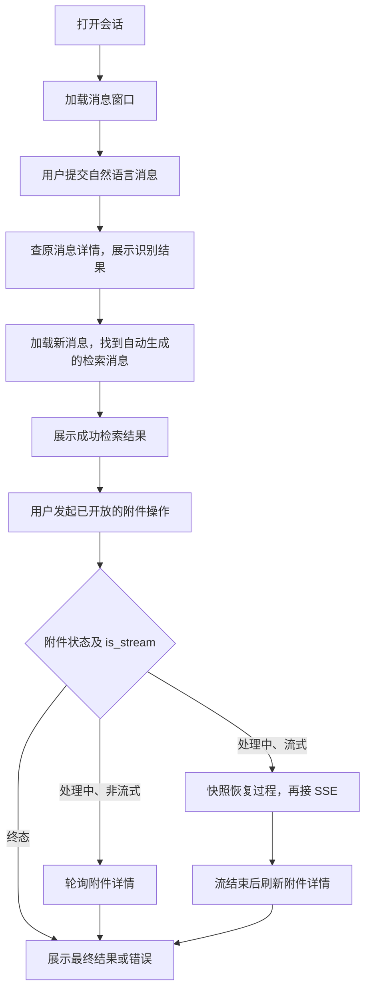
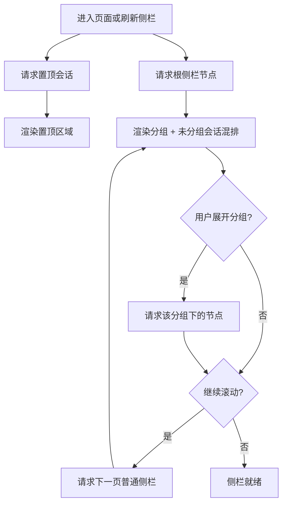
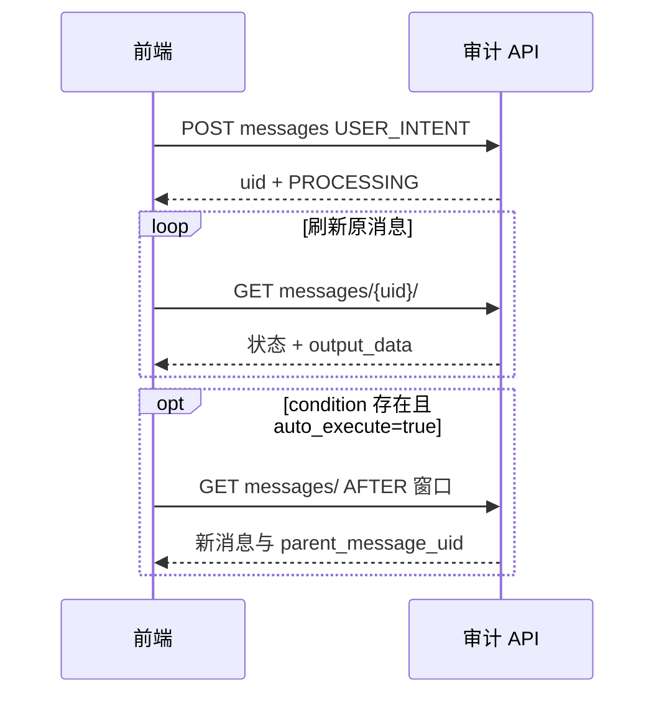
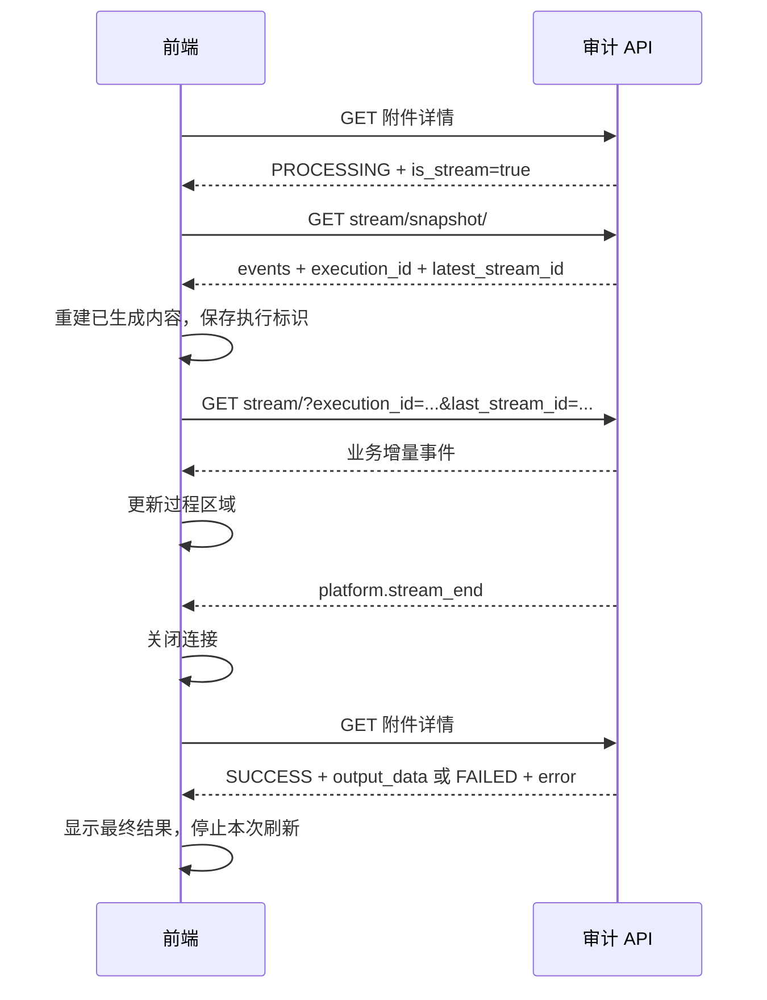

# AI 助手前端联调指南：会话、消息、附件与流式

本文说明调用时机、接口衔接和页面状态处理。按页面操作串联会话、消息、附件和流式展示，并说明日志检索入口。附件与流式属于公共接入方式；具体附件类型是否可创建，以目标环境已开放的业务能力为准。二期 AI 分析单独交付，不因公共接口存在而默认开放。

阅读顺序：首次接入从对象关系、接口导航开始；实现检索看消息章节；接报告面板看附件与流式章节。AI 分析专属交互见二期分支同目录的 `frontend_log_analysis.md`。

## 协议入口与维护边界

- 在当前联调后端域名下访问 `/swagger/`；机器可读协议为 `/api/schema/`。在 Swagger 按下文的方法和完整路径定位操作，查看请求、响应、枚举、约束及业务成功信封。
- 本文表格中以 `/` 开始的相对接口均需加前缀 `/api/v1/ai_assistant/`；跨模块接口会写完整路径。
- 本文只保留串联请求所需的关键字段，不复制完整 DTO。具体字段以同一部署版本的 Swagger 为准；发现 Swagger、本文或实际响应不一致时记录请求标识并修正，不能依赖错误文案解析业务。
- 普通接口先判断 HTTP 与业务信封，再读取对象状态；文件下载直接处理文件响应。登录态、CSRF 和域名代理复用审计前端现有请求层。
- 后端维护者改动编排、状态或路由时同步本文；只改字段类型时优先维护 Serializer/Swagger。

## 先看页面中的对象关系

```text
侧栏分组
 └─ 会话 conversation_uid
     ├─ 系统选择消息 selectionUid
     ├─ 用户意图消息 intentUid
     │   └─ 日志检索消息 searchUid（parent_message_uid = intentUid）
     │       ├─ 附件 attachmentUidA
     │       └─ 附件 attachmentUidB
     └─ 后续消息……
```

- **会话**是整段交互的容器。会话详情不包含完整消息历史，打开会话还需要请求消息列表。
- **消息**是时间线上的一条操作及结果。先展示输入，再根据消息状态补充结果；检索消息和自然语言消息有各自的 UID。
- **附件**是某条成功消息派生的独立产物。挂在来源卡片下，也可在报告列表独立打开；创建附件不会新增一条消息。
- **流式快照和 SSE**用于展示某个附件的生成过程。附件详情用于展示最终结果；三者不是同一份响应。



前端可分别维护消息表（按 message UID）、附件表（按 attachment UID）与当前流连接。刷新消息时按 UID 更新原卡片；收到附件更新时只更新该附件；切换会话后丢弃旧页面迟到的请求结果。

## 接口导航：先按页面动作定位

下表路径均相对于 `/api/v1/ai_assistant/`，请求体、查询参数及完整响应到 Swagger 查看。

| 页面动作 | 接口 | 成功后接什么 |
| --- | --- | --- |
| 新会话 | `POST /conversations/` | 保存会话与初始化消息 UID，展示时间线 |
| 打开会话 | `GET /conversations/{conversation_uid}/` | 再查消息列表 |
| 加载历史/新消息 | `GET /messages/` | 合并消息，恢复处理中对象 |
| 提交操作 | `POST /messages/` | 保存消息 UID，按状态刷新详情 |
| 查原消息结果 | `GET /messages/{message_uid}/` | 更新同一张卡片 |
| 修改原输入再执行 | `PATCH /messages/{message_uid}/` | 原 UID 重新进入状态刷新 |
| 重试失败消息 | `POST /messages/{message_uid}/retry/` | 查询原 UID |
| 从检索卡片创建附件 | `POST /messages/{message_uid}/attachments/` | 保存附件 UID，按状态和 is_stream 分流 |
| 报告列表 | `GET /attachments/` | 点击项后查询附件详情 |
| 打开/刷新附件 | `GET /attachments/{attachment_uid}/` | 展示终态，或恢复轮询/流式 |
| 恢复生成过程 | `GET /attachments/{attachment_uid}/stream/snapshot/` | 展示历史事件，拿本次执行和游标 |
| 接收生成增量 | `GET /attachments/{attachment_uid}/stream/` | 处理业务事件与两个具名控制事件 |
| 编辑报告 | `PATCH /attachments/{attachment_uid}/` | 更新同一附件的标题/正文 |
| 重试失败附件 | `POST /attachments/{attachment_uid}/retry/` | 原 UID，重新获取本次执行 |
| 下载附件 | `GET /attachments/{attachment_uid}/export/` | 直接保存文件，无导出轮询 |
| 赞踩/取消 | `POST /feedback/`、`DELETE /feedback/{feedback_uid}/` | 更新来源卡片反馈 |

## 资源与标识怎么串联

| 返回值 | 下一步用途 |
| --- | --- |
| 会话 `uid` | 创建/查询消息时传 `conversation_uid`，打开或重命名会话 |
| 消息 `uid` | 查询详情、编辑、重试；作为允许类型的 `parent_message_uid` |
| `parent_message_uid` | 关联后端自动生成的子消息，不用消息顺序或相似文本猜关联 |
| 侧栏 `node_type + node_uid` | 移动、置顶业务节点；不要使用内部 Node ID |
| 消息窗口 `first_uid / last_uid` | 分别作为向前/向后加载的锚点，使用服务端窗口值 |
| 全量导出 `export_task_id` | 既有导出任务整数 ID，供查询与下载；它不是附件 UID |

消息是历史时间线，父子关系表达因果。附件平台的存在不表示一期已开放 AI_ANALYSIS/AI_STATISTICS 等业务类型；二期分析指南仅随二期分支交付。

## 进入页面、创建与恢复会话

页面初始化可并行请求 `GET /conversation_sidebar/pinned/` 和 `GET /conversation_sidebar/nodes/`。置顶单独展示，普通列表不重复展示；按响应顺序分页，展开分组时再请求对应容器。搜索使用 `GET /conversation_sidebar/search/`，结果只用于定位会话。

用户确认系统后再调用 `POST /conversations/`，同时携带 `initial_message.message_type=SYSTEM_SELECTION` 与对应 input_data。保存返回的会话 UID 和 `initial_message.uid`，进入会话并更新侧栏。初始化消息为 PROCESSING 时轮询它的详情，SUCCESS 后才能用于后续检索；FAILED 时保留错误卡片，不将其用作有效父消息。创建请求失败则保留选择界面与输入。系统选择字段见 Swagger。

若产品使用直接自然语言入口，可先 `POST /conversations/` 创建空会话，再提交 USER_INTENT；缺少系统时由识别结果引导补全。不要同时创建手工系统选择和语义相同的意图消息。

打开历史会话：

1. 按需 `GET /conversations/{conversation_uid}/` 读取基础信息；它不代替消息历史。
2. `GET /messages/` 传会话 UID，无锚点时返回最新窗口，按服务端正序展示。
3. 向上加载使用 `anchor_uid=first_uid`、`direction=BEFORE`；发现新消息使用 `anchor_uid=last_uid`、`direction=AFTER`。锚点与方向成对提交。
4. 按消息 UID 合并去重；返回 `visible=false` 的消息不渲染为卡片，但保留其关联用途，窗口锚点不要从可见卡片自行推算。
5. 对已有 PROCESSING 消息继续查详情。AFTER 只能发现新增消息，不能替代原消息详情刷新。

重命名会话/分组使用对应 `PATCH`；分组创建使用 `POST /conversation_groups/`。拖动使用 `POST /conversation_sidebar/nodes/move/`，按 Swagger 传来源、目标与 before/after 锚点；成功后刷新受影响容器。置顶用 `PUT /conversation_sidebar/nodes/pin/`。删除会话/分组使用各自 DELETE，删除分组会同时删除其中会话；`POST /conversations/clear/` 清空会话，均需明确用户确认语义并停止相关轮询。

### 一条消息从提交到显示的固定步骤

1. 用户提交时禁用该提交按钮，调用 `POST /messages/`。请求尚未返回时可显示本地等待态，但不要虚构服务端 UID。
2. 得到对象后按返回 UID 插入或更新卡片，展示 input_data；若返回 PROCESSING，开始查询该 UID 的详情。
3. 每次详情响应替换卡片的状态、输出与错误。PROCESSING 继续等待；FAILED 展示错误和可用的重试动作；SUCCESS 渲染该类型结果。
4. USER_INTENT 成功表示识别结束；还需按下文分支判断是引导、切系统还是继续查日志。LOG_SEARCH 成功才显示日志表格与基于结果的操作。
5. 自动检索开启时，通过消息列表发现子消息，再按子消息自己的状态展示。不要把意图消息的成功直接当作日志查询成功。

### 详情刷新和消息窗口刷新各解决什么

| 问题 | 应调用 | 不足以解决问题的调用 |
| --- | --- | --- |
| 已有消息是否完成 | `GET /messages/{message_uid}/` | AFTER 不会重新返回该锚点之前的旧消息 |
| 是否出现自动生成的检索消息 | `GET /messages/` + AFTER | 原意图详情不等于会话新消息列表 |
| 卡片下已有哪些附件 | 消息详情中的 attachments 摘要，或按 source_message_uid 查附件列表 | 附件创建不追加消息，不能靠 AFTER 发现 |
| 已知附件是否完成 | `GET /attachments/{attachment_uid}/` | 消息摘要不包含完整附件正文 |

例如已显示意图消息 M1，轮询 M1 得到 SUCCESS 后，以消息窗口的 last_uid 请求 AFTER，获得 `parent_message_uid=M1` 的检索消息 M2。将 M2 作为独立结果记录保存，展示关联关系；不能将 M2 的 UID 覆盖 M1，也不能再主动创建一次相同检索。

## 侧栏的完整操作顺序


建议页面进入时按下面顺序加载：

1. 调用 `GET /conversation_sidebar/pinned/` 获取全部置顶会话；
2. 调用 `GET /conversation_sidebar/nodes/` 获取根容器的分页数据；
3. 将置顶会话单独放入置顶区域，普通节点列表不要重复展示这些会话；
4. 根节点返回分组和未分组会话的混合列表，按服务端返回顺序展示；
5. 用户展开分组时，再带分组节点信息请求该分组下的节点，不需要一次性加载所有分组内容；
6. 侧栏继续滚动时，使用普通分页参数加载下一页。

分组节点会返回分组内会话数量；会话节点会返回所属分组摘要。当前没有单独的“分组列表查询”接口，分组名称和数量从侧栏 Node 接口获取。



### 侧栏操作

- 新建分组：创建成功后，把返回的分组节点放入侧栏首位；
- 重命名：直接调用分组或会话的 `PATCH` 接口，成功后更新当前节点；
- 置顶：使用 `node_type=CONVERSATION` 的置顶接口；置顶成功后，将会话移入置顶列表，同时从普通列表移除；
- 取消置顶：调用同一接口并传入取消状态，成功后按当前普通列表重新加载；
- 移动：提交来源节点、目标分组和可选的 before/after 锚点；不传锚点表示放到目标容器最前面；移动成功后刷新受影响容器；
- 删除会话：会话及其侧栏节点从前端移除，一期不提供恢复；
- 删除分组：分组下会话会一并被清理，前端需要在确认文案中明确这一点；
- 搜索：搜索结果是会话定位结果，不改变当前侧栏排序，点击结果后直接打开对应会话。

## 用户自然语言入口：USER_INTENT

新入口使用 `POST /messages/`，携带会话 UID、`message_type=USER_INTENT`、用户输入和当前 UI 的 scope。USER_INTENT 是入口消息，**不要传父消息**；即使已有系统选择，也由后端在当前会话内解析上下文。

下面仅演示 UID 和 scope 的衔接；占位 UID 必须替换，完整约束查看 Swagger：

```json
{
  "conversation_uid": "<创建会话返回的 uid>",
  "message_type": "USER_INTENT",
  "input_data": {
    "query_text": "查询审计中心昨天的失败操作",
    "scope_type": "system",
    "scope_id": "bk-audit",
    "auto_execute": true
  }
}
```



完成后按以下分支处理，不只看顶层 SUCCESS：

| 输出语义 | 前端动作 |
| --- | --- |
| `output_data.error` 非空 | 展示业务引导；SYSTEM_REQUIRED 可用 candidates 辅助用户选系统，不当作已有检索结果 |
| 纯系统切换，condition/error 均空 | 展示 message 和选择结果，按 selection_message_uid 获取选择消息；不再自行触发检索 |
| condition 存在，auto_execute=true | 展示识别条件，刷新消息窗口等待后端生成 LOG_SEARCH；前端不要重复 POST |
| condition 存在，auto_execute=false | 展示条件供确认，用户确认后按下节创建 LOG_SEARCH |

业务无法识别可以表现为顶层 SUCCESS + output_data.error；技术执行失败才按顶层 FAILED 处理。自动子消息可能晚于父消息 SUCCESS 出现；不要要求 `log_search_message_uid` 总已填充，使用消息窗口与父子关联发现结果。短暂缺少子消息不等同于失败；持续缺失时保留识别条件并提供用户显式重查，先刷新确认没有已有子消息，不自动重复提交。

存量 NATURAL_LANGUAGE_SEARCH 消息仍按 condition/error 分支展示，重试与编辑后同样遵循 auto_execute 的续链规则；其父消息是成功的 SYSTEM_SELECTION。新页面的自然语言提交统一使用 USER_INTENT，不另行创建 NATURAL_LANGUAGE_SEARCH。

## 结构化检索、条件确认与编辑

手工选择系统后直接检索，或识别后用户确认条件，调用 `POST /messages/` 创建 LOG_SEARCH，传会话 UID、完整 `input_data.condition` 和正确的直接父消息：

- 手工条件检索引用成功 SYSTEM_SELECTION。
- 识别条件后的手工执行引用产生该条件的成功 USER_INTENT/NATURAL_LANGUAGE_SEARCH。
- 不把上一条 LOG_SEARCH 当作父消息；不要给 parent_message_uid 传会话 UID。

手工切系统时创建新的 SYSTEM_SELECTION 消息，历史选择和检索保留。不要用修改旧选择的方式重写历史上下文。

“修改当前卡片再执行”和“新增一次检索”分开处理：

| 动作 | 调用及结果 |
| --- | --- |
| 编辑重跑原消息 | `PATCH /messages/{message_uid}/`，完整替换 input_data；保留原 UID、父关系及历史位置，按返回状态恢复刷新 |
| 追加一次查询 | `POST /messages/`，生成新 UID，选取允许的父消息 |
| 失败原消息重试 | `POST /messages/{message_uid}/retry/`，复用原 UID 和快照输入；不是修改条件 |

仅 SUCCESS/FAILED 消息可编辑，PROCESSING 不并发编辑。编辑保留已有子消息、附件和反馈，不会自动重算这些历史快照；自然语言编辑若 auto_execute=true，可能新增一条检索子消息。前端应按 UID 区分新旧结果，不让旧查询结果冒充新条件的结果。

## 状态刷新、结果列与反馈

创建返回 PROCESSING 后围绕 UID 轮询详情，切页/卸载停止轮询，恢复页面时重新读取；SUCCESS/FAILED 进入终态后停止。调用可能立即完成，不把固定延时、轮询次数或 SSE EOF 当作成功依据。当前自然语言检索消息使用详情/窗口刷新，不接附件 SSE。

LOG_SEARCH 成功后按 `output_data.columns` 渲染 samples；total 是命中总量，samples 是有限快照，不能用 samples 长度代替 total。耗时展示使用消息 duration_seconds，query_summary.took_ms 仅反映查询部分。

列配置：`GET /columns/` 加载可选/已选列，`POST /columns/apply/` 提交选择并使用后端规范化后的 selected_fields。偏好更新用于后续执行，不自动改写已有快照；需重新执行检索才能获得新增列数据。

反馈仅在 SUCCESS 且 supports_feedback=true 时开放：`POST /feedback/` 写当前反馈，保存返回 UID；重复评价覆盖当前值，`DELETE /feedback/{feedback_uid}/` 取消。打开历史时从对象响应恢复反馈状态。

## 日志文件导出

| 用户诉求 | 调用链路 | 边界 |
| --- | --- | --- |
| 导出当前预览 | `GET /messages/{message_uid}/preview-export/` | 来源为成功 LOG_SEARCH；直接返回 Excel 文件，导出快照样例，不重新查全量日志 |
| 导出完整检索范围 | `POST /messages/{message_uid}/full-export/` → 保存 export_task_id → 既有导出任务详情 → 下载 | 后端从来源快照重建条件；请求成功只代表任务创建，不代表文件就绪 |

全量导出复用现有审计日志导出列表和下载流程。在 Swagger 定位“查询/下载日志导出任务”，使用 full-export 返回的整数任务 ID，按该模块公开状态判断就绪后调用 download；不要调用 Attachment 的详情或 export。导出格式/列选择等字段以对应 Swagger 为准，前端不额外塞入新检索条件改变来源范围。

## 从消息卡片创建附件

本节适用于目标环境已开放的附件类型。前端提供哪些统计/分析按钮由该环境的业务范围决定，不根据枚举里出现某个名字就开放入口。

### 创建后立即分流

1. 用户在成功的 LOG_SEARCH 卡片上点击某个附件操作，记下**该卡片**的消息 UID，不使用会话中“最新一条消息”代替。
2. 调用 `POST /messages/{message_uid}/attachments/`，请求体只提交对应 attachment_type 与 input_data，具体业务字段见 Swagger。
3. 保存返回附件 uid 与 source_message_uid，将它挂到来源卡片；创建完成后也可刷新消息详情确认 attachments 摘要。
4. 按返回状态处理：SUCCESS 直接渲染 output_data；FAILED 显示错误；PROCESSING 显示生成中，再根据 is_stream 选择下表链路。
5. 用户再次创建会得到另一个附件。双击防重在请求期间处理；需要重试原失败产物时调用 retry，不再调用创建接口。

| 返回状态 | is_stream | 接下来做什么 |
| --- | --- | --- |
| SUCCESS | 任意 | 展示最终正文/图表，按能力显示编辑、反馈、下载 |
| FAILED | 任意 | 展示 error_message，允许适用类型重试；过程可按需查看 |
| PROCESSING | false | 轮询附件详情，直到 SUCCESS/FAILED |
| PROCESSING | true | 先读快照，恢复已有过程，再订阅 SSE；结束后查详情 |

非流式附件轮询时按附件 UID 更新；不要为了刷新一个附件而不断加载全部消息。切页停止轮询，重新打开后先查详情，仍 PROCESSING 才恢复。

### 从会话和报告列表打开同一附件

- 会话入口：消息响应的 attachments 是摘要。点击摘要，使用附件 uid 请求 `GET /attachments/{attachment_uid}/`。
- 报告入口：请求 `GET /attachments/`，按 attachment_type、status、keyword、conversation_uid 或 source_message_uid 等已公开条件筛选；当前不分页。
- 列表只返回摘要，没有完整 input_data/output_data，也不能仅靠列表决定是否订阅流。点击项仍需请求附件详情。
- 列表项的 conversation 和 source_message 用于显示归属及返回原会话。打开产物本身只需附件 UID，无需先遍历消息历史。
- 只看已完成报告时筛选 SUCCESS；若页面还展示生成中和失败项，不要全局固定该筛选。
- 附件详情是共用入口：终态渲染结果；处理中按 is_stream 恢复。两个入口不能各自启动一条针对同一面板的重复订阅。

## 流式附件：先快照，再增量，最后详情

前端需要区分三份数据：

| 接口结果 | 用途 | 页面处理 |
| --- | --- | --- |
| 附件详情 status/output_data | 本次业务状态与最终产物 | 决定成功/失败，渲染最终正文 |
| snapshot.events | 当前执行已保存的过程 | 打开、刷新、恢复时重建过程区域 |
| SSE 事件 | 从游标之后到达的过程增量 | 更新当前过程区域，监听结束/重置 |

过程里已经出现文字不代表最终报告已完成；连接断开也不代表分析失败。

### 首次打开生成中的附件

1. `GET /attachments/{attachment_uid}/`，确认 status=PROCESSING 且 is_stream=true。
2. `GET /attachments/{attachment_uid}/stream/snapshot/`。从业务响应中取出 events、execution_id、latest_stream_id。
3. 使用 events **重建**过程区域，不将整份快照反复追加到已显示内容后。快照每项是 `{event, stream_id, data}`，按返回顺序处理。
4. execution_id 为空时显示“等待开始”，暂不建立 SSE；退避后再次查询详情与快照。详情已进入终态则直接展示最终结果。
5. execution_id 非空时保存该值；携带同一快照的 latest_stream_id 建立连接。latest_stream_id 为空时省略该参数，不传字符串 `null`。
6. 业务增量更新过程；平台结束事件关闭连接并刷新详情；平台重置事件重新走恢复流程。

```text
GET /api/v1/ai_assistant/attachments/{attachment_uid}/stream/
    ?execution_id={snapshot.execution_id}
    &last_stream_id={snapshot.latest_stream_id}
```

上面换行只是排版，实际请求为一个 URL；参数值需要正常 URL 编码。

三个标识的用途固定：attachment_uid 找产物；execution_id 标识这一次生成；last_stream_id 是该次生成已读到的位置。把 execution_id 和游标一起保存，不跨执行复用。



### 快照与 SSE 如何交给同一个渲染器

快照项的 data 已是 JSON 值；SSE 的 MessageEvent.data 是 JSON 文本，需要解析一次。SSE **不会**把完整的 `{event, stream_id, data}` 再包装到 data 中。

| 收到的内容 | 快照入口 | SSE 入口 | 动作 |
| --- | --- | --- | --- |
| 业务事件 | event 为空，读取 item.data | `onmessage`，解析 event.data | 交给附件类型的过程渲染器 |
| 重置通知 | 如有对应 event，进入恢复流程 | `addEventListener("platform.stream_reset", …)` | 关闭旧连接，重读详情/快照 |
| 结束通知 | 如有对应 event，刷新终态详情 | `addEventListener("platform.stream_end", …)` | 关闭连接，读取最终产物 |
| 心跳 | 无需处理 | 浏览器忽略 SSE 注释心跳 | 不创建空白消息或更新业务状态 |

同一 execution 内可以按非空 stream_id 去重；SSE 对应值在 lastEventId。没有游标的事件不能全部按空值去重。若快照已经包含结束通知，先刷新详情，不再机械建立新连接。

下面仅演示浏览器事件注册；请求取消、退避和页面生命周期需要接入项目已有封装：

```javascript
const params = new URLSearchParams({ execution_id: snapshot.execution_id });
if (snapshot.latest_stream_id) params.set('last_stream_id', snapshot.latest_stream_id);
const source = new EventSource(`${base}/attachments/${attachmentUid}/stream/?${params}`);

source.onmessage = event => {
  // 当前面板与执行仍匹配时，解析 event.data 并更新业务过程。
  renderBusinessEvent(JSON.parse(event.data), event.lastEventId);
};
source.addEventListener('platform.stream_end', () => {
  source.close();
  refreshAttachmentDetail();
});
source.addEventListener('platform.stream_reset', () => {
  source.close();
  reloadDetailAndSnapshot();
});
source.onerror = () => {
  source.close();
  scheduleRecoveryWithBackoff();
};
```

此处函数名表示前端需要实现的动作，不是后端提供的 SDK。处理 JSON 解析失败时提示过程展示异常并恢复详情，不把附件自行写成 FAILED。同源请求复用登录 Cookie；跨域按现有鉴权/CORS 配置。原生 EventSource 不支持自定义 headers，项目需要该能力时使用相应 SSE 客户端。

### 刷新、断线、重置与失败重试

| 触发场景 | 前端按顺序处理 |
| --- | --- |
| 刷新页面/重新打开 | 查详情 → 终态展示结果；处理中读快照 → 重建过程 → 连接增量 |
| 网络断开/onerror | 关旧连接 → 有限退避 → 查详情 → 仍处理中才读快照并重连；登录或权限失败停止自动重试 |
| platform.stream_reset | 关旧连接 → 使旧请求回调失效 → 查详情与新快照 → 替换过程 → 按新的执行标识订阅 |
| platform.stream_end | 关连接 → 查详情 → SUCCESS 展示 output_data，FAILED 展示错误；详情请求失败可重试详情，不重跑业务 |
| 用户重试 FAILED 附件 | 先关旧连接 → POST retry → 保留附件 UID、清空旧错误/过程 → 查详情和快照，等待新 execution_id |
| 离开页面/删除会话 | 关闭连接、取消请求和退避定时器；忽略迟到响应，防止覆盖新页面 |

重试排队期间可能暂时仍读到旧 execution_id 和旧过程。记录重试前的 execution_id；再次读到相同值时保持“等待重新生成”，不要把旧结束事件或旧正文当成本轮结果。取得新的 execution_id 后再重建和订阅。

如果使用 EventSource 自带重连，Last-Event-ID 请求头优先于 URL 游标。本指南示例在 onerror 中主动 close，再通过详情/快照恢复；不要同时保留浏览器自动重连和应用自己的重连循环。

关闭浏览器连接只停止本地观看，不会取消附件生成。页面恢复不应重新 POST 创建或重试附件。

快照 archive_status 非 COMPLETE 表示过程记录可能不完整：可提示“部分生成过程不可恢复”，最终是否成功仍看附件详情。不要因过程缺失隐藏已成功的报告，也不要承诺刷新后能恢复每一个中间事件。

## 附件编辑、重试与下载

### 编辑已有产物

1. 打开附件详情，用当前 title/output_data 初始化编辑器。
2. 修改标题可单独 `PATCH /attachments/{attachment_uid}/` 提交 title。
3. 修改正文仅对已成功且业务协议允许编辑的类型开放，提交完整 output_data；不是提交 Markdown 的一段增量。
4. 保存成功后使用最新响应更新同一附件；保存失败保留编辑草稿，不能显示“已保存”。
5. 编辑不会重新生成，也不改变当时的流式过程。查看过程和查看当前正文允许不同。

失败重试用 `POST /attachments/{attachment_uid}/retry/`，保留原附件位置和 UID。非流式附件回到详情轮询；流式附件按上面的新执行恢复流程处理。修改输入要求并重新生成应创建新附件，不用 PATCH output_data 代替执行。

### 下载已有产物

1. 附件 SUCCESS 时读取 export_formats，只展示其声明的格式。
2. 用户选定格式后请求 `GET /attachments/{attachment_uid}/export/?export_format={所选格式}`。
3. 成功响应为文件，按 Content-Type/文件名下载；如果返回错误，按错误响应提示，不保存成一个假报告文件。
4. 此接口直接下载，不返回导出任务、不创建新附件、不轮询。它与日志全量导出是两条链路。

## 对消息或附件反馈

1. 从对象详情读取 SUCCESS、supports_feedback 和 feedback，决定按钮可用性与当前赞踩状态。
2. 点击赞/踩时 `POST /feedback/`，按 Swagger 提交来源类型、来源 UID 和反馈值。消息用消息 UID，附件用附件 UID。
3. 用响应覆盖当前反馈并保存反馈 UID；再次评价是更新当前评价，不累计计数。
4. 取消时 `DELETE /feedback/{feedback_uid}/`，成功后清空按钮状态；失败时保留原状态或回读来源详情。
5. 打开历史时直接用来源响应的 feedback 恢复，不需要另找反馈列表。


## 异常与联调核对

- 请求超时或网络失败不等于未创建对象。已有 UID 时先读详情；创建请求结果不确定时先刷新会话，避免重复点击制造重复消息。
- 403/资源不可见时停止对应重试并提示用户；状态冲突时刷新对象再决定下一步。
- 顶层 FAILED 展示 error_code/error_message；业务识别引导读取 output_data.error，不能混为一种错误。
- 联调至少覆盖直接自然语言、缺系统引导、纯切系统、自动续链、手动确认、编辑重跑、历史恢复、两种导出、反馈及删除会话后的停止刷新。
- 报障保留环境、请求方法/路径、对象 UID、request_id、状态和复现步骤；不要在普通日志保存认证或完整敏感日志。
