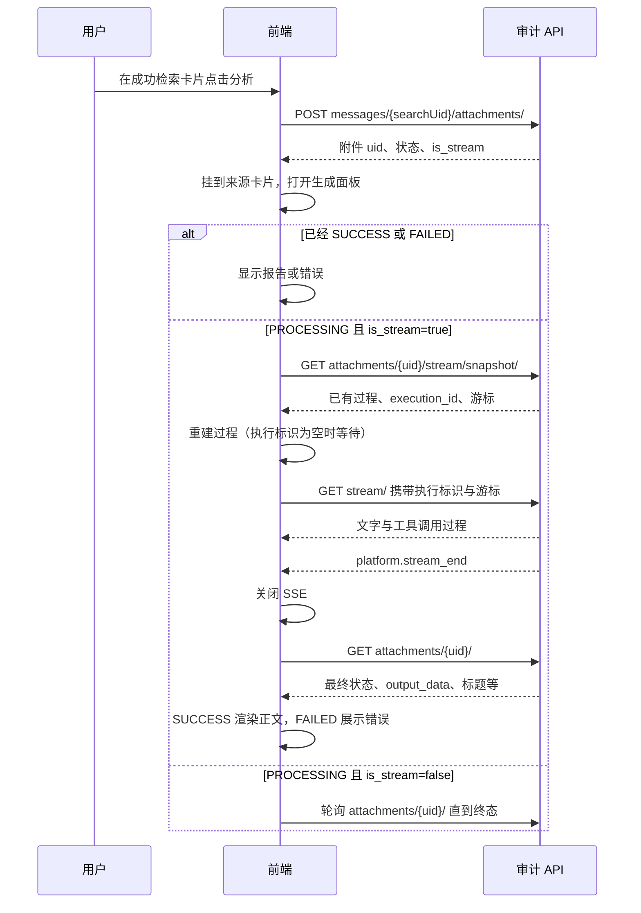

# AI 日志分析前端联调指南

本文从成功的日志检索卡片开始，说明点击分析、展示生成过程、打开报告和后续操作。公共会话、消息、附件与 SSE 接入步骤见[前端联调指南](frontend_integration.md)。本能力随二期发布，请先确认联调环境已开放 AI_ANALYSIS。

所有下文相对接口均加 `/api/v1/ai_assistant/` 前缀。完整字段和限制查看当前后端域名的 `/swagger/`（机器协议 `/api/schema/`）；本文的请求仅保留完成操作所需的关键字段。

## 1. 从哪张卡片开始分析

分析按钮放在成功的 LOG_SEARCH 结果卡片上。前端需要已有：

- 该检索消息的 uid：用于创建附件。
- 当前会话 uid：用于页面归属与返回会话。
- 该卡片显示的检索范围：帮助用户确认正在分析哪次查询。

用户在条件编辑器中修改条件但还没执行时，旧卡片仍对应旧查询。应先完成新检索，再从新结果发起分析；不能一边传旧消息 UID，一边把页面临时条件描述成分析范围。

同一张卡片允许有多个分析报告。每次新建保存不同附件 UID，报告列表和卡片内的生成状态按附件分别维护。

## 2. 默认分析与自定义分析

| 用户操作 | 请求体 | 输入区行为 |
| --- | --- | --- |
| 点击默认分析 | attachment_type=AI_ANALYSIS，analysis_mode=DEFAULT | 不填写分析要求，也不传 instruction（包括 null/空串） |
| 输入要求并确认 | attachment_type=AI_ANALYSIS，analysis_mode=CUSTOM，instruction=用户要求 | 必填非空要求，长度限制见 Swagger；提交失败保留草稿 |

默认分析：

```http
POST /api/v1/ai_assistant/messages/{searchMessageUid}/attachments/
Content-Type: application/json
```

```json
{
  "attachment_type": "AI_ANALYSIS",
  "input_data": {"analysis_mode": "DEFAULT"}
}
```

自定义分析使用同一路径：

```json
{
  "attachment_type": "AI_ANALYSIS",
  "input_data": {
    "analysis_mode": "CUSTOM",
    "instruction": "分析失败操作及其集中时段，给出可核查证据。"
  }
}
```

请求期间禁用本次提交按钮。成功取得附件对象后保存 uid，用 source_message_uid 关联来源卡片，进入报告面板。请求失败时留在当前卡片并保留输入；网络超时导致创建结果不确定时，先按来源消息刷新附件列表，不立即重复创建。

## 3. 从创建响应到最终报告



具体恢复算法、事件注册、重试换流规则按公共指南的“流式附件”章节实现。前端不需要另外请求 Agent 或 MCP；创建附件后由附件接口提供整个执行过程。

## 4. 生成面板应该展示什么

建议将“生成过程”和“报告正文”分开管理：过程可折叠，正文在成功后作为可编辑、可下载的产物展示。

| 收到的数据 | 页面动作 |
| --- | --- |
| 创建响应 PROCESSING | 展示生成中，占位报告区域，保留附件 UID |
| 快照 execution_id 为空 | 展示等待开始，退避获取详情/快照，不请求缺参数的流 |
| AG-UI 文字事件 | 按 messageId 归属维护文本块，将内容增量追加到对应块 |
| AG-UI 工具调用事件 | 按 toolCallId 归属展示调用过程和结果，支持折叠；工具参数和结果不拼进报告正文 |
| 单次工具错误 | 展示该步骤错误，仍等待附件终态，不立即把整个报告标记失败 |
| RUN_FINISHED 或文字块结束 | 只结束相应过程展示；继续等待附件结果，不直接开启下载/编辑 |
| platform.stream_end | 关闭流，读取附件详情，按最终状态展示 |
| 详情 SUCCESS | 用 output_data.markdown 渲染最终报告，停止生成态 |
| 详情 FAILED | 显示 error_message 和重试入口；已收到的过程可留作查看，不当作成功正文 |

AG-UI 事件由流中的业务 data 承载。快照里的 data 已是对象，SSE 的 event.data 要先解析；不要对工具结果中的每个 content 再强行 JSON.parse，它可能是普通文本。兼容未知事件，不因不认识某个事件类型中断整份报告展示。

模型可能输出多段文字：执行说明、工具调用前后说明和最终报告。**最终正文固定读取 output_data.markdown**，不能将所有中间文本连接后保存或导出。Markdown 按项目现有安全渲染策略展示。

标题可能晚于正文更新。正文完成后即可展示报告，临时标题不影响成功状态；下次刷新详情或列表时更新标题。

## 5. 刷新页面与重新打开报告

从会话卡片打开：附件摘要 → `GET /attachments/{attachment_uid}/`。

从报告列表打开：`GET /attachments/?attachment_type=AI_ANALYSIS` → 点击某项 uid → 请求详情。只列已完成报告时追加 status=SUCCESS；需要展示生成中任务时不固定此条件。

得到详情后：

1. SUCCESS：展示 output_data.markdown，恢复标题和反馈，按 export_formats 展示下载格式。查看生成过程时按需请求 snapshot，无需重新连接 SSE。
2. FAILED：展示错误与重试按钮，过程按需加载。
3. PROCESSING：is_stream=true 时按快照 → 增量恢复；否则轮询详情。
4. 过程记录不完整时提示过程不可完整恢复，正文仍正常展示；页面恢复不会重新创建报告。

## 6. 重试、重新分析、编辑和下载

| 用户意图 | 操作顺序 | 对象是否变化 |
| --- | --- | --- |
| 原失败报告再试一次 | 关闭旧流 → `POST /attachments/{uid}/retry/` → 获取详情/新快照 → 恢复本轮生成 | 附件 UID 不变，execution_id 更新 |
| 换一段分析要求 | 从原检索消息重新 POST attachments，选择 CUSTOM | 创建新附件，保留原报告 |
| 换检索范围分析 | 先完成新的 LOG_SEARCH，再从该结果创建附件 | 来源消息及附件都按新结果关联 |
| 改报告标题 | `PATCH /attachments/{uid}/` 提交 title，成功后更新卡片/列表 | 原附件不变 |
| 编辑已完成正文 | PATCH 提交完整 `output_data: {"markdown": "编辑后的完整正文"}` | 不重新分析；保存成功后更新当前正文 |
| 下载报告 | SUCCESS 时从 export_formats 选格式 → `GET /attachments/{uid}/export/?export_format=PDF`（或 MARKDOWN） | 直接文件响应，无需查询导出任务 |

重试排队时可能暂时看到旧 execution_id。不要恢复旧过程或把旧的结束事件当作重试完成，按公共指南等待新的执行标识。

正文编辑失败保留用户草稿。编辑不会改变历史生成过程；下载使用当前已保存正文，尚未保存的编辑不会进入下载文件。

反馈使用公共 feedback 接口，以 ATTACHMENT 作为来源类型，传附件 UID；从详情中的 feedback 恢复当前评价。

## 7. 前端联调的完整走查

按用户路径走一遍：完成检索 → 默认分析 → 查看生成过程 → 刷新页面继续观看 → 成功后展示正文 → 修改标题/正文并保存 → 下载 → 从报告列表重新打开。再用自定义要求创建第二份报告，确认两份报告归属同一来源而互不覆盖。

恢复与失败场景检查：断线后只恢复一个连接；切换报告后旧响应不覆盖新面板；失败重试保留附件 UID 且使用新执行标识；过程结束但详情请求失败时只重试读取，不再次发起分析。

报障保留环境、请求路径、附件 UID、execution_id、请求标识和复现动作，认证信息与用户日志正文不要写入通用文档。
