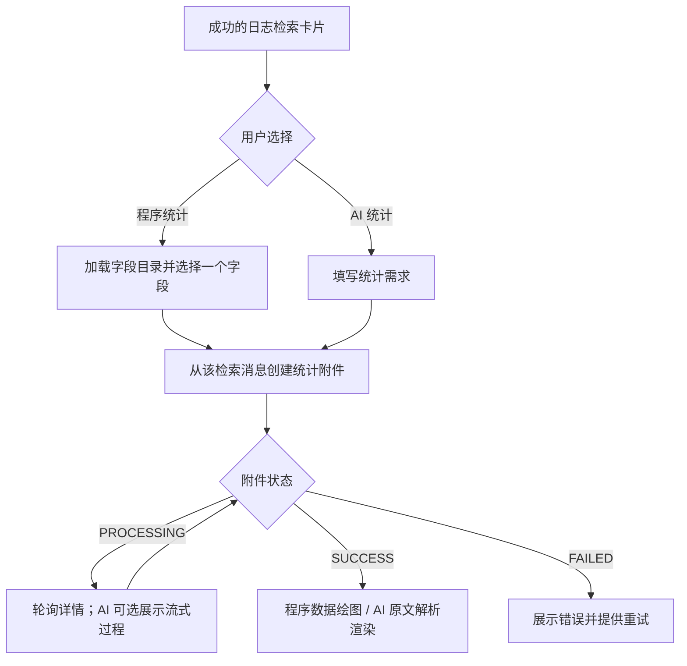

# AI 与程序统计前端联调指南

本文按页面操作串联统计能力：从哪张检索卡片进入、何时调用接口、如何等待结果，以及重新打开和重试时如何恢复。具体请求参数、字段类型、枚举、限制和请求响应样例，请在当前联调环境的 `/swagger/` 查看；机器协议为 `/api/schema/`。下文保留的字段用于说明接口之间的关联和页面行为。

会话、消息、认证、公共响应处理及 SSE 实现见[公共联调指南](frontend_integration.md)。真实环境端到端验收尚待完成。

## 1. 先看完整用户路径

| 页面决策 | 程序统计 | AI 统计 |
| --- | --- | --- |
| 用户提供什么 | 选择一个字段，可调整类别数和时间粒度 | 填写统计需求 |
| 统计什么范围 | 来源成功检索的完整范围 | 来源为初始上下文，Agent 可按需求调整 |
| 如何等待 | 轮询附件详情 | 同样可轮询；需要过程时选用 SSE |
| 成功后展示什么 | 后端固定统计包，由前端绘图 | `output_data.content` 原文，由前端按与 Agent 的约定解析 |

统计是来源消息上的附件，不会新增消息。同一检索卡片可以有多个统计附件，每个附件独立保存、展示和重试。

## 2. 进入统计面板：先绑定来源卡片

从当前用户的成功 LOG_SEARCH 卡片进入，保存**该卡片的消息 UID**，后续创建请求始终使用它，不用“最新一条消息”推测来源。程序统计针对完整检索范围，不针对卡片预览行。

页面筛选条件修改但尚未执行时，旧卡片仍代表旧查询。需要按新范围统计，应先完成新检索，再从新卡片进入。打开历史卡片时，如果页面只有摘要，先读取消息详情；字段探索使用该消息 `input_data.condition` 中的完整条件，不用当前条件编辑器中的草稿替换。

程序统计进入字段选择步骤；AI 统计直接进入需求输入，不要求前端先探索字段或调用统计工具。

## 3. 程序统计：选字段 → 创建 → 展示

### 选择字段

打开字段选择器时，调用 `POST /api/v1/query/namespaces/{namespace}/collector_query/field_metadata/`，namespace 沿用页面已有的租户上下文，并使用来源消息的完整检索条件。此处是 Web 接口，前端无需接 MCP 网关。

初次请求获取根字段。用户展开可展开的 JSON 字段时，用返回的字段引用作为 parent_field 再请求下一层；保留返回引用中的完整路径，不自行拼接字段名称。继续展开不会创建统计附件。

目录中的可展开提示决定是否展示展开入口，统计能力提示决定是否提供选择操作；字段可以可展开但本身不可统计。选中可统计字段后保留其 `field` 引用，供创建附件使用。目录加载失败留在选择器中提供重新加载，不创建附件。

目录根据声明和样本提供提示，可能未覆盖所有 JSON key，也不保证全量执行一定成功。最终遇到类型或权限变化，按附件执行错误处理。

### 确认并创建

用户确认字段后，调用 `POST /api/v1/ai_assistant/messages/{searchMessageUid}/attachments/`，类型选 FIELD_STATISTICS，业务输入使用选中的字段及需要调整的统计选项。无需让用户再选择统计类型，后端决定是否增加数值摘要；参数默认值、范围与样例见 Swagger。

请求期间禁用本次提交，失败时保留已选字段和选项。成功取得附件 UID 后，将其挂到来源卡片并打开结果面板，按第 5 节处理状态。创建响应也可能已经是终态，不要固定假设一定先进入轮询。

### 将成功产物映射到页面

详情 SUCCESS 后使用 `output_data`，前端不再查询 Doris 或自己汇总日志：

| 页面区域 | 数据来源与衔接 |
| --- | --- |
| 字段标题与概览 | 服务端字段展示名及 overview |
| 类别分布图 | distribution.groups，使用服务端给出的类别、数量与比例 |
| 时间趋势图 | bucket_starts 为横轴；通过 group_id 将 series 与分布类别关联，counts 与横轴一一对应 |
| 数值摘要 | numeric_summary 存在时展示；类别统计不展示该区域 |
| 范围和粒度说明 | 使用响应的实际查询范围、effective_interval 和 timezone |

渲染时保留以下口径：

- `group_id` 用于关联，不解析其内容；“其他”“缺失”按 kind 判断，不能靠文字匹配。真实值也可能叫“其他”，数字与字符串同名也不能合并。
- 分布与时序共用全范围 TopN。OTHER/MISSING 是额外类别，保留它们，不在各时间桶重新排名或重新计算比例。空桶已经补齐。
- 空字符串与缺失不同；比例为小数，展示时转换为百分比，null 显示无数据。空结果是成功空态，不是执行失败。
- 数值摘要针对完整范围，中位数为近似值。实际时间粒度可能由 AUTO 决定，按返回值展示。

这些约定影响图表含义；完整字段定义与取值约束仍以 Swagger 为准。

## 4. AI 统计：填需求 → 创建 → 解析产物

用户填写统计需求后，使用相同创建附件接口，类型选 AI_STATISTICS，业务输入为 instruction。无需前端拼系统提示词、探索字段或调用聚合接口；后端和 Agent 完成查询执行。

提交失败保留需求草稿。创建成功保存附件 UID，挂到来源卡片，并按第 5 节选择仅看结果或展示过程。

SUCCESS 后读取 `output_data.content`。这是最终消息原文，不保证是 JSON；图表标记和 ECharts 格式由前端与 Agent skills 协同约定，后端不解析。联调前应确认该约定已在统计 Agent 配置中生效，否则仍可得到成功文本，但不一定能渲染为图表。

解析失败时保留原文查看入口，提示图表展示异常；不要将附件当作执行失败或自动重试。中间文字和工具结果属于过程，不拼接成最终产物。AI 可以调整查询范围，因此不能直接把来源卡片范围标成图表实际范围；若页面需要展示实际范围，由前端与 Agent 输出约定提供。

## 5. 等待结果：轮询是通用方式，SSE 按需接入

所有异步附件都可以直接轮询 `GET /api/v1/ai_assistant/attachments/{uid}/`。`is_stream=true` 只表示支持过程订阅，不要求前端连接 SSE。

| 详情状态 | 页面下一步 |
| --- | --- |
| PROCESSING | 保持生成态，继续轮询；需要过程且支持流时，可切换为快照 + SSE |
| SUCCESS | 停止等待，按附件类型读取最终产物并渲染 |
| FAILED | 停止等待，展示 error_message 和重试入口 |

只看结果时无需快照、execution_id 或游标。按附件 UID 更新面板，合理设置轮询间隔，网络故障时退避；离开页面和进入终态时停止轮询。一次详情请求失败只重读，不重复创建附件，也不自行认定任务 FAILED。

选择展示 AI 生成过程时，链路为：**读快照 → 恢复已有过程 → 订阅后续 SSE → 收到 platform.stream_end → 重新读详情**。完整事件注册、游标和断线恢复使用[公共指南的流式章节](frontend_integration.md#流式附件先快照再增量最后详情)，不在本专题重复实现。

Agent 的消息结束或运行结束事件都不替代附件终态。最终结果始终读取详情；即便过程无法完整恢复，仍可以通过详情获得产物。

## 6. 重新打开、重试与改变需求

| 用户动作 | 调用衔接与页面行为 |
| --- | --- |
| 刷新页面或从原卡片重新打开 | 从消息附件摘要或附件列表找到 UID → 读取附件详情 → 终态展示结果，PROCESSING 恢复轮询或可选过程订阅；不重新创建 |
| 查看该卡片已有统计 | `GET /api/v1/ai_assistant/attachments/` 按 source_message_uid 和统计类型筛选；列表是摘要，点击后读详情 |
| 失败后原样重试 | `POST /api/v1/ai_assistant/attachments/{uid}/retry/` → 保留附件 UID → 按返回状态恢复等待 |
| 更换字段、统计选项或 AI 需求 | 从来源消息创建新附件，保留原结果；不能修改原附件 input_data 来重跑 |
| 更换程序统计范围 | 先完成新的检索，再从新消息创建附件 |
| 修改标题 | PATCH 原附件，成功后更新卡片和列表标题 |

仅轮询的页面在重试成功后继续读原附件详情，无需等待执行标识。使用 SSE 时先关闭旧连接，等待新的 execution_id 后恢复；排队期间读到旧快照不能当作本轮结果。切换卡片后，迟到的请求或旧流事件不能覆盖新面板。

创建请求超时、无法确定是否成功时，先刷新该来源消息的附件列表核对，不立即重复提交。重试请求结果不确定时也先读原附件状态。

创建时的校验错误直接在输入面板展示；已创建后的执行错误从详情展示。权限或字段错误需修正选择/条件，预算错误可减少类别数、调整粒度或缩小检索范围后新建，暂时性故障可原样重试。错误码与参数约束见 Swagger，不按内部错误文案推断业务分支。

两种统计均可改标题，不支持编辑产物或后端导出。反馈按 supports_feedback 展示，AI 统计复用公共附件反馈链路。不要复用 AI_ANALYSIS 的正文编辑、Markdown 取值或报告下载逻辑。

## 7. 按用户路径完成联调

先走两条成功路径：

1. 成功检索 → 打开字段目录 → 展开并选择字段 → 创建程序统计 → 轮询 → 展示概览、分布、时序及适用的数值摘要 → 刷新后重新打开同一结果。
2. 从同一卡片填写 AI 需求 → 创建 AI 统计 → 仅轮询获取结果 → 按约定解析渲染；若页面需要生成过程，再单独走快照/SSE 和断线恢复路径。

再检查失败与边界：空数据、缺失与其他类别、不可统计字段、权限变化、执行失败后重试、切换卡片时迟到响应、创建结果不确定时的核对、AI 文本不符合图表约定时的原文降级。同一卡片多份产物应互不覆盖。

联调开始前由后端确认环境可用、统计 Agent 已配置，由前端与 Agent 配置方确认图表输出约定。真实环境验收仍需按上述页面路径完成，已有自动化测试不替代该验收。Agent 生成质量评估另行跟进。报障保留环境、请求路径、附件 UID、执行标识（使用流时）及复现动作。
