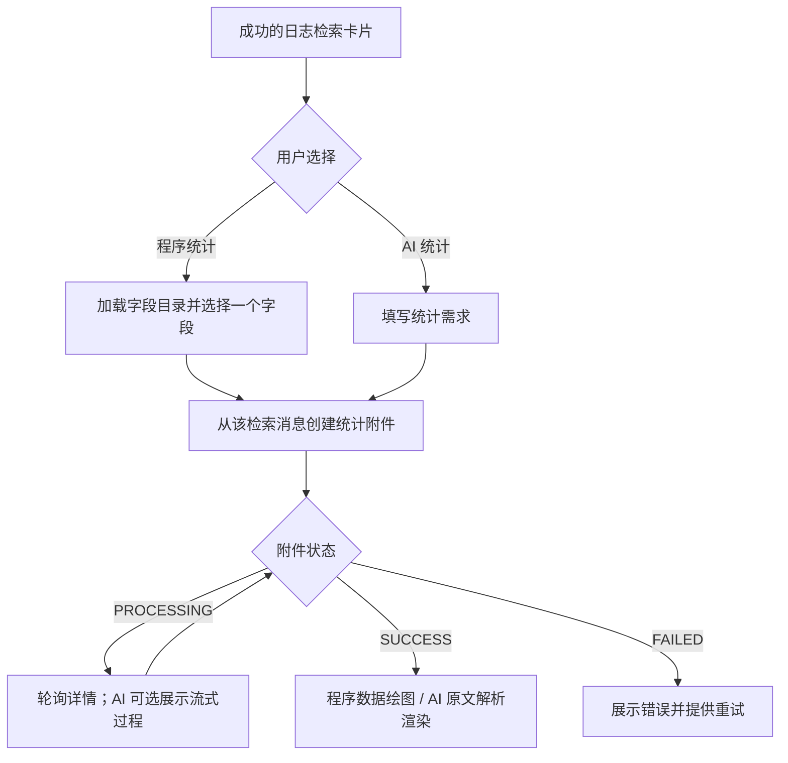
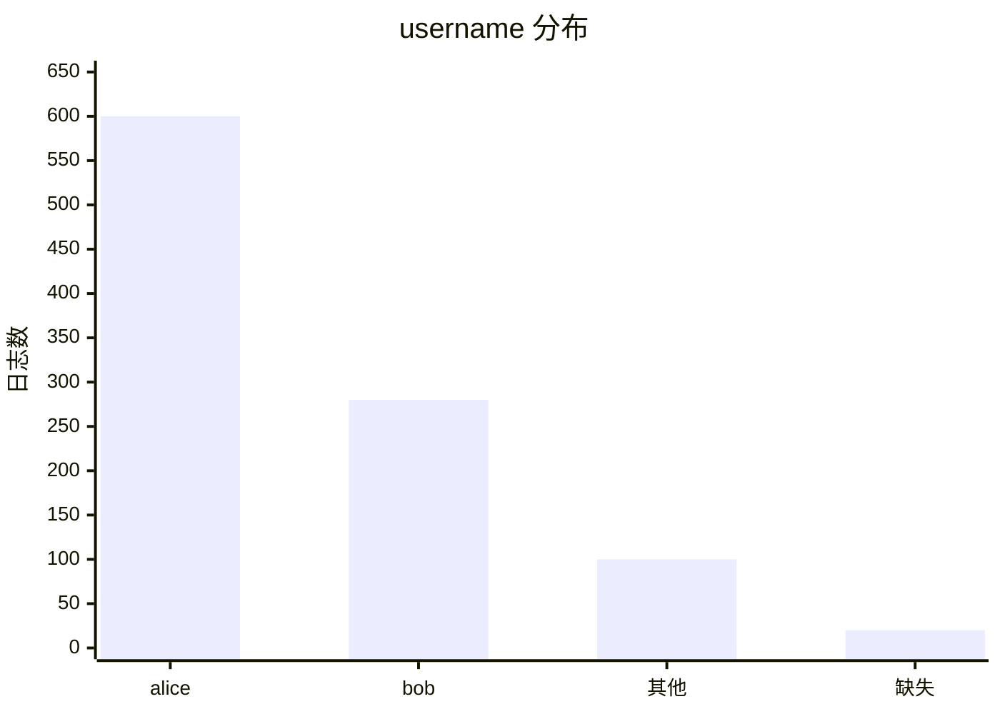
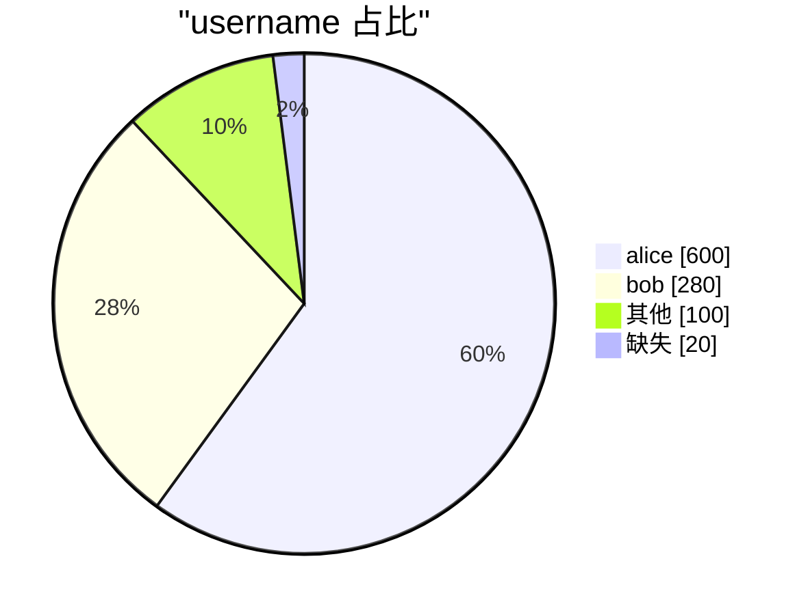
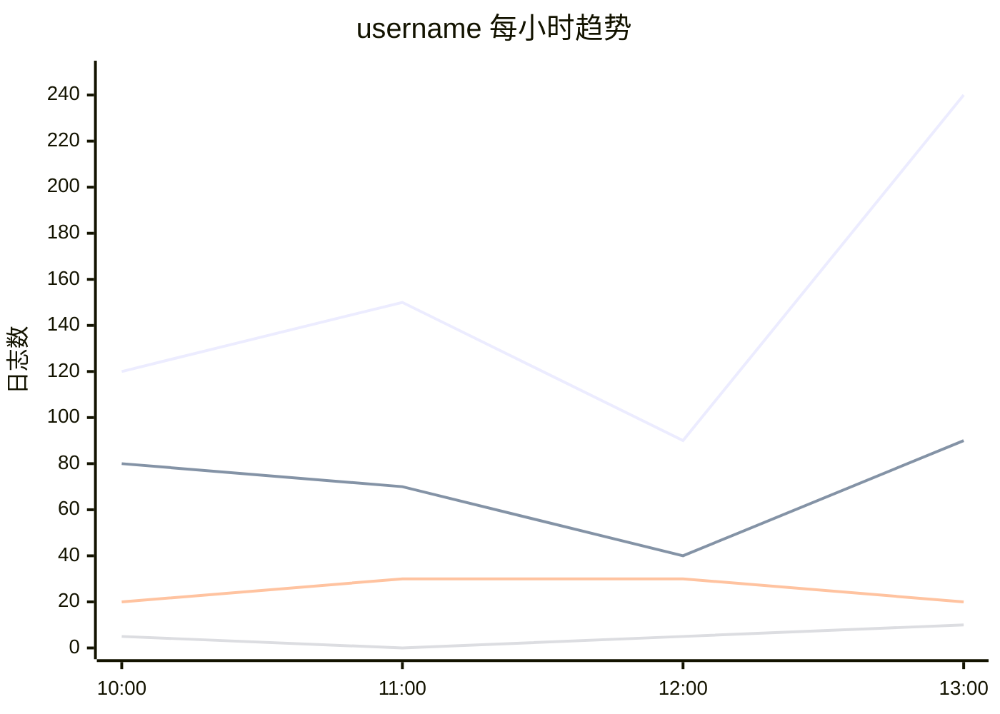
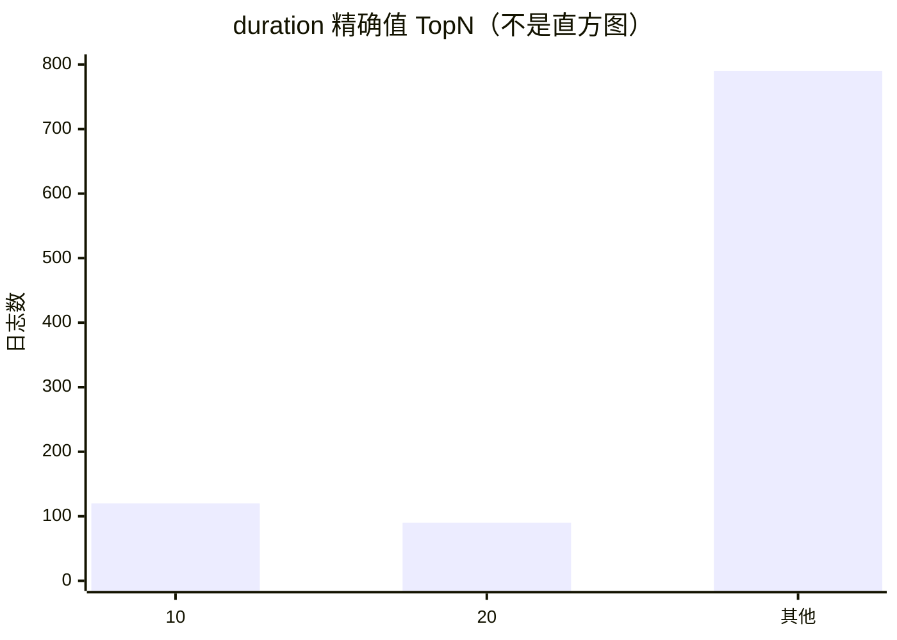

# AI 与程序统计前端联调指南

本文按页面操作串联统计能力：从哪张检索卡片进入、何时调用接口、如何等待结果，以及重新打开和重试时如何恢复。具体请求参数、字段类型、枚举、限制和请求响应样例，请在当前联调环境的 `/swagger/` 查看；机器协议为 `/api/schema/`。下文保留的字段用于说明接口之间的关联和页面行为。

会话、消息、认证、公共响应处理及 SSE 实现见[公共联调指南](frontend_integration.md)。本文只说明稳定的联调链路和渲染语义，环境进展与验收记录不在此维护。

## 1. 先看完整用户路径



| 页面决策 | 程序统计 | AI 统计 |
| --- | --- | --- |
| 用户提供什么 | 选择一个字段，可调整类别数和时间粒度 | 填写统计需求 |
| 统计什么范围 | 来源成功检索的完整范围 | 来源为初始上下文，Agent 可按需求调整 |
| 如何等待 | 轮询附件详情 | 同样可轮询；需要过程时选用 SSE |
| 成功后展示什么 | 后端固定统计包，由前端绘图 | `output_data.content` 原文，由前端按与 Agent 的约定解析 |

两类统计当前均异步执行。创建后按返回的 status 进入等待或终态，不假设响应已经包含 output_data。

| attachment_type | input_data | SUCCESS 时的 output_data |
| --- | --- | --- |
| FIELD_STATISTICS | field，可选 top_n/interval | 固定统计包：overview/distribution/time_series/numeric_summary |
| AI_STATISTICS | instruction | content 原文，格式由 Agent Skill 与前端约定 |

Swagger 的嵌套 oneOf 不会自动关联外层 attachment_type；前端按此映射选择输入和解释输出。
程序统计与 MCP 类别聚合默认 Top10，可显式调整；部署预算可收紧上限，以后端校验为准。已有附件保留创建时的参数。
前端固定包补齐时间轴；MCP 返回稀疏时间桶并收敛展示比例精度，两者共享统计口径而不共用响应形状。

统计是来源消息上的附件，不会新增消息。同一检索卡片可以有多个统计附件，每个附件独立保存、展示和重试。

## 2. 进入统计面板：先绑定来源卡片

从当前用户的成功 LOG_SEARCH 卡片进入，保存**该卡片的消息 UID**，后续创建请求始终使用它，不用“最新一条消息”推测来源。程序统计针对完整检索范围，不针对卡片预览行。

页面筛选条件修改但尚未执行时，旧卡片仍代表旧查询。程序统计需要按新范围计算时，应先完成新检索，再从新卡片进入；AI 统计可以从原卡片提交新的统计指令，由 Agent 按需求调整有权限的查询范围，附件仍归属原卡片。打开历史卡片时，如果页面只有摘要，先读取消息详情；字段探索使用该消息 `input_data.condition` 中的完整条件，不用当前条件编辑器中的草稿替换。

程序统计进入字段选择步骤；AI 统计直接进入需求输入，不要求前端先探索字段或调用统计工具。

## 3. 程序统计：选字段 → 创建 → 展示

### 选择字段

打开字段选择器时，调用 `POST /api/v1/query/namespaces/{namespace}/collector_query/field_metadata/`，namespace 沿用页面已有的租户上下文，并使用来源消息的完整检索条件。此处是 Web 接口，前端无需接 MCP 网关。

初次请求获取根字段。用户展开可展开的 JSON 字段时，用返回的字段引用作为 parent_field 再请求下一层；保留返回引用中的完整路径，不自行拼接字段名称。继续展开不会创建统计附件。

目录中的可展开提示决定是否展示展开入口，统计能力提示决定是否提供选择操作；字段可以可展开但本身不可统计。选中可统计字段后保留其 `field` 引用，供创建附件使用。目录加载失败留在选择器中提供重新加载，不创建附件。

目录根据声明和样本提供提示，可能未覆盖所有 JSON key，也不保证全量执行一定成功。最终遇到类型或权限变化，按附件执行错误处理。

### 确认并创建

用户确认字段后，调用 `POST /api/v1/ai_assistant/messages/{searchMessageUid}/attachments/`，类型选 FIELD_STATISTICS，业务输入使用选中的字段及需要调整的统计选项。无需让用户再选择统计类型，后端决定是否增加数值摘要；参数默认值、范围与样例见 Swagger。

请求期间禁用本次提交，失败时保留已选字段和选项。成功取得附件 UID 后，将其挂到来源卡片并打开结果面板，按第 5 节处理状态。创建响应也可能已经是终态，不要固定假设一定先进入轮询。

### 将成功产物映射到页面

详情 SUCCESS 后使用 `output_data`，前端不再查询 Doris 或自己汇总日志：

| 页面区域 | 数据来源与衔接 |
| --- | --- |
| 字段标题与概览 | 服务端字段展示名及 overview |
| 类别分布图 | distribution.groups，使用服务端给出的类别、数量与比例 |
| 时间趋势图 | bucket_starts 为横轴；通过 group_id 将 series 与分布类别关联，counts 与横轴一一对应 |
| 数值摘要 | numeric_summary 存在时展示；类别统计不展示该区域 |
| 范围和粒度说明 | 使用响应的实际查询范围、effective_interval 和 timezone |

渲染时保留以下口径：

- `group_id` 用于关联，不解析其内容；“其他”“缺失”按 kind 判断，不能靠文字匹配。真实值也可能叫“其他”，数字与字符串同名也不能合并。
- 分布与时序共用全范围 TopN。OTHER/MISSING 是额外类别，保留它们，不在各时间桶重新排名或重新计算比例。空桶已经补齐。
- 空字符串与缺失不同；比例为小数，展示时转换为百分比，null 显示无数据。空结果是成功空态，不是执行失败。
- 数值摘要针对完整范围，中位数为近似值。实际时间粒度可能由 AUTO 决定，按返回值展示。

这些约定影响图表含义；完整字段定义与取值约束仍以 Swagger 为准。

### 3.1 FIELD_STATISTICS 结果如何映射为前端组件

`FIELD_STATISTICS` 返回的是与组件无关的语义数据包，不直接返回 ECharts option、AntV 配置或某个 UI 组件的 props。前端可以根据同一份数据适配 ECharts、AntV、表格或自定义组件；不要把 `group_id` 当作展示文案，也不要根据接口字段名猜图表类型。

#### 先回答两个协议问题

**字段类型怎么来：**

| 场景 | 类型来源 | 作用 |
| --- | --- | --- |
| 普通根字段 | 服务端 `COLLECT_SEARCH_CONFIG` 的字段声明，目录返回 `type_source=DECLARED` | 声明为 `int/long/float/double/timestamp` 时，统计能力提示为 `NUMERIC` |
| JSON 子字段 | 字段目录读取脱敏样本，返回 `type_source=INFERRED` 和 `observed_types` | 只用于字段探索和能力提示；样本为空、对象、数组时不能据此认为可做数值统计 |
| `FIELD_STATISTICS` 最终结果 | 重新按完整查询范围统计，不信任客户端传入的 `field_type`，也不只看样本 | `statistics_kind` 才是本次结果的最终类型：声明数值字段，或全范围非空值全部为原生数字时为 `NUMERIC`；其余可统计标量为 `CATEGORICAL` |

因此，字符串 `"120"` 仍是字符串，不能由前端把它改成数字；`null`/缺失不算字段值。字段目录中的类型是“可选字段提示”，最终统计结果以 `statistics_kind` 和 `numeric_summary` 为准。完整范围出现对象、数组等不支持类型时会执行失败，应按附件 FAILED 处理，不会自动降为类别统计。

**百分比怎么展示：**程序统计与 MCP 的比例统一以 0～1 数值返回，保留小数点后四位。例如计算值 `0.472934282` 返回 `0.4729`，前端乘 100 后显示 `47.29%`。页面百分比保留两位即可。JSON 数字不补尾零，`0.6` 与 `0.6000` 含义相同，页面均显示 `60.00%`。

`null` 显示“—”；计数为 0 时显示 `0.00%`。极小的正比例可能舍入为 0，因此不能用 `ratio === 0` 判断没有日志；需要精确显示时用 `count / total_count` 重算，非零且小于 `0.01%` 可显示 `<0.01%`。存在率对应使用 `present_count / total_count`。各组分别舍入后合计可能不是 100%，无需改写计数凑齐；图形使用原始 `count`，计数和其他数值指标不受比例精度规则影响。

下面用同一份示例统计数据说明分布与时序的对应关系，示例数值用于说明协议。

推荐的结果面板结构如下：

```text
字段标题 / 查询范围 / 实际粒度
        |
概览 KPI：总日志数、字段存在数、缺失数、存在率
        |
类别分布：TopN 条形图或环形图
        |
时间趋势：折线图、堆叠柱状图或堆叠面积图
        |
数值摘要（NUMERIC）：最小值、最大值、平均值、中位数
        |
查询信息：系统、时间范围、时区、耗时、TopN
```

#### 最小映射

一份成功响应可以直接拆成以下组件：`overview` → KPI 卡片，`distribution.groups` → 类别条形图/饼图，`time_series` → 折线图/堆叠柱状图，`numeric_summary` → 数值摘要卡片，`query_summary` → 查询信息条。图表配置仍由前端适配，不由后端返回 ECharts option。

| 响应字段 | 业务含义 | 推荐组件 | 前端处理规则 |
| --- | --- | --- | --- |
| `field` | 服务端确认的字段标识和展示名 | 标题、面包屑、字段标签 | 标题优先使用 `display_name`；请求和唯一定位保留 `raw_name + keys` |
| `statistics_kind` | `CATEGORICAL` 或 `NUMERIC` | 页面布局分支 | `NUMERIC` 显示数值摘要；`CATEGORICAL` 的 `numeric_summary` 必须视为 `null` |
| `overview` | 完整检索范围的存在性统计 | KPI 卡片、进度条、完整性环图 | `total_count` 是总日志数；`present_ratio` 是 0–1 小数，展示百分比时再乘 100 |
| `distribution.groups` | 全范围 TopN 类别及 `OTHER/MISSING` | 横向条形图、环形图、排行列表、分布表格 | 少量类别可用环图；类别较多优先横向条形图；使用 `kind` 判断合成组 |
| `time_series.bucket_starts` + `series` | 各类别按时间桶的数量变化 | 折线图、堆叠柱状图、堆叠面积图、趋势表格 | 横轴使用 `bucket_starts`；每条序列通过 `group_id` 找到类别；`counts` 与横轴等长 |
| `numeric_summary` | 完整范围的原生数值摘要 | 四个数值卡片、摘要表格 | 可展示 min/max/avg/median；`median` 必须标记为近似值；`valid_count` 可说明样本量；成功结果的 `conversion_failed_count` 当前固定为 0，不表示支持字符串数值转换 |
| `query_summary` | 实际执行范围、粒度和预算信息 | 查询信息条、筛选条件标签、折叠详情 | `returned_count` 是聚合 rows 数，不是日志总数；总数使用 `overview.total_count` |

#### 按 `statistics_kind` 选择布局

| 类型 | 默认布局 | 可以展示 | 不应做的事情 |
| --- | --- | --- | --- |
| `CATEGORICAL` | 概览 + 类别分布 + 时间趋势 | 用户名、操作类型、系统 ID、布尔值等的 TopN 和趋势 | 不显示数值摘要；不要把字符串数字当数值排序 |
| `NUMERIC` | 概览 + 数值摘要 + Top 值分布 + 时间趋势 | min/max/avg/median、原生数值 TopN 和趋势 | 不要根据 min/max/median 自行绘制箱线图；接口没有 Q1/Q3 |

#### `distribution.groups` 的渲染方式

`groups` 中每一项的 `value` 保留原始标量类型：

- `value_type=string`：按字符串展示和比较；即使内容是 `"120"`，也不能当作数字。
- `value_type=number`：按数字格式化，并可进行数值排序。
- `value_type=boolean`：按前端约定展示为“是/否”或 true/false。
- `kind=VALUE`：`value` 是真实日志值。
- `kind=OTHER`：TopN 之外的非缺失值总和，展示为“其他”。
- `kind=MISSING`：字段缺失或为 null，展示为“缺失”。

`OTHER` 和 `MISSING` 不占 `top_n` 名额，因此最终组数可能是 `top_n + 2`。真实值可能刚好叫“其他”或“缺失”，所以不能通过文字判断合成组。组件 key、图表关联均使用 `group_id`，不能使用格式化标签作为类别身份。同名时区分显示：数字 `120` 与字符串 `"120"` 可标注“120（数字）”“120（字符串）”；空字符串显示“空字符串”，真实值“其他”显示“其他（原始值）”。图表库若按名称操作图例，也要使用这些可区分的名称。

适配图表时：

```text
图例/标签：VALUE 用 value，OTHER/MISSING 用前端固定文案
数据值：使用 count
百分比：使用 ratio；total_count=0 时允许为 null
稳定关联：使用 group_id，但不解析 group_id 的内部格式
```

#### `time_series` 的渲染方式

- `bucket_starts` 是按时间升序排列的完整横轴。
- `series[].group_id` 对应 `distribution.groups[].group_id`。
- `series[].counts[i]` 对应 `bucket_starts[i]`，长度必须一致。
- 一个类别时适合折线图；多个类别时适合多折线、堆叠柱状图或堆叠面积图。
- `requested_interval=AUTO` 时，展示粒度应使用 `effective_interval`，不能把 AUTO 当作实际时间单位。
- 时间轴和桶划分使用 `timezone`，前端不要再次按本地时区转换后重新分桶。

#### 典型结果与组件示例

下面的 JSON 是绘图字段节选，不是完整接口响应；完整必填字段见 Swagger。Case 1 与 Case 2 来自同一份结果，类别、合计和比例一致。

**Case 1：用户名分布 → 横向条形图或饼图**

```json
{
  "statistics_kind": "CATEGORICAL",
  "overview": {"total_count": 1000, "present_count": 980, "missing_count": 20, "present_ratio": 0.98},
  "distribution": {
    "top_n": 2,
    "has_other": true,
    "groups": [
      {"group_id": "g1", "kind": "VALUE", "value_type": "string", "value": "alice", "count": 600, "ratio": 0.6},
      {"group_id": "g2", "kind": "VALUE", "value_type": "string", "value": "bob", "count": 280, "ratio": 0.28},
      {"group_id": "g3", "kind": "OTHER", "value_type": null, "value": null, "count": 100, "ratio": 0.1},
      {"group_id": "g4", "kind": "MISSING", "value_type": null, "value": null, "count": 20, "ratio": 0.02}
    ]
  }
}
```

前端得到：`labels = [alice, bob, 其他, 缺失]`，`values = [600, 280, 100, 20]`；tooltip 百分比使用 `ratio * 100` 并保留 2 位。



同一组数据也可以渲染为：



**Case 2：同一份用户名统计 → 按小时折线图**

沿用 Case 1 的 `overview` 和 `distribution`，同一份产物的 `time_series` 如下，四个组均完整保留：

```json
{
  "time_series": {
    "requested_interval": "HOUR",
    "effective_interval": "HOUR",
    "timezone": "Asia/Shanghai",
    "bucket_starts": [
      "2026-09-18T10:00:00+08:00",
      "2026-09-18T11:00:00+08:00",
      "2026-09-18T12:00:00+08:00",
      "2026-09-18T13:00:00+08:00"
    ],
    "series": [
      {"group_id": "g1", "counts": [120, 150, 90, 240]},
      {"group_id": "g2", "counts": [80, 70, 40, 90]},
      {"group_id": "g3", "counts": [20, 30, 30, 20]},
      {"group_id": "g4", "counts": [5, 0, 5, 10]}
    ]
  }
}
```

`g1` 关联 alice，四个桶合计 600；`g2` 关联 bob，合计 280；其他组 100、缺失组 20，全部序列合计 1000。`counts[i]` 与 `bucket_starts[i]` 一一对应，值为 0 的桶也保留。

组件适配步骤如下，`displayLabel` 按上文规则处理合成组、空字符串和同名值：

```javascript
const groupById = new Map(output.distribution.groups.map(group => [group.group_id, group]));
const xAxis = output.time_series.bucket_starts;
const lines = output.time_series.series.map(series => ({
  id: series.group_id,
  name: displayLabel(groupById.get(series.group_id)),
  data: series.counts,
}));
```

这是组件中间数据，实际 ECharts/AntV 配置由前端适配。图中四条线按顺序为 alice、bob、其他、缺失：



**Case 3：数值分布 → 精确值 TopN 条形图**

```json
{
  "statistics_kind": "NUMERIC",
  "numeric_summary": {
    "min": 1, "max": 980, "avg": 86.5, "median": 42,
    "median_is_approximate": true, "valid_count": 1000, "conversion_failed_count": 0
  },
  "distribution": {
    "top_n": 2,
    "groups": [
      {"group_id": "g1", "kind": "VALUE", "value_type": "number", "value": 10, "count": 120, "ratio": 0.12},
      {"group_id": "g2", "kind": "VALUE", "value_type": "number", "value": 20, "count": 90, "ratio": 0.09},
      {"group_id": "g3", "kind": "OTHER", "value_type": null, "value": null, "count": 790, "ratio": 0.79}
    ]
  }
}
```

数值字段仍可展示摘要卡片和按时间的日志计数趋势；下面仅说明数值分布。它可以画成精确值排行，但它**不是直方图**：`10` 和 `20` 是两个真实值，`OTHER` 是 TopN 之外的合计。



**Case 4：空结果和全缺失不是同一种空态**

| 情况 | API 特征 | 页面表现 |
| --- | --- | --- |
| 查询没有日志 | `total_count=0`、`present_ratio=null`、`groups=[]` | 成功空状态，显示“该查询范围没有日志” |
| 有日志但字段全缺失 | `total_count>0`、`present_count=0`、`missing_count=total_count` | 显示“有日志但字段无值”，保留 `MISSING` 组；不要显示成无日志 |

#### 当前接口明确不返回的内容

当前 `FIELD_STATISTICS` 是固定语义数据包，不返回以下内容：

- ECharts/AntV 的最终配置对象；
- 后端指定的唯一图表类型；
- 原始日志明细表；
- 直方图分桶、四分位数 Q1/Q3、P95/P99 等未定义统计量；
- 每个时间桶重新排名后的 TopN。

因此前端负责“数据到组件”的适配，后端负责统计口径和结果完整性。若后续需要直方图、箱线图或后端统一图表配置，应新增明确的结果字段或独立接口，不能从当前字段推导出不存在的数据。

## 4. AI 统计：填需求 → 创建 → 解析产物

用户填写统计需求后，使用相同创建附件接口，类型选 AI_STATISTICS，业务输入为 instruction。无需前端拼系统提示词、探索字段或调用聚合接口；后端和 Agent 完成查询执行。

提交失败保留需求草稿。创建成功保存附件 UID，挂到来源卡片，并按第 5 节选择仅看结果或展示过程。

SUCCESS 后读取 `output_data.content`。这是最终消息原文，不保证是 JSON；图表标记和 ECharts 格式由前端与 Agent skills 协同约定，后端不解析。联调前应确认该约定已在统计 Agent 配置中生效，否则仍可得到成功文本，但不一定能渲染为图表。

解析失败时保留原文查看入口，提示图表展示异常；不要将附件当作执行失败或自动重试。中间文字和工具结果属于过程，不拼接成最终产物。AI 可以调整查询范围，因此不能直接把来源卡片范围标成图表实际范围；若页面需要展示实际范围，由前端与 Agent 输出约定提供。

## 5. 等待结果：轮询是通用方式，SSE 按需接入

所有异步附件都可以直接轮询 `GET /api/v1/ai_assistant/attachments/{uid}/`。`is_stream=true` 只表示支持过程订阅，不要求前端连接 SSE。

| 详情状态 | 页面下一步 |
| --- | --- |
| PROCESSING | 保持生成态，继续轮询；需要过程且支持流时，可切换为快照 + SSE |
| SUCCESS | 停止等待，按附件类型读取最终产物并渲染 |
| FAILED | 停止等待，展示 error_message 和重试入口 |

只看结果时无需快照、execution_id 或游标。按附件 UID 更新面板，合理设置轮询间隔，网络故障时退避；离开页面和进入终态时停止轮询。一次详情请求失败只重读，不重复创建附件，也不自行认定任务 FAILED。

选择展示 AI 生成过程时，链路为：**读快照 → 恢复已有过程 → 订阅后续 SSE → 收到 platform.stream_end → 重新读详情**。完整事件注册、游标和断线恢复使用[公共指南的流式章节](frontend_integration.md#流式附件先快照再增量最后详情)，不在本专题重复实现。

Agent 的消息结束或运行结束事件都不替代附件终态。最终结果始终读取详情；即便过程无法完整恢复，仍可以通过详情获得产物。

## 6. 重新打开、重试与改变需求

| 用户动作 | 调用衔接与页面行为 |
| --- | --- |
| 刷新页面或从原卡片重新打开 | 从消息附件摘要或附件列表找到 UID → 读取附件详情 → 终态展示结果，PROCESSING 恢复轮询或可选过程订阅；不重新创建 |
| 查看该卡片已有统计 | `GET /api/v1/ai_assistant/attachments/` 按 source_message_uid 和统计类型筛选；列表是摘要，点击后读详情 |
| 失败后原样重试 | `POST /api/v1/ai_assistant/attachments/{uid}/retry/` → 保留附件 UID → 按返回状态恢复等待 |
| 更换字段、统计选项或 AI 需求 | 从来源消息创建新附件，保留原结果；不能修改原附件 input_data 来重跑 |
| 更换程序统计范围 | 先完成新的检索，再从新消息创建附件 |
| 修改标题 | PATCH 原附件，成功后更新卡片和列表标题 |

仅轮询的页面在重试成功后继续读原附件详情，无需等待执行标识。使用 SSE 时先关闭旧连接，等待新的 execution_id 后恢复；排队期间读到旧快照不能当作本轮结果。切换卡片后，迟到的请求或旧流事件不能覆盖新面板。

创建请求超时、无法确定是否成功时，先刷新该来源消息的附件列表核对，不立即重复提交。重试请求结果不确定时也先读原附件状态。

创建时的校验错误直接在输入面板展示；已创建后的执行错误从详情展示。权限或字段错误需修正选择/条件，预算错误可减少类别数、调整粒度或缩小检索范围后新建，暂时性故障可原样重试。错误码与参数约束见 Swagger，不按内部错误文案推断业务分支。

错误处理分两层：字段探索/创建/详情/重试请求失败时按 HTTP 与平台 code 处理；详情请求成功但 status=FAILED 时，按附件 error_code/error_message 展示执行失败。预算或字段问题需修改输入后新建，暂时性查询故障可原对象重试。处理中的重复重试应恢复轮询，不重新创建。

Swagger 提供人工可读的协议与样例；全量 OpenAPI 的代码生成兼容性需单独验证，不能以 /api/schema/ 返回成功作为严格校验通过的依据。

两种统计均可改标题，不支持编辑产物或后端导出。反馈按 supports_feedback 展示，AI 统计复用公共附件反馈链路。不要复用 AI_ANALYSIS 的正文编辑、Markdown 取值或报告下载逻辑。

## 7. 按用户路径完成联调

先走两条成功路径：

1. 成功检索 → 打开字段目录 → 展开并选择字段 → 创建程序统计 → 轮询 → 展示概览、分布、时序及适用的数值摘要 → 刷新后重新打开同一结果。
2. 从同一卡片填写 AI 需求 → 创建 AI 统计 → 仅轮询获取结果 → 按约定解析渲染；若页面需要生成过程，再单独走快照/SSE 和断线恢复路径。

再检查失败与边界：空数据、缺失与其他类别、不可统计字段、权限变化、执行失败后重试、切换卡片时迟到响应、创建结果不确定时的核对、AI 文本不符合图表约定时的原文降级。同一卡片多份产物应互不覆盖。

联调开始前由后端确认环境可用、统计 Agent 已配置，由前端与 Agent 配置方确认图表输出约定。真实环境验收仍需按上述页面路径完成，已有自动化测试不替代该验收。Agent 生成质量评估另行跟进。报障保留环境、请求路径、附件 UID、执行标识（使用流时）及复现动作。
