# Message 与 Attachment Handler 接入指南

本文面向自然语言检索、日志检索、统计和 AI 分析模块开发者。平台负责对象生命周期、快照校验、
任务 fencing、接口返回和可观测性；接入者只定义业务类型、输入/上下文/输出协议和执行逻辑。

## 接入架构

```mermaid
flowchart LR
    FE[前端] --> API[Message / Attachment Resource]
    API --> SVC[Platform Service]
    SVC --> REG[Handler Registry]
    REG --> PREP[Handler.prepare]

    PREP --> MODE{execution_mode}
    MODE -->|SYNC| EXEC[Handler.execute]
    EXEC --> VALIDATE[output_model 校验]
    VALIDATE --> SUCCESS[(MySQL SUCCESS 快照)]

    MODE -->|ASYNC| PROCESSING[(MySQL PROCESSING 快照)]
    PROCESSING -->|transaction.on_commit| MQ[RabbitMQ]
    MQ --> TASK[业务 Celery Task<br/>平台装饰器承载]
    TASK --> GUARD[Execution Service<br/>状态与 task_id fencing]
    GUARD --> BUSINESS[业务 Task 函数]
    BUSINESS --> RESULT[输出校验与终态 CAS]
    RESULT --> SUCCESS
```



平台只编排生命周期和协议校验，不接管业务逻辑与 Celery 调度参数。业务接入点集中在 Handler 的
类型声明、`prepare()`、同步 `execute()` 或异步 Task 函数；其余状态流转由平台统一完成。

## 1. 先选对象类型

- 用户发起一次输入并获得直接响应：使用 `MessageTypeHandler`。
- 基于一条成功消息生成分析、统计、报告等独立产物：使用 `AttachmentTypeHandler`。
- 不要用 Attachment 表达下一次检索，也不要用 Message 表达报告或图表附件。

新增类型需要先扩展 `constants.py` 中的 `MessageType` 或 `AttachmentType`。平台首期枚举是固定
产品协议，业务不能用任意字符串绕过注册校验。

## 2. 快照协议

每种类型都声明三个 `MessageSchema` 子类：

- `input_model`：前端提交并原样留存的业务输入；
- `context_model`：`prepare()` 构造的执行上下文，只在后端内部使用；
- `output_model`：同步返回或异步 Task 最终返回的产物协议。

写入和读取都会经过 Pydantic。未知字段默认拒绝，不能把临时运行对象、数据库 Model 或客户端
连接放入 JSON 快照。`context_data` 不对外返回，敏感信息仍应遵守最小化存储原则。

## 3. 同步消息示例

```python
class SearchInput(MessageSchema):
    query: str


class SearchContext(MessageSchema):
    system_ids: list[str]


class SearchOutput(MessageSchema):
    filters: dict


class NaturalLanguageSearchHandler(
    MessageTypeHandler[SearchInput, SearchContext, SearchOutput]
):
    message_type = MessageType.NATURAL_LANGUAGE_SEARCH
    execution_mode = ExecutionMode.SYNC
    input_model = SearchInput
    context_model = SearchContext
    output_model = SearchOutput

    def prepare(self, *, user, conversation, parent_message, input_data):
        # 父消息状态、类型和省略时如何兜底，都由当前业务类型在这里决定。
        return MessagePreparation(
            parent_message=parent_message,
            context_data=SearchContext(system_ids=["system-a"]),
        )

    def execute(self, *, input_data, context_data):
        return SearchOutput(filters={"query": input_data.query})
```

同步执行异常时不会创建 Message；输出不符合 `output_model` 时请求失败，不允许部分结果落库。

## 4. 异步消息示例

```python
@message_execution_task(
    name="audit.execute_natural_language_search",
    queue="audit_ai",
    acks_late=True,
)
def execute_search(self, execution):
    # execution.message / input_data / context_data 已由平台加载并类型化。
    result = call_business_service(execution.input_data, execution.context_data)
    return SearchOutput(filters=result)


class AsyncNaturalLanguageSearchHandler(NaturalLanguageSearchHandler):
    execution_mode = ExecutionMode.ASYNC
    async_task = execute_search
```

装饰器原样透传 Celery 配置。平台固定 `bind=True` 和 Task 基类，业务不要覆盖它们。调用
`self.retry()` 时不要替换平台投递的 `args/kwargs`，也不要使用 `throw=False`。RabbitMQ 是
至少一次投递，外部写操作必须由业务通过幂等键、状态检查或上游能力保证可重复执行。

业务配置的 Retry `countdown`/`eta` 必须小于对应对象的巡检硬失效阈值：消息使用
`AI_ASSISTANT_MESSAGE_FAILURE_SECONDS`，附件使用 `AI_ASSISTANT_ATTACHMENT_FAILURE_SECONDS`。
平台一期不持久化 Celery 的下一次执行时间；等待时间超过该阈值时，巡检会把仍为
`PROCESSING` 的对象收敛为失败，后续重投将被 task ID/status fencing 忽略。

## 5. Attachment 扩展能力

Attachment 的 `prepare()` 返回 `AttachmentPreparation(title, context_data)`。同步 Handler 实现
`execute(execution=...)`；异步 Handler 使用 `@attachment_execution_task` 并绑定 `async_task`。

可选能力：

- `supports_feedback = True`：接口返回可反馈标记；平台统一保存用户当前反馈。
- 覆写 `edit_output()`：开放成功产物编辑；平台仍按 `output_model` 校验输入和返回值。
- 声明 `export_formats` 并覆写 `export()`：开放即时文件导出，不创建导出附件。
- `is_stream = True`：仅异步附件可用；业务通过 `execution.stream.send(data)` 写 UI 事件。

流式业务只提交可 JSON 编码的 `data`，不构造平台事件、Redis key 或 SSE 帧。详细约束见
[流式传输设计](../streaming/README.md)。

## 6. 注册与 OpenAPI

在业务 Django App 的 `AppConfig.ready()` 中注册 Handler：

```python
def ready(self):
    message_handler_registry.register(AsyncNaturalLanguageSearchHandler())
    attachment_handler_registry.register(AIAnalysisAttachmentHandler())
```

必须在首次 OpenAPI schema 生成前完成注册。动态字段会根据当时已注册 Handler 生成 `oneOf`；
进程启动后热注册不保证刷新 schema。`input_data` / `output_data` 的类型判别字段位于外层对象，
嵌套 JSON 本身不携带 discriminator。

## 7. 校验职责

平台统一负责：

- 当前用户、会话和来源消息的可见性；
- 显式父消息同用户、同会话；
- Attachment 来源消息必须为 `SUCCESS`；
- Pydantic 输入、上下文和输出解析；
- 异步状态、task ID fencing、失败映射和手动重试 CAS。

业务 Handler 负责：

- 父消息或来源消息的具体类型、顺序和业务状态约束；
- 省略父消息时是否查找最新系统选择消息；
- 外部权限、系统范围、查询参数和业务上下文构造；
- Celery 队列、重试、超时、确认策略及外部副作用幂等；
- Retry `countdown`/`eta` 小于对应消息或附件的巡检硬失效阈值；
- 业务异常中不得携带敏感输入或日志正文。

手动重试不重新调用 `prepare()`，而是复用持久化 input/context 快照并投递新 task ID。若权限或
依赖必须实时检查，应在业务 Task 中执行。

## 8. 接入测试清单

至少覆盖：

1. 注册定义错误和重复注册；
2. input/context/output 的合法与非法快照；
3. 同步成功、异常和输出契约失败；
4. 异步成功、最终失败、`self.retry()`、重试耗尽、重复投递及 Retry 等待时间约束；
5. 手动重试只允许 `FAILED + ASYNC`，旧 task ID 不能回写；
6. 用户、会话、父消息或来源消息越权；
7. 开放的反馈、编辑、导出和流式能力；
8. 真实 RabbitMQ/Celery 集成测试，验证接入任务而不只 mock 平台方法。
