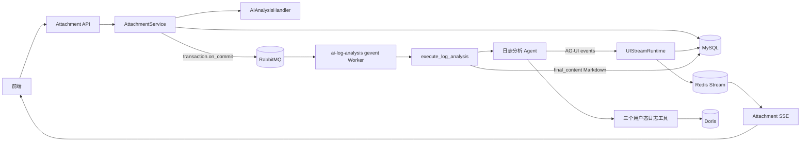
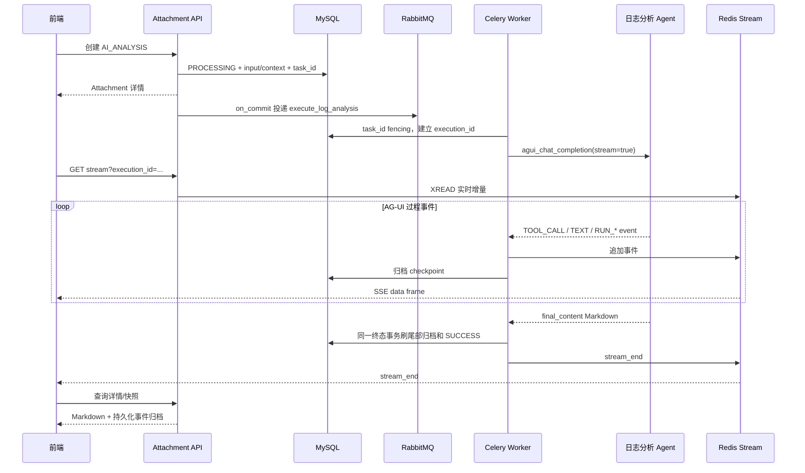

# 日志分析报告接入

日志分析报告是从一条成功 `LOG_SEARCH` 消息派生的流式 `AI_ANALYSIS` Attachment。MySQL 保存
状态、执行快照、事件归档和最终 Markdown；Redis Stream 只承载实时增量；Celery 使用专属
`ai_assistant_log_analysis` 队列调用日志分析 Agent。

## 组件架构



Handler 负责来源和快照协议，平台负责创建、投递、task fencing、重试和终态收敛，业务 Task 只
构造 Agent 请求、透传事件并返回最终 Markdown。Agent 查询日志时使用
[`query/ai_assistant/README.md`](../../query/ai_assistant/README.md) 中的三个受控工具。

## 创建与快照

创建入口：

```http
POST /api/v1/ai_assistant/messages/{message_uid}/attachments/
Content-Type: application/json

{
  "attachment_type": "AI_ANALYSIS",
  "input_data": {
    "analysis_mode": "CUSTOM",
    "instruction": "按操作人汇总异常行为"
  }
}
```

`DEFAULT` 模式不接收 `instruction`，而是在创建时读取全局默认 Prompt；`CUSTOM` 模式必须提供
非空指令。两种模式都会把最终有效指令固化到内部 Context，之后修改全局 Prompt 不影响历史
Attachment 或手动重试。

Handler 只接受当前用户可见、状态为 `SUCCESS` 的 `LOG_SEARCH` 来源，并校验输入条件、来源
Context 和查询摘要属于同一次检索。Context 只保存：

- 有效指令、`search_condition` 和 `total/took_ms/executed_at` 查询摘要；
- 当前用户名、时区、语言和内部使用的 namespace；
- 不保存日志样例、结果列、SQL、消息/附件数据库 ID。

Worker 发给 Agent 的 `input` 进一步去掉 namespace，只包含指令、检索条件、轻量摘要以及用户的
用户名/时区/语言。调用固定使用 `agent_code=bp-ai-log-analyse`、空 `chat_history` 和
`execute_kwargs={"stream": true}`；Agent 的每次工具调用仍按该用户名实时鉴权。

## 流式时序与终态



AG-UI 事件按原始 JSON 透传为默认 SSE `data` 帧，平台只增加命名事件 `stream_reset` 和
`stream_end`。`final_content` 是最终业务事实，只有非空且满足 Markdown 大小限制时才写入
`output_data.markdown`；Agent 的 `final_result` 不持久化。成功时实时收到的事件顺序与 MySQL
归档一致，终态之后 Redis 过期不会丢失报告或历史快照。

前端接入顺序：

1. 创建后轮询 `GET /api/v1/ai_assistant/attachments/{uid}/stream/snapshot/`。排队期间
   `execution_id` 允许为空；待其非空后，使用持久化事件和最新游标建立
   `GET .../stream/?execution_id=...` SSE。若轮询期间 Attachment 已进入终态，则直接读取详情，
   不再建立实时流。
2. 使用 `Last-Event-ID` 续传；连接关闭或收到 reset 后重新读取流快照和附件详情。
3. 收到 `stream_end` 后关闭连接，以 MySQL 详情中的 `status/output_data/error_code` 为最终结果。
4. SSE 300 秒无业务事件会主动关闭；heartbeat 和平台事件不刷新空闲窗口。

## 失败、重试与重投

- Agent `RUN_ERROR` 会先按 AG-UI 事件归档，随后任务以公开脱敏错误收敛 `FAILED` 并追加
  `stream_end`；HTTP 中断或非法最终内容同样由平台失败链路收口。
- 手动重试仅允许 `FAILED` 异步 Attachment。它复用原对象和创建时快照，生成新的 `task_id`、
  `execution_id` 和 Redis key；旧流收到 `stream_reset`，旧 Worker 的回写被 task fencing 拒绝。
- `acks_late=True`。Worker 硬退出时 RabbitMQ 可重投同一 task ID；平台允许重复执行，最终通过
  MySQL `status + task_id` CAS 决定唯一终态。业务调用不是 exactly-once，Agent/工具应按此设计。
- 用户 A 不能读取、重试、编辑、导出或订阅用户 B 的 Attachment；Worker Context 也不使用
  全局可变用户状态。

## 编辑、导出与生命周期

成功报告允许完整替换 `output_data.markdown`，并更新 `content_updated_at`；编辑不修改来源检索
快照。导出入口为 `GET /api/v1/ai_assistant/attachments/{uid}/export/?export_format=MARKDOWN|PDF`，
文件按当前 Markdown 实时生成且不在平台留存。失败 Attachment 不能导出，重试成功后才恢复
编辑与导出能力。

## 超时与部署

生产 Worker 在 `app_desc.yaml` 中以 `ai-log-analysis` 独立进程部署：监听
`ai_assistant_log_analysis`，gevent pool，`--prefetch-multiplier=1`，默认并发 32、2 个副本。

| 配置 | 默认值 | 语义 |
| --- | --- | --- |
| `BKAPP_AI_ASSISTANT_LOG_ANALYSIS_TASK_RATE_LIMIT` | `5/m` | 每个 Worker 实例的 Celery rate limit，不是集群全局限流 |
| `BKAPP_AI_ASSISTANT_LOG_ANALYSIS_BUSINESS_TIMEOUT` | `1740` 秒 | 可捕获的 gevent 业务超时，按普通异常写 `FAILED + stream_end` |
| `BKAPP_AI_ASSISTANT_LOG_ANALYSIS_TASK_TIMEOUT` | `1800` 秒 | Celery hard limit，仅作 Worker 最终保险 |
| `BKAPP_AI_ASSISTANT_LOG_ANALYSIS_CONCURRENCY` | `32` | 专属 Worker gevent 并发数 |

业务超时必须严格小于 hard limit，非法配置会在 Django 启动时失败。hard kill 可能来不及写业务
终态，依赖 late ack 重投和长期 `PROCESSING` 巡检兜底。

## 可观测与安全

平台按 `business_type=AI_ANALYSIS` 自动记录执行状态、失败码、排队/执行耗时和流运行摘要；专属
队列还需监控 RabbitMQ ready/unacked、Worker 在线数和限流饱和。详细边界见
[`observability.md`](observability.md)。

日志、Metric、Event 和 Trace 禁止记录：分析指令、检索条件值、用户名维度、日志样例、工具请求
与响应正文、生成 SQL、AG-UI 事件正文、最终 Markdown、task ID、execution ID 或对象 UID 维度。
错误对外只返回稳定错误码和脱敏文案，原始 Agent 正文不能进入异常日志。

## 真实组件验证

`tests/test_ai_assistant/special/test_log_analysis_e2e.py` 使用本地 fake HTTP AG-UI 服务，但不 mock
Agent SDK；生产 Task 通过真实 RabbitMQ/gevent Worker 执行，事件进入真实 Redis Stream 和 MySQL
测试库，并通过真实 Gunicorn HTTP/SSE 读取。生产分析 Task 的 Worker SIGKILL 重投、旧执行
fencing、失败终止帧和跨用户 HTTP 流隔离也由同目录日志分析专项测试验证；其余平台专项测试
继续覆盖通用 Redis/MySQL 故障与竞争边界。
