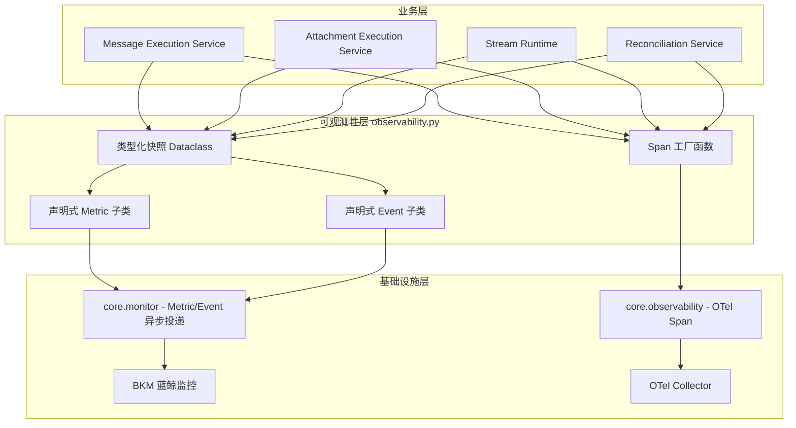
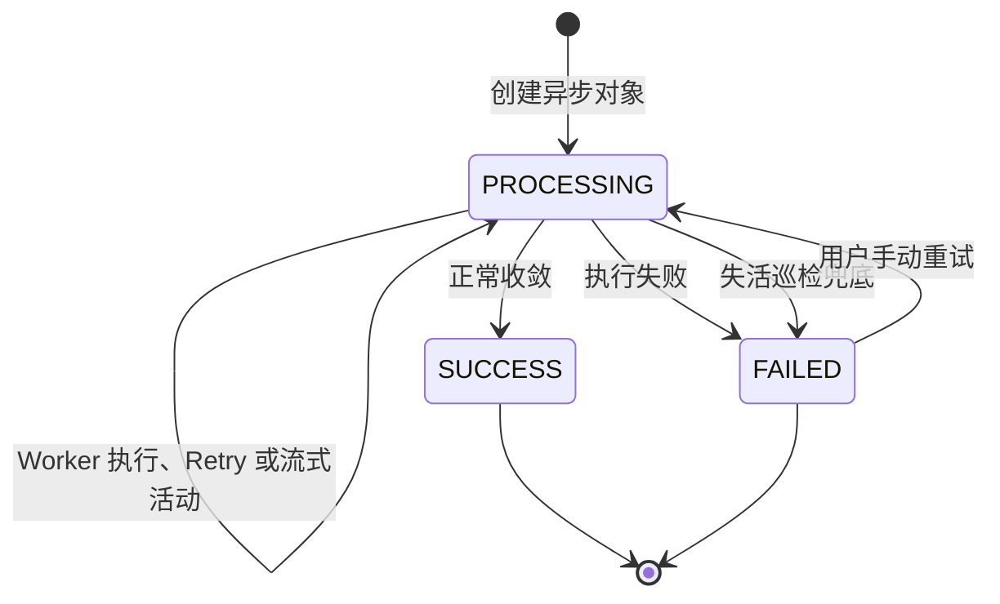

# AI 助手平台可观测性架构

本文面向 AI 助手平台开发者和 Handler 接入者，说明可观测性模块的架构、职责边界与
生命周期约束。Metric/Event 字段、函数调用顺序和异常分支以代码及其注释为准，不在本文
重复维护。BKM 策略、SLO、环境配置和故障处置见
[`docs/ai_assistant_observability.md`](../../../../docs/ai_assistant_observability.md)。
平台总体设计见 [`../README.md`](../README.md)，流式运行与降级语义见
[`../streaming/README.md`](../streaming/README.md)。

## 1. 架构

架构分为三层：

- **业务层**拥有 Message、Attachment、Stream 和巡检的生命周期事实，在状态提交后构造
  类型化观测快照，不直接拼装 BKM payload。
- **可观测性层**把快照转换为声明式 Metric、Event 或 Span。该层不读取业务正文，不参与
  状态决策，也不反向修改领域对象。
- **基础设施层**负责异步投递和链路采集。基础设施异常按最佳努力处理，不改变业务结果。

## 2. 生命周期模型

终态与 SLO 围绕一次平台对象执行而非一次 Celery attempt 建模：

- 创建对象时建立排队和活动时间，Worker、Retry 和流式 checkpoint 只推进当前执行活动；
- 成功或失败终态只由赢得 `status + task_id` 条件更新的执行上报，避免重投和并发 Worker
  重复计数；
- Celery Retry 保持 `PROCESSING`，手动重试则产生新的 `task_id` 并开始新一轮平台执行；
- 巡检以 MySQL 生命周期字段发现失活对象，通过相同的条件更新收敛，不依赖 Celery
  Result Backend、Worker inspect 或 RabbitMQ 状态；
- 流式 Attachment 被巡检收敛时会同时写入 `stream_end` 并把归档提升为至少 `DEGRADED`，
  Redis 通知仍是最佳努力；
- 流式执行的 Redis 实时通道和 MySQL UI 快照都是展示能力，Attachment 最终状态与
  `output_data` 仍是最终事实。

Stream Metric 例外地按每次 Runtime execution 建模。Celery Retry 收敛当前流时会上报
`status=RETRY`，下一 attempt 使用新的 `execution_id` 建立新流。因此 Stream 执行数用于
观察实时通道及重试代价，不应与平台对象终态计数直接对账。

## 3. 核心设计原则

### 3.1 MySQL 是状态事实源

Metric、Event、Trace、Redis 和 Celery 状态都不能决定 Message/Attachment 的业务终态。
所有终态、超时兜底和旧任务隔离最终由 MySQL 条件更新确认。

### 3.2 观测协议类型化

业务模块向可观测性层传递冻结的快照 Dataclass。声明式 Metric/Event 子类集中约束名称、
单位、维度和字段说明，避免调用点使用自由字典形成协议漂移。

### 3.3 观测失败不影响业务

Metric/Event 使用 `core.monitor` 的异步最佳努力投递；Span 使用 `core.observability` 的
fail-open 边界。监控客户端、OTel SDK 或属性写入异常只能记录日志，不能覆盖业务返回值、
Celery Retry 或已提交终态。

### 3.4 控制基数与敏感数据

Metric 维度只允许稳定枚举和布尔值，不包含对象 UID、task ID、execution ID、用户或异常
正文。Event 和 Trace 只在定位需要时携带受控标识。任何观测载荷都不得记录输入、上下文、
最终产物、日志样例或流事件正文。

### 3.5 Event 必须可行动

普通业务失败、正常 Retry、旧任务 fencing 和单次流降级通过 Metric/Trace 观察，不升级为
Event。Event 只表达需要维护者处理的平台异常，例如长期失活收敛、巡检不可用或输出契约
被破坏。

旧 task ID、重复投递和已终态对象属于正常 fencing 控制流。平台在执行 Span 内将其转换为
受控忽略，再向 Celery 抛出 `Ignore`，避免这些投递被 OTel 误标为业务错误。

## 4. 模块职责

| 模块 | 可观测性职责 |
| --- | --- |
| `services/message_execution.py` | Message 开始、终态和输出契约异常 |
| `services/attachment_execution.py` | Attachment 开始、终态和输出契约异常 |
| `streaming/runtime.py` | 一次流执行的容量、降级、截断和收敛汇总 |
| `services/reconciliation.py` | PROCESSING 存量、硬失活收敛和巡检结果 |
| `observability.py` | 类型化快照、声明式协议和 Span 工厂 |
| `core/monitor.py` | Metric/Event 投递与异常隔离 |
| `core/observability.py` | OTel Span 创建、上下文传播与 fail-open |

## 5. 接入约束

- Handler 不直接上报平台生命周期 Metric/Event，也不需要感知巡检实现；平台从既有执行
  生命周期自动观测。
- 新增业务类型应复用现有 `business_type` 维度，不为每个 Handler 创建独立指标。
- 新增 Metric 前先确认现有指标无法表达，并评估维度基数、SLO 或告警用途。
- 新增 Event 必须同时定义触发条件、维护动作和恢复条件，不能把普通业务异常提升为 Event。
- 新的活动刷新点必须代表 Worker 的真实进展，浏览器连接、详情读取等用户行为不能续活任务。
- 修改具体字段或埋点时同步更新代码声明、契约测试和运维文档；本文只在架构或生命周期原则
  变化时更新。
