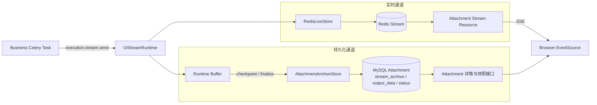
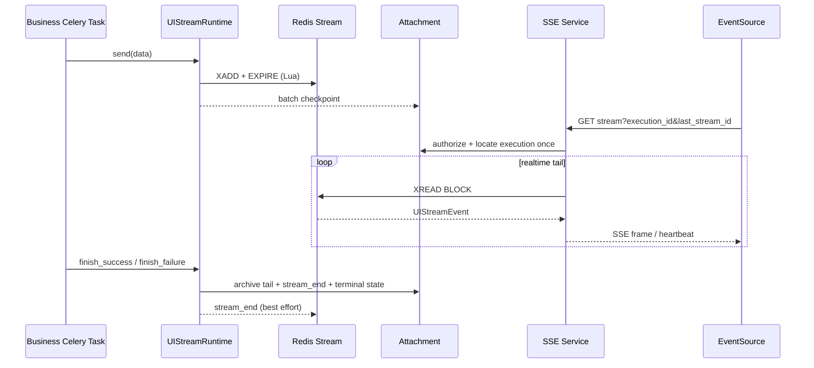

# Attachment UI 流式传输设计

流式子系统为异步 Attachment 提供协议无关的 UI 事件通道。平台负责事件校验、实时推送、快照
归档和最终产物；业务只调用 `execution.stream.send(data)`，`data` 可以承载 AG-UI 或其他
自定义协议。

## 1. 架构概览



`UIStreamRuntime` 是业务写入 UI 流的唯一入口。实时通道只解决低延迟推送与短期追赶；持久化通道
保存 UI 快照和最终状态。两条通道允许独立降级，前端通过 SSE 接收增量，通过详情与快照接口恢复
完整可展示状态。

## 2. 数据流



三份数据职责不同：

- Redis Stream：低延迟实时尾流和短期断线续传，不是事实源；
- `Attachment.stream_archive`：刷新、换端或 Redis 过期后的 UI 快照；
- `Attachment.output_data` 与 `status`：最终产物和业务终态的事实源。

这不是 Redis 与 MySQL 的强一致双写，也不承诺 exactly-once。事件可在 Worker 崩溃的最后一个
checkpoint 窗口内丢失，最终产物仍由 MySQL 终态事务保证。

## 3. 事件模型与传输格式

`UIStreamEvent` 是平台内部统一的**逻辑事件记录**，Redis、MySQL 快照和 SSE 会按各自职责映射，
并不共用同一种 wire format：

```json
{
  "event": "platform.stream_reset",
  "stream_id": "1710000000000-0",
  "data": {"reason": "execution_replaced"}
}
```

- `event`：平台控制事件名称；业务事件固定为 `null`；
- `stream_id`：Redis Stream 增量游标；Redis 写入失败或服务端合成事件时可为空；
- `data`：业务或平台事件负载，必须可编码为标准 JSON，平台不解析业务事件内容。

当前平台控制事件是 `event` 字段的两个枚举值：

- `event="platform.stream_reset"`：当前 execution 被新执行替换，前端关闭旧连接并重新拉取详情和快照；
- `event="platform.stream_end"`：当前 execution 已进入终态，前端关闭连接并拉取最终详情。

业务只调用 `execution.stream.send(data)`，无法指定 `event`，因此平台事件只能由平台产生。

### 3.1 Redis Stream entry

Redis entry 自身的 ID 就是 `stream_id`，所以 entry 的 `payload` 只保存 `event/data`，读取时再将
entry ID 补回逻辑事件：

```json
{"event":"platform.stream_reset","data":{"reason":"execution_replaced"}}
```

### 3.2 MySQL 快照

`Attachment.stream_archive` 和快照接口保存完整的 `event/stream_id/data` 逻辑事件列表，用于刷新、
换端和 Redis 过期后的 UI 恢复。`platform.stream_end` 会随最终状态进入当前 execution 的快照；
`platform.stream_reset` 只通知被替换的旧 Redis Stream，或在 execution 不匹配时由读取服务即时合成，
不保证出现在 MySQL 快照中。

### 3.3 SSE wire format

SSE 把逻辑事件映射为标准 `event/id/data` 文本行，而不是把整个 `UIStreamEvent` 作为 `data`：

```text
event: platform.stream_reset
id: 1710000000000-0
data: {"reason":"execution_replaced"}

```

- 业务事件省略 `event:` 行，由 `EventSource.onmessage` 接收；
- 平台事件输出具名 `event:` 行，前端必须通过 `addEventListener` 监听；
- 只有来自 Redis 的事件输出 `id:`，合成事件不输出，避免客户端续传不存在的游标；
- `data:` 只包含逻辑事件的 `data` 值；浏览器通过 `MessageEvent.data` 读取 JSON 文本，通过
  `MessageEvent.lastEventId` 读取游标。

```javascript
source.onmessage = handleBusinessEvent;
source.addEventListener("platform.stream_reset", handleStreamReset);
source.addEventListener("platform.stream_end", handleStreamEnd);
```

heartbeat 是 `: heartbeat` SSE 注释帧，浏览器会自动忽略；它不是 `UIStreamEvent`，不会写入 Redis
或 MySQL 快照。

## 4. 执行与 fencing

每次实际 Worker 执行调用 `start_execution()`，生成独立 `execution_id` 和 Redis key。
`task_id + execution_id` 构成双重 fencing：

- task ID 隔离用户手动重试产生的新平台任务；
- execution ID 隔离同一 Celery task 的自动 Retry 或 RabbitMQ 重投；
- checkpoint 和 finalize 都在行锁内校验 fencing，旧 Worker 不能覆盖新执行；
- 手动重试排队期间暂存旧配置，新 Worker 启动后向旧流发送 `stream_reset` 并清空旧快照；
- Celery Retry 退出前尽力 checkpoint，不写终态；下一次执行建立新流。

任务持续执行时，只有成功 checkpoint/touch 会刷新 `last_activity_at`。长期无平台活动的执行由
巡检置为 `FAILED`；若已建立有效流，巡检同时在 MySQL 追加 `stream_end`、将归档标记为
`DEGRADED`，并最佳努力通知 Redis。之后旧 Worker 的 checkpoint/finalize 会被 fencing 拒绝。

## 5. 缓冲与容量

Runtime 默认每 20 条、256KB 或达到活动刷新间隔时 checkpoint。MySQL 故障时保留 pending，
但进程内 pending 同样受 `AI_ASSISTANT_STREAM_ARCHIVE_MAX_BYTES` 限制，达到上限后停止归档并
标记 `TRUNCATED`，避免单任务耗尽 Worker 内存。

独立容量边界：

- 单事件字节：超限事件同时放弃实时与归档；
- 业务事件条数：超限后停止归档，实时通道可继续；
- Redis 累计字节：超限后停止实时写入，MySQL 归档可继续；
- MySQL 归档字节：超限后停止业务事件归档；终止事件和最终 output 不受限制。

一期 `stream_archive` 使用 MySQL JSON 整体追加。实现简单且适合单次分析不超过 10MB 的当前
规模，但 checkpoint 会重复解析和写回历史 JSON。若事件量或写放大成为瓶颈，应演进为按
execution/sequence 追加的事件块表，而不是继续提高 JSON 上限。

## 6. Redis 与 SSE

Redis 复用项目 `redis` cache 连接池和 key prefix。Lua 将 `XADD` 与 `EXPIRE` 原子执行，每次
追加刷新默认 1 小时滑动 TTL；终态后无新事件，key 自然过期。

SSE 接口面向浏览器原生 `EventSource`：

1. 建连时查询 MySQL 一次，完成用户权限、Attachment 状态和 execution 定位；
2. 进入循环前归还数据库连接，之后只使用 `XREAD BLOCK` 读取 Redis；
3. 每 15 秒无数据发送 heartbeat；只有业务事件刷新默认 300 秒空闲窗口；
4. 读到 `platform.stream_reset` / `platform.stream_end`、Redis 异常或空闲超时即关闭连接；
5. `EventSource.onerror` 后前端先重新拉详情和快照，再决定是否按新 execution 重连。

终态写 MySQL 成功但 Redis 通知失败时，已连接客户端可能等到空闲超时；这是 Redis-only 读取
换取不长期占用 MySQL 连接的明确取舍。重新建连会从 MySQL 终态直接合成 `stream_end`。

## 7. 失败矩阵

| 故障 | 实时流 | MySQL 快照 | 最终产物 |
| --- | --- | --- | --- |
| Redis 写失败 | 停止或缺失部分事件 | 继续，状态 `DEGRADED` | 继续执行 |
| checkpoint 短暂失败 | 已发布事件仍可见 | pending 后续重试 | 继续执行 |
| checkpoint 持续失败 | 可继续至 Redis 上限 | pending 达上限后 `TRUNCATED` | 继续执行 |
| finalize 数据库失败 | 不能确认终态 | 保留 pending | 由业务 Celery 重试策略决定 |
| terminal Redis 发布失败 | 连接等待至超时 | 已含 `stream_end` | 已提交 |
| Worker 永久退出 | Redis 保留已发送事件至 TTL | 最后 checkpoint 前缀，巡检标记 `DEGRADED` | 巡检置为 `FAILED` |
| Redis key 过期 | 无法继续追赶 | 快照仍可读取 | 不受影响 |

日志、Metric、Event 和 Trace 都不得包含业务 `data` 正文。流降级只影响 UI 过程完整性，不应
直接把成功最终产物改为失败。

## 8. 测试入口

- `test_stream_runtime.py`：缓冲、容量、降级和终态；
- `test_stream_archive.py`：MySQL 行锁、fencing、快照解析；
- `test_stream_redis.py` / `test_stream_resources.py`：Redis 协议和 SSE 服务；
- `test_http_integration.py`：真实 HTTP StreamingResponse；
- `special/test_sse_e2e.py`、`test_stream_concurrency.py`、`test_stream_failures.py`：真实 Redis、
  RabbitMQ、Celery Worker 的端到端、并发和故障场景。
