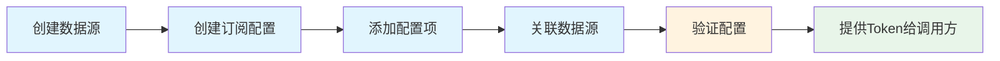
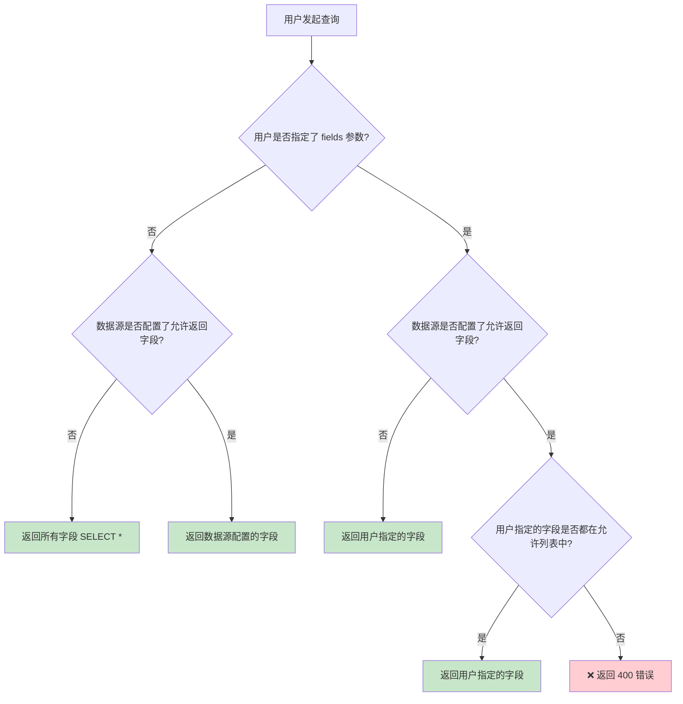

# 日志订阅配置与验证指南（运营版）

> 📌 **本文档面向**：运营同学、产品经理、业务管理员
> 
> 📌 **目的**：帮助你快速完成日志订阅的配置，并验证配置是否正确

---

## 📖 目录

1. [什么是日志订阅？](#1-什么是日志订阅)
2. [配置全流程](#2-配置全流程)
3. [Step 1：创建数据源](#step-1创建数据源)
4. [Step 2：创建订阅配置](#step-2创建订阅配置)
5. [Step 3：添加配置项](#step-3添加配置项)
6. [Step 4：验证配置](#step-4验证配置)
7. [常见问题](#常见问题)

---

## 1. 什么是日志订阅？

日志订阅是一个**数据分发服务**，允许外部系统通过 API 接口获取审计日志数据。

### 🎯 核心概念

```
┌─────────────────────────────────────────────────────────────────┐
│                        日志订阅配置结构                          │
├─────────────────────────────────────────────────────────────────┤
│                                                                 │
│  📦 订阅配置（LogSubscription）                                  │
│  ├── 名称、描述、Token（用于 API 认证）                          │
│  │                                                              │
│  └── 📋 配置项（LogSubscriptionItem）× N 个                     │
│      ├── 筛选条件（如：只要某个系统的日志）                       │
│      │                                                          │
│      └── 🗄️ 数据源（LogDataSource）× N 个                       │
│          └── 数据表、存储类型、时间字段等                         │
│                                                                 │
└─────────────────────────────────────────────────────────────────┘
```

### 📝 名词解释

| 名词 | 说明 | 举例 |
|------|------|------|
| **订阅配置** | 一个完整的订阅，包含 Token 用于 API 认证 | "安全团队审计日志订阅" |
| **配置项** | 订阅下的筛选规则，定义要获取哪些日志 | "只要配置平台的日志" |
| **数据源** | 实际存储日志的数据表 | "审计日志主表" |
| **Token** | API 访问凭证，创建订阅时自动生成 | `a1b2c3d4-e5f6-...` |

---

## 2. 配置全流程



| 步骤 | 操作位置 | 预计耗时 |
|------|----------|----------|
| 创建数据源 | Admin > 数据源配置 | 2 分钟 |
| 创建订阅配置 | Admin > 日志订阅配置 | 1 分钟 |
| 添加配置项 | 订阅详情页 | 2 分钟 |
| 验证配置 | 调试界面 | 3 分钟 |

---

## Step 1：创建数据源

> ⚠️ **注意**：如果数据源已存在，可跳过此步骤

### 1.1 进入数据源管理

1. 登录 Django Admin 后台
2. 在左侧菜单找到 **日志订阅** > **数据源配置**
3. 点击右上角 **添加 数据源配置**

### 1.2 填写数据源信息

| 字段 | 必填 | 说明 | 示例 |
|------|:----:|------|------|
| 数据源ID | ✅ | 唯一标识，英文+下划线 | `audit_log_main` |
| 名称 | ✅ | 数据源显示名称 | 审计日志主表 |
| 描述 | ❌ | 详细说明 | 存储所有系统的审计日志 |
| 命名空间 | ❌ | 数据分类 | `bkaudit` |
| BKBase表ID | ✅ | 数据平台的表ID | `591_bkaudit_event` |
| 存储类型 | ✅ | 数据存储引擎 | Doris |
| 时间字段 | ✅ | 用于时间筛选的字段 | `dtEventTimeStamp` |
| 必须筛选字段 | ❌ | 配置项必须包含的筛选字段 | `["system_id"]` |
| 允许返回字段 | ❌ | 限制可返回的字段白名单（详见下方说明） | `["event_id","username"]` |
| 是否启用 | ✅ | 是否生效 | ✅ |

### 1.3 「允许返回字段」配置说明

> 🔐 **用途**：用于数据脱敏和字段过滤，控制 API 可以返回哪些字段

#### 配置格式

```json
["field1", "field2", "field3"]
```

#### 行为规则

| 配置值 | 查询行为 |
|--------|----------|
| 空列表 `[]` | 返回所有字段（`SELECT *`） |
| 有内容的列表 | 只允许返回列表中的字段 |

#### 查询时的校验逻辑



#### 示例场景

**场景 1：数据脱敏**

假设审计日志中有敏感字段 `snapshot_user_info`（包含用户手机号等），不希望暴露给外部系统：

```json
["event_id", "username", "action_id", "system_id", "start_time", "result_code"]
```

这样配置后，即使调用方请求 `snapshot_user_info` 字段，也会返回 400 错误。

**场景 2：精简返回数据**

只需要核心字段，减少数据传输量：

```json
["event_id", "username", "action_id", "start_time"]
```

**场景 3：不限制（默认）**

留空 `[]`，允许返回所有字段。

### 1.4 保存

点击 **保存** 按钮完成创建。

---

## Step 2：创建订阅配置

### 2.1 进入订阅管理

1. 在左侧菜单找到 **日志订阅** > **日志订阅配置**
2. 点击右上角 **添加 日志订阅配置**

### 2.2 填写订阅信息

| 字段 | 必填 | 说明 | 示例 |
|------|:----:|------|------|
| 名称 | ✅ | 订阅名称 | 安全团队审计日志订阅 |
| 描述 | ❌ | 订阅用途说明 | 用于安全分析平台获取审计日志 |
| 是否启用 | ✅ | 是否生效 | ✅ |

### 2.3 保存并记录 Token

1. 点击 **保存** 按钮
2. 保存后页面会显示自动生成的 **Token**
3. ⚠️ **重要**：复制并妥善保管 Token，这是 API 调用的凭证

```
Token: a1b2c3d4-e5f6-7890-abcd-ef1234567890
```

---

## Step 3：添加配置项

### 3.1 进入订阅详情

1. 在 **日志订阅配置** 列表中，点击刚创建的订阅
2. 进入订阅详情页面

### 3.2 添加配置项

在页面下方的 **配置项** 区域：

1. 点击 **添加另一个 配置项**
2. 填写配置项信息：

| 字段 | 必填 | 说明 | 示例 |
|------|:----:|------|------|
| 名称 | ✅ | 配置项名称 | 配置平台日志筛选 |
| 排序 | ✅ | 执行顺序 | 1 |
| 筛选条件 | ❌ | JSON 格式的筛选规则 | 见下方说明 |
| 数据源 | ✅ | 关联的数据源 | 审计日志主表 |

### 3.3 配置筛选条件

筛选条件是一个 JSON 对象，用于定义要获取哪些日志。

#### 常用筛选条件示例

**示例 1：只要某个系统的日志**

```json
{
  system_id: {
    operator: eq,
    value: bk_cmdb
  }
}
```

**示例 2：只要多个系统的日志**

```json
{
  system_id: {
    operator: in,
    value: [bk_cmdb, bk_job, bk_monitor]
  }
}
```

**示例 3：只要某个操作类型的日志**

```json
{
  action_id: {
    operator: eq,
    value: edit_host
  }
}
```

**示例 4：组合条件**

```json
{
  system_id: {
    operator: eq,
    value: bk_cmdb
  },
  result_code: {
    operator: eq,
    value: 0
  }
}
```

#### 支持的操作符

| 操作符 | 含义 | 示例 |
|--------|------|------|
| `eq` | 等于 | `{"operator": "eq", "value": "bk_cmdb"}` |
| `ne` | 不等于 | `{"operator": "ne", "value": "test"}` |
| `in` | 在列表中 | `{"operator": "in", "value": ["a", "b"]}` |
| `not_in` | 不在列表中 | `{"operator": "not_in", "value": ["a"]}` |
| `contains` | 包含（模糊匹配） | `{"operator": "contains", "value": "error"}` |

### 3.4 关联数据源

1. 在配置项的 **数据源** 字段
2. 选择要关联的数据源（可多选）
3. 点击 **保存** 完成配置

---

## Step 4：验证配置

> 🎯 **目的**：确认配置正确，能够查询到预期的数据

### 4.1 进入调试界面

**方式一：从订阅详情进入**

1. 打开订阅详情页面
2. 在浏览器地址栏的 URL 后面添加 `/preview-sql/`
3. 回车访问

**示例**：
```
原地址：http://your-domain/admin/log_subscription/logsubscription/1/change/
调试地址：http://your-domain/admin/log_subscription/logsubscription/1/preview-sql/
```

**方式二：直接访问**

```
http://your-domain/admin/log_subscription/logsubscription/<订阅ID>/preview-sql/
```

### 4.2 调试界面说明

调试界面提供以下参数：

| 参数 | 说明 | 必填 | 建议值 |
|------|------|:----:|--------|
| 数据源 | 选择要测试的数据源 | ✅ | - |
| 开始时间 | 查询起始时间 | ✅ | 最近 1 小时 |
| 结束时间 | 查询结束时间 | ✅ | 当前时间 |
| 页码 | 分页页码 | ❌ | 1 |
| 每页数量 | 每页记录数 | ❌ | 10 |
| 返回字段 | 指定返回字段（逗号分隔） | ❌ | 留空返回全部 |

### 4.3 验证步骤

#### 第一步：验证 SQL 语句

1. 选择数据源
2. 设置时间范围（建议最近 1 小时）
3. 点击 **仅生成 SQL**
4. 检查生成的 SQL 是否包含你配置的筛选条件

**正确的 SQL 示例**：

```sql
SELECT *
FROM 591_bkaudit_event.doris AS t
WHERE dtEventTimeStamp >= \'2025-12-26 15:00:00\'
  AND dtEventTimeStamp < \'2025-12-26 16:00:00\'
  AND system_id = \'bk_cmdb\'  -- 你配置的筛选条件
LIMIT 10 OFFSET 0
```

#### 第二步：执行查询验证

1. 确认 SQL 正确后
2. 点击 **生成并执行查询**
3. 查看返回的数据是否符合预期

**成功的返回示例**：

```
共 156 条记录，当前第 1 页，每页 10 条

| system_id | username | action_id | start_time |
|-----------|----------|-----------|------------|
| bk_cmdb   | admin    | view_host | 2025-12-26 15:30:00 |
| bk_cmdb   | zhangsan | edit_host | 2025-12-26 15:35:00 |
| ...       | ...      | ...       | ...        |
```

### 4.4 验证检查清单

完成以下检查，确保配置正确：

- [ ] SQL 语句包含了配置的筛选条件
- [ ] 查询返回了数据（如果时间范围内有数据）
- [ ] 返回的数据符合筛选条件（如 system_id 确实是配置的值）
- [ ] 分页功能正常
- [ ] 指定返回字段功能正常

---

## 常见问题

### ❓ Q1: 数据源下拉框是空的？

**原因**：订阅配置没有关联配置项，或配置项没有关联数据源。

**解决**：
1. 返回订阅详情页
2. 添加配置项
3. 为配置项选择数据源
4. 保存后重新进入调试界面

---

### ❓ Q2: 点击"生成并执行查询"报错？

**常见原因及解决方案**：

| 错误提示 | 原因 | 解决方案 |
|----------|------|----------|
| 数据源未启用 | 数据源被禁用 | 启用对应的数据源 |
| 时间范围超限 | 时间跨度超过 30 天 | 缩短查询时间范围 |
| 表不存在 | BKBase 表配置错误 | 检查数据源的表ID配置 |
| 字段不在允许范围 | 请求的字段不在数据源的「允许返回字段」列表中 | 检查数据源配置，将需要的字段添加到允许列表中 |

---

### ❓ Q3: 查询成功但没有数据？

**排查步骤**：

1. **检查时间范围**：确认该时间段内确实有日志产生
2. **检查筛选条件**：条件是否过于严格
3. **尝试放宽条件**：先清空筛选条件测试

---

### ❓ Q4: 如何给调用方提供接口信息？

配置验证通过后，提供以下信息给 API 调用方：

```
接口地址：POST /api/v1/log_subscription/query/

请求参数：
{
  "token": "<你的订阅Token>",
  "source_id": "<数据源ID>",
  "start_time": 1735200000000,  // 毫秒时间戳
  "end_time": 1735203600000,
  "page": 1,
  "page_size": 100
}
```

---

### ❓ Q5: 多个配置项是什么关系？

- **同一数据源的多个配置项**：条件用 **OR** 连接（满足任一条件即可）
- **不同数据源的配置项**：各自独立，互不影响

**示例**：
- 配置项 A：`system_id = \'bk_cmdb\'`
- 配置项 B：`system_id = \'bk_job\'`

生成的 SQL：`WHERE (system_id = \'bk_cmdb\') OR (system_id = \'bk_job\')`

---

## 📞 获取帮助

如果遇到问题无法解决，请联系开发团队，并提供以下信息：

1. 订阅配置的名称和 ID
2. 数据源的名称和 ID
3. 配置的筛选条件
4. 错误截图或错误信息
5. 调试界面生成的 SQL 语句

---

*文档版本：v1.0 | 更新时间：2025-12-26*
