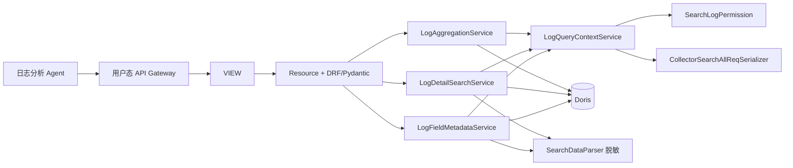

# 审计 AI 日志工具接入

本目录提供日志分析 Agent 使用的三个用户态 MCP 工具。协议事实位于
`log_tools/schemas.py`，HTTP/OpenAPI 入口位于 `services.web.query.mcp_views`。一期仅由 Agent
通过用户态 APIGW/MCP 调用；普通 Web 查询不经过这些 MCP Resource。领域 Service 与类型化协议
保持独立，后续前端程序统计可按场景直接复用，不需要绕行 MCP HTTP 接口。

## 架构与边界



| 层 | 职责 | 不承担 |
| --- | --- | --- |
| View/Resource | 固定 operationId、标准响应包、path 参数注入、请求/响应序列化 | 拼 SQL、信任客户端身份 |
| `LogQueryContextService` | 先鉴权，再复用 Web 校验器，注入系统条件并解析物理表 | 执行查询、返回原始条件 |
| 查询 Service | 构造受控 SQL、执行 Doris 查询、脱敏/聚合、限制响应成本 | 任意 SQL、跨系统查询 |
| Pydantic Schema | 字段、分页、排序、聚合函数和交叉字段约束 | 代替运行期权限检查 |

## 三个稳定工具

基础路径为 `/api/v1/query/namespaces/{namespace}/mcp_user/logs/`，`namespace` 只能来自 URL
path，不能放入请求体。

| operationId | 路径 | 用途 | 关键约束 |
| --- | --- | --- | --- |
| `mcp_get_log_field_metadata` | `POST field_metadata/` | 探索标准字段、JSON 子路径和脱敏样例 | 至多采样 50 条，不递归展开对象 |
| `mcp_search_logs` | `POST search/` | 返回当前用户可见的脱敏日志明细 | 最多 20 个投影字段、3 个排序项、100 条/页，业务 data 有字节预算 |
| `mcp_aggregate_logs` | `POST aggregate/` | 固定函数的分组、时间桶和数值聚合 | 最多 2 个维度、5 个指标、100 个分组；不接受 SQL 或任意函数名 |

三个请求都包含同一 `condition`：一期只允许 `scope_type=system` 和单个 `scope_id`，时间范围与
条件结构和日志检索页一致；过滤值只接受字符串、整数或浮点数，复杂 JSON 值会在查询前拒绝。
字段先通过 `field_metadata` 探索，再传给明细或聚合工具。例如：

```json
{
  "condition": {
    "scope_type": "system",
    "scope_id": "bk_iam",
    "start_time": "2026-08-29T00:00:00+08:00",
    "end_time": "2026-08-29T12:00:00+08:00",
    "conditions": []
  },
  "dimensions": [
    {"id": "operator", "type": "FIELD", "field": {"raw_name": "username", "keys": []}}
  ],
  "metrics": [{"id": "count", "type": "COUNT"}],
  "order_by": [{"target_id": "count", "direction": "DESC"}],
  "limit": 20
}
```

响应中的 `query_summary` 只提供数量、耗时和执行时间等受控元数据；聚合数值转换同时返回
`data_quality`，调用方不能把转换失败行静默当成零。

明细页码从 1 开始，无协议或环境最大页码限制；每页最多 100 条，部署配置可以进一步收紧每页条数。
`has_more` 仅按真实命中总量计算，即 `page * page_size < total`；全量导出应使用导出任务。
排序最多 3 项，支持 `COLLECT_SEARCH_CONFIG` 中的非 JSON 根字段及 `start_time`，不支持 JSON
子路径；`start_time` 映射为物理时间列 `dtEventTimeStamp`，并补齐采集器排序键。

聚合未指定 `order_by` 时，按维度升序返回前 `limit` 组，不代表 TopN；显式按指标排序时才表示
该指标下的 TopN/BottomN。一期不合并“其他”分组、不补空时间桶，并列指标值不额外按维度稳定
排序。`data_quality` 是整个检索范围的数值转换质量，不是返回分组的逐组质量统计。
时间桶使用物理时间列 `dteventtimestamp`（与现有字段统计一致），而非业务上报的 `start_time` 列。

## 统计能力复用边界

日志分析、后续 AI 统计和程序字段统计可以调用相同的用户态聚合服务：业务侧分别生成统计请求，
查询侧统一完成鉴权、范围注入、SQL 执行和类型化响应，图表及报告协议由上层负责。

现有 `DorisStatisticSQLBuilder` 返回固定统计套餐（非空、Top5、Top5 时序或数值指标），
`LogAggregationSQLBuilder` 接收显式维度和指标；两者平级复用 `BaseDorisSQLBuilder`，
不互相继承，也不在本期重写旧统计接口。公共基类承载字段表达式、过滤、排序和 COUNT；
固定套餐仍由旧 Builder 编排，后续按具体场景适配聚合服务，并保持旧响应兼容。

## 动态 JSON 字段路径

`extend_data` 等拓展数据的子键由业务系统上报，平台不能假设它们都满足
`^\w+$`。因此 SQL Builder 会把每个 `keys` 元素作为 JSONPath 的独立字面路径段编码：

| `keys` | 生成的 JSONPath | 含义 |
| --- | --- | --- |
| `["ticket", "id"]` | `$.ticket.id` | 两层普通子键 |
| `["中文字段"]` | `$.中文字段` | Unicode 普通子键 |
| `["*"]` | `$."*"` | 字面 key `*`，不是通配符 |
| `["items[0]"]` | `$."items[0]"` | 字面 key，不是数组下标 |
| `["ticket id"]` | `$."ticket id"` | 包含空格的字面 key |

PyPika `wrap_constant()` 只保护 SQL 字符串边界，不理解 JSONPath 中的通配符、数组下标和
引用路径段，因此不能替代路径编码。引号、反斜杠和控制字符先按 JSON 字符串规则
转义，再由 SQL 常量层处理；两层转义职责不同。

## 身份、权限与敏感数据

- 用户身份由用户态 APIGW/请求上下文提供，Resource 使用 `get_request_username()`，请求体没有
  `username` 字段。
- `LogQueryContextService` 在字段校验和 Doris 查询前调用 `SearchLogPermission`；每个工具调用都
  重新鉴权，不能沿用创建 Attachment 时的权限结论。
- 服务端强制注入当前系统条件和 namespace 对应表名。响应不暴露 SQL、物理表名或内部查询细节。
- 明细和字段样例必须先经 `SearchDataParser` 脱敏再投影；脱敏辅助列不会返回给调用方。
- 字段探索不因 `parent_field` 命中敏感规则而整体拒绝；先脱敏样本，再探索可见字段和子路径。
  查询条件的敏感字段权限预检仍保留，不能通过字段探索绕过。
- 查询条件、排序及聚合结果无法逐行脱敏，因此对命中的无权敏感字段在查询前拒绝；`log` 原始全文条件按系统全部敏感规则校验，无权限时不会执行 Doris 查询。
- 为便于定位查询问题，`SafeQuerySyncResource` 会记录实际提交的 SQL（包含条件值），部署侧必须
  限制日志访问与保留周期；不得记录原始查询结果、脱敏前字段值、完整工具响应或远端错误正文。

## Web 兼容和错误语义

三个工具复用 `UserAPIGWViewSet` 的标准响应包：成功数据位于 `data`，参数、权限、字段、超时和
响应过大等错误使用平台稳定错误响应。调用方可以缩小时间范围、页大小、字段或聚合维度后重试，
但不得绕过 schema 构造 SQL。OpenAPI 契约由 Pydantic 模型生成，变更时应同步运行：

```bash
.venv/bin/python manage.py test \
  tests.test_query.test_ai_assistant.test_log_tool_apigw_contract \
  tests.test_query.test_ai_assistant.test_log_tool_openapi \
  tests.test_query.test_ai_assistant.test_log_tool_resources
```

报告生成链路见 [`../../ai_assistant/docs/log_analysis.md`](../../ai_assistant/docs/log_analysis.md)。
