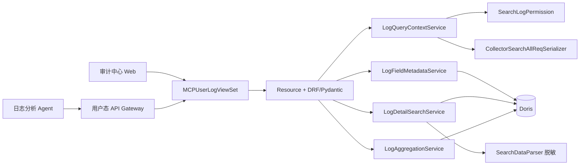

# 审计 AI 日志工具接入

本目录提供日志分析 Agent 使用的三个用户态 MCP 工具。协议事实位于
`log_tools/schemas.py`，HTTP/OpenAPI 入口位于 `services.web.query.mcp_views`；普通 Web
调用与 Agent 调用共享同一套 Resource、鉴权、校验和查询 Service。

## 架构与边界



| 层 | 职责 | 不承担 |
| --- | --- | --- |
| View/Resource | 固定 operationId、标准响应包、path 参数注入、请求/响应序列化 | 拼 SQL、信任客户端身份 |
| `LogQueryContextService` | 先鉴权，再复用 Web 校验器，注入系统条件并解析物理表 | 执行查询、返回原始条件 |
| 查询 Service | 构造受控 SQL、执行 Doris 查询、脱敏/聚合、限制响应成本 | 任意 SQL、跨系统查询 |
| Pydantic Schema | 字段、分页、排序、聚合函数和交叉字段约束 | 代替运行期权限检查 |

## 三个稳定工具

基础路径为 `/api/v1/query/namespaces/{namespace}/mcp_user/logs/`，`namespace` 只能来自 URL
path，不能放入请求体。

| operationId | 路径 | 用途 | 关键约束 |
| --- | --- | --- | --- |
| `mcp_get_log_field_metadata` | `POST field_metadata/` | 探索标准字段、JSON 子路径和脱敏样例 | 至多采样 50 条，不递归展开对象 |
| `mcp_search_logs` | `POST search/` | 返回当前用户可见的脱敏日志明细 | 最多 20 个投影字段、一期仅支持单个 `start_time` 排序项、100 条/页，完整响应有字节预算 |
| `mcp_aggregate_logs` | `POST aggregate/` | 固定函数的分组、时间桶和数值聚合 | 最多 2 个维度、5 个指标、100 个分组；不接受 SQL 或任意函数名 |

三个请求都包含同一 `condition`：一期只允许 `scope_type=system` 和单个 `scope_id`，时间范围与
条件结构和日志检索页一致。字段先通过 `field_metadata` 探索，再传给明细或聚合工具。例如：

```json
{
  "condition": {
    "scope_type": "system",
    "scope_id": "bk_iam",
    "start_time": "2026-08-29T00:00:00+08:00",
    "end_time": "2026-08-29T12:00:00+08:00",
    "conditions": []
  },
  "dimensions": [
    {"id": "operator", "type": "FIELD", "field": {"raw_name": "username", "keys": []}}
  ],
  "metrics": [{"id": "count", "type": "COUNT"}],
  "order_by": [{"target_id": "count", "direction": "DESC"}],
  "limit": 20
}
```

响应中的 `query_summary` 只提供数量、耗时和执行时间等受控元数据；聚合数值转换同时返回
`data_quality`，调用方不能把转换失败行静默当成零。

## 身份、权限与敏感数据

- 用户身份由用户态 APIGW/请求上下文提供，Resource 使用 `get_request_username()`，请求体没有
  `username` 字段。
- `LogQueryContextService` 在字段校验和 Doris 查询前调用 `SearchLogPermission`；每个工具调用都
  重新鉴权，不能沿用创建 Attachment 时的权限结论。
- 服务端强制注入当前系统条件和 namespace 对应表名。响应不暴露 SQL、物理表名或内部查询细节。
- 明细和字段样例必须先经 `SearchDataParser` 脱敏再投影；脱敏辅助列不会返回给调用方。
- 聚合无法逐行脱敏，因此对命中的敏感字段在查询前拒绝；无权限时不会执行 Doris 查询。
- 日志中不得记录请求条件值、生成 SQL、原始行、脱敏前字段值或完整工具响应。

## Web 兼容和错误语义

三个工具复用 `UserAPIGWViewSet` 的标准响应包：成功数据位于 `data`，参数、权限、字段、超时和
响应过大等错误使用平台稳定错误响应。调用方可以缩小时间范围、页大小、字段或聚合维度后重试，
但不得绕过 schema 构造 SQL。OpenAPI 契约由 Pydantic 模型生成，变更时应同步运行：

```bash
.venv/bin/python manage.py test \
  tests.test_query.test_ai_assistant.test_log_tool_apigw_contract \
  tests.test_query.test_ai_assistant.test_log_tool_openapi \
  tests.test_query.test_ai_assistant.test_log_tool_resources
```

报告生成链路见 [`../../ai_assistant/docs/log_analysis.md`](../../ai_assistant/docs/log_analysis.md)。
