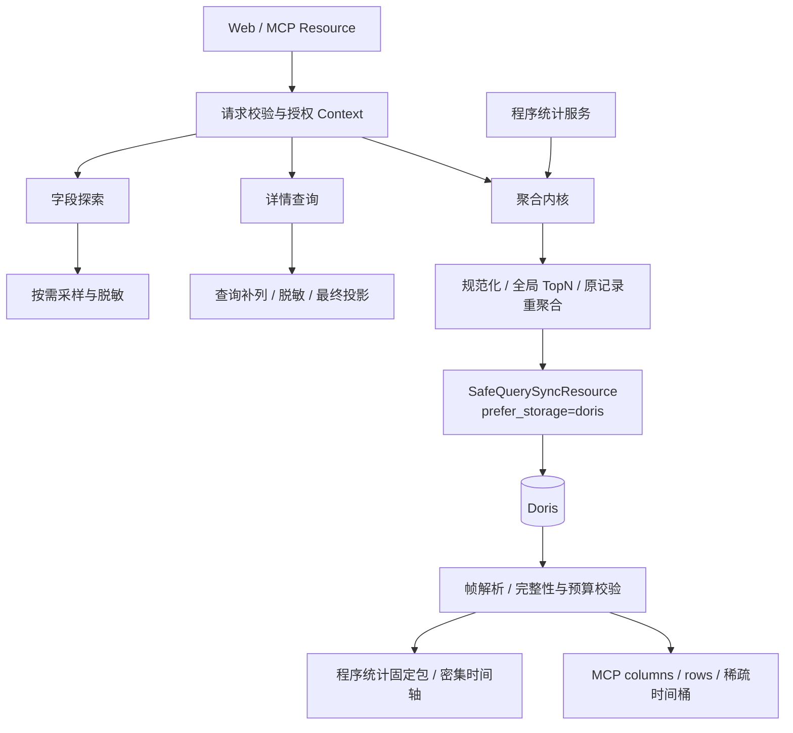

# 日志详情、字段探索、聚合与统计实现架构

本文面向 query 领域维护者，解释 `ai_assistant/log_tools` 的实现和算法；它不是前端接口契约。附件生命周期见 [AI 助手架构](../../../ai_assistant/docs/architecture.md)，前端调用见 [统计联调指南](../../../ai_assistant/docs/frontend_statistics.md)。

## 1. 能力边界与代码导航

四项能力共用查询上下文与字段权限，但返回语义不同。

| 能力 | 入口文件（当前目录） | 结果与用途 |
| --- | --- | --- |
| 字段探索 | field_metadata.py | 根字段声明或下一层 JSON 样本元数据，帮助选择字段 |
| 日志详情 | search.py | 脱敏、投影后的分页日志及总数，供分析取证 |
| 通用聚合 | aggregation.py | columns/rows/groups 等统计数据，供 Agent 使用 |
| 程序字段统计 | statistics.py | 单字段固定统计包，供附件保存和前端渲染 |
| 共用规则 | context.py、sensitive.py、schemas.py | 可信条件、权限与参数边界 |
| 查询构造 | sql.py、statistics_sql.py、statistics_fields.py | 明细投影、聚合 SQL、字段表达式 |
| 结果与预算 | statistics_result.py、statistics_budget.py、statistics_summary.py、statistics_types.py | 完整性、时间轴、数值摘要、标量保真 |



这是当前新增日志工具能力的实现范围，不表示所有历史 collector 查询/导出都迁移到这里。明细查询服务可被日志分析 Agent 使用；统计 Agent 的预期工具配置仅含字段探索和聚合。

## 2. 可信上下文与权限顺序

`LogQueryContextService` 根据当前用户、URL 租户和请求条件检查系统查询权限，校验系统归属，复用现有检索序列化器规范化条件，并解析实际数据表。调用方不能直接指定任意物理表或 SQL。服务入口再次校验 Pydantic 请求，防止内部构造绕过协议验证。

不能仅靠结果脱敏保护查询：过滤敏感字段会泄露命中数，按敏感值排序会泄露顺序，聚合会泄露分布。因此，详情的过滤/排序字段、字段采样的过滤字段、聚合的过滤/维度/指标必须在查询前检查。详情输出和采样值还要逐行脱敏；聚合则对参与计算的无权字段直接拒绝，不能先算后遮罩。

## 3. 字段探索：目录不是全量类型证明

不传 parent_field 时从日志检索字段配置生成根目录，不访问 Doris 采样。指定可见 JSON 父路径时，查询最小必要列，先经过 `SearchDataParser` 脱敏，再推断下一层字段、类型、覆盖率和样本值；不会递归扫出整个 JSON 树。

父对象中可能同时包含有权和无权子字段，因此探索不简单地拒绝整个父对象，而是依赖逐行脱敏。目录中的统计权限提示会清除无权字段的样本和统计能力。返回数量、采样和响应体有预算，truncated 表示探索截断；未被样本观察到不等于全范围不存在。

## 4. 详情查询：补列 → 脱敏 → 投影

假设只请求一个 JSON 子字段，直接只查该值会丢失敏感规则判断所需的上下文。`prepare_sensitive_query_fields` 补齐辅助列，`ProjectedLogSQLBuilder` 查询所需根列，完整行先经过 `SearchDataParser`，最后按请求字段投影。辅助列不进入最终 items；columns 给出 items 对应 key，消费者不必猜路径。

数据 SQL 和 count SQL 使用相同授权条件，通过一次 bulk_request 批量发出。排序先采用用户指定顺序，再补采集器序列键，减少 OFFSET 分页并列值导致的不稳定。此批量调用包含两条 SQL，不承诺数据库事务快照一致性；数据持续写入时，分页结果和总数仍可能变化。

响应包含 total、columns、items、pagination 和 query_summary。has_more 根据 total 与页码计算；最终业务响应超限明确失败，不通过截断行或改写字段值伪装完整成功。

## 5. 聚合与程序统计内核

### 5.1 字段与权限

`context.py` 解析系统、租户、条件和数据表；`sensitive.py` 检查过滤字段、维度、指标和子路径权限。字段范围来自日志检索可见字段配置，并允许有效 JSON 子路径。私有敏感字段拒绝，其他敏感对象按 IAM 判断；统计不能绕过明细字段的权限限制。

`field_metadata.py` 返回声明信息、样本推断和统计能力提示。样本只能帮助字段选择，不能证明全量值都可统计。最终查询仍检查实际类型和权限。`statistics_fields.py` 将普通列、JSON、VARIANT 字段转换为统一内部表示。

类别身份由“类型 + 规范值”确定：数字 `1` 与字符串 `"1"` 不同，布尔值不转换成数字；数字 `1` 与 `1.0` 归一。缺失/null 进入 MISSING，空字符串仍是存在的真实类别。对象、数组或不安全数值等不支持的数据触发错误，不偷偷塞进 OTHER。

### 5.2 全范围 TopN，再映射原始记录

以 8 条日志为例：GET 3、POST 2、PUT 1、DELETE 1、缺失 1。`top_n=2` 时，结果是 GET 3、POST 2、OTHER 2、MISSING 1。

算法先对**完整时间范围**的非缺失类别排序，默认按日志数降序并使用稳定的类型/值排序处理并列；选出 TopN 后，把每条原始记录映射为入选类别、OTHER 或 MISSING。时序始终复用这一组类别，不在每个时间桶重新选 TopN。

这不是普通的 `GROUP BY ... LIMIT N`。直接截断只能得到前 N 组，无法同时保证 OTHER 精确、每个时间桶使用同一组图例，以及 AVG、去重数、近似分位数等非可加指标的正确性。实现采用以下顺序：

```text
字段值提取
  → 按原始标量类型规范化类别身份
  → 在完整范围内统计类别并选择 TopN
  → 将每条原始日志映射到 VALUE / OTHER / MISSING
  → 从映射后的原始记录计算分组指标和时间桶
  → 校验总数、分组和时序闭合
```

以下两小时数据可以直观看出“先全局选组，再画时序”的含义：

| 时间桶 | GET | POST | PUT | DELETE | 缺失 |
| --- | ---: | ---: | ---: | ---: | ---: |
| 10:00 | 2 | 1 | 1 | 0 | 1 |
| 11:00 | 1 | 1 | 0 | 1 | 0 |
| 完整范围 | 3 | 2 | 1 | 1 | 1 |

`top_n=2` 在完整范围选中 GET、POST，随后得到：

| 组 | 总数 | 10:00 | 11:00 |
| --- | ---: | ---: | ---: |
| GET（VALUE） | 3 | 2 | 1 |
| POST（VALUE） | 2 | 1 | 1 |
| OTHER（PUT + DELETE） | 2 | 1 | 1 |
| MISSING | 1 | 1 | 0 |

因此前端固定图例不会随时间桶跳变，且每组时序求和等于该组完整范围总数。若分别在每个桶内选择 TopN，类别可能在相邻桶中进入或退出图例，OTHER 的含义也会发生变化。

OTHER 的 AVG、DISTINCT_COUNT、近似分位数必须对映射后的原始记录重算。例如两组分别有 1 条数值 100 和 9 条数值 0，合并平均值是 10，不能对两个组的平均值求平均得到 50。

### 5.3 SQL 与完整性

`statistics_sql.py` 生成受控 SQL，维度和指标仅接受协议枚举，不接受任意 SQL 表达式。逻辑处理顺序：

```text
读取来源值 → 安全类型处理 → 规范化 → 类型校验
    → 全范围类别汇总 → 排名选 TopN → 原记录映射分组
    → 分组/时间聚合 + 数据质量 + 可选数值摘要
    → META / GROUP / ROW / QUALITY / SUMMARY 结果帧
```

查询 SQL 还需同时兼容 BKBase 前置解析与 Doris。查询统一使用不带 `.doris` 后缀的表 ID，并传 `prefer_storage="doris"`；构造层移除历史上下文中的后缀，避免两种路由声明同时出现；元数据计数通过单行 CTE 关联，避免在 CAST 中嵌入标量子查询；UNION 内部键列使用 `frame_key`，避免保留字 `key`；时间桶使用毫秒差除法取整，避免 BKBase 拒绝的 DIV。上述边界已通过真实查询复现，单独使用本地 SQL 解析器无法覆盖。

这些 CTE 描述逻辑步骤，不保证 Doris 物理执行只扫描一次。有类别的时间查询先做规划查询；纯时间统计 ALL 组数固定为 1，直接规划并执行最终查询，但最终统计数据由同一最终 SQL 重算，避免把预检结果与最终数据拼接。

`statistics_result.py` 校验帧结构、类型、计数闭合和时序闭合。程序统计补齐时间轴；MCP 仅返回有日志的时间桶，并通过 `query_summary.sparse_time_buckets=true` 标识缺省桶语义，空范围返回空 rows。计数类空桶为 0，无有效数值的数值指标为 null。缺帧、截断或预算超限返回错误，不把不完整数据标记为成功。

### 5.4 时间与预算

`statistics_budget.py` 按可信时区规划 MINUTE/HOUR/DAY。分钟、小时沿 UTC 时间线推进，日桶按本地日历推进，覆盖夏令时边界。首尾桶只统计原查询范围内的数据。

MCP 默认 TopN 10，程序统计默认 10，协议最大 500，部署配置可收紧；OTHER/MISSING 不占 TopN 名额。默认最多 1440 个时间桶、100000 个数值单元和 4 MiB 业务结果。单元预算结合组数、桶数和指标列计算；程序统计每组每桶只有计数列，MCP 还需考虑辅助计数/比例列。

AUTO 选择预算允许的最细粒度；最终查询发现实际规模超预算时可加粗粒度并重跑完整查询。显式粒度不静默改变，超预算报错。即使日桶仍超预算，也不会无限扩展。以上是防护上限，不是容量压测承诺。

### 5.5 两种消费者

程序统计：`statistics.py` 编排固定包，类别字段返回概览、分布和时序；声明为数值或全范围存在值均为原生数值的字段增加摘要。字符串数字不自动转数值，中位数为近似值。

MCP：`aggregation.py` 消费统一 DSL，支持最多 2 个维度、5 个指标；指标包括 COUNT、DISTINCT_COUNT、MIN、MAX、AVG、SUM、PERCENTILE_APPROX。输出 columns、rows、groups、query_summary、data_quality，供 Agent 继续解释。无类别维度可做全局 ALL 汇总。

## 6. 变更与验证入口

- 新字段或路径规则：同步检查 schemas、元数据提示、敏感对象路径覆盖、实际表达式及 typed 结果；不能只让目录可见而执行失败。
- 新聚合指标：同步考虑参数约束、允许类型、OTHER 重算、空桶语义、数据质量和单元预算。
- SQL 优化：保留全范围类别选择与最终查询口径一致，不能把预检统计直接拼成最终结果；以实际 Doris 执行计划验证性能。
- 新消费者：复用服务与领域结果，图表协议留在消费者侧，查询内核不引入 ECharts。

测试主要位于 `tests/test_query/test_ai_assistant/`，覆盖协议、Resource、字段权限、明细脱敏、SQL 构造、类型、预算和结果闭合；程序附件链路测试位于 `tests/test_ai_assistant/`。SQL 字符串单测只能校验构造约束，JSON/VARIANT、数值精度、近似分位数、查询超时和数据量边界仍需在实际查询引擎验证。

### MCP 故障恢复与上下文成本

多 DISTINCT_COUNT 指标使用单列类型前缀键去重，避免 Doris 拒绝同条 SQL 中多个多列 DISTINCT；前缀保留字符串/数值/布尔类型差异，缺失值排除，空字符串参与。

根字段目录不读取日志，`sampling_performed=false` 时 `sampled_count=0` 不能解释为无日志；总量由 COUNT 获取。字段目录可在同一分析中复用。保留/重复列 ID 和非法操作符分别返回固定的修正提示，错误消息不回显用户条件。MCP 的 `ratio/log_ratio` 与程序统计的 `ratio/present_ratio` 统一输出四位小数，保留 null；计数及数值指标不降精度。很小的正比例可能舍入为 0，是否有日志以计数为准。

时间条件、SQL分区和桶轴共用 `time_range.parse_log_time`：无时区字符串按服务端默认时区解释，显式偏移按真实时刻转换。MCP入口覆盖旧范围校验，避免UTC与本地混合输入被误判；传入Collector前转换为默认时区ISO，避免UTC被重复解释为本地时间。
