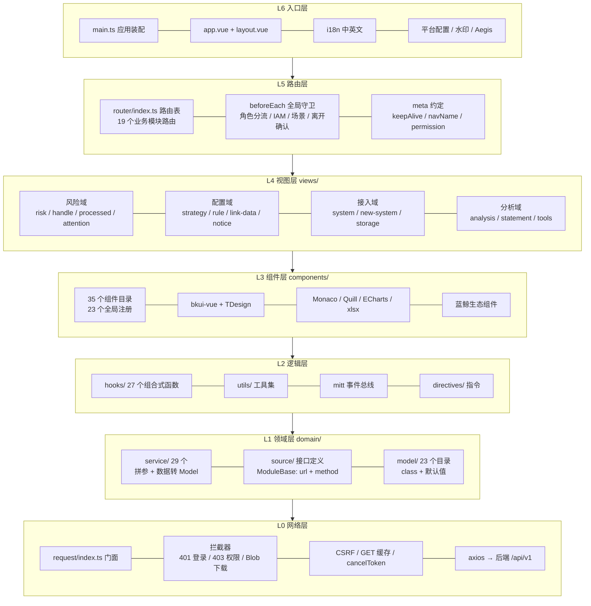
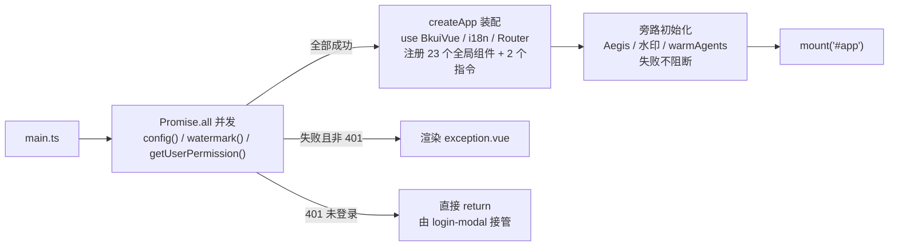

# 架构与目录

> [← 文档索引](./README.md) ｜ 上一篇：[项目总览](./project-overview.md) ｜ 下一篇：[功能地图](./feature-map.md)

## 分层图谱



依赖方向自上而下：上层只依赖紧邻下层的约定（通过路径别名导入），不存在反向引用。

各层职责：

| 层 | 目录 | 职责 |
| --- | --- | --- |
| L6 入口层 | `src/main.ts`、`app.vue`、`layout.vue` | 应用装配、全局注册、布局骨架、语言与平台配置 |
| L5 路由层 | `src/router/` | 路由表、角色分流、IAM 鉴权、场景分流、离开确认 |
| L4 视图层 | `src/views/` | 20 个业务模块的页面与模块内组件 |
| L3 组件层 | `src/components/` | 跨模块复用的公共组件与第三方 UI 封装 |
| L2 逻辑层 | `src/hooks/`、`src/utils/` | 请求状态机、URL 读写、工具函数、事件总线、指令 |
| L1 领域层 | `src/domain/` | 接口定义、业务语义、领域模型 |
| L0 网络层 | `src/utils/request/` | axios 封装、拦截器、缓存、错误处理 |

## 启动流程



- 启动配置写入 `sessionStorage['BK_AUDIT_CONFIG']`，含 `super_manager`、`aegis_id`、`agent_auth`、`metric` 等字段。
- `config.super_manager === true` 时，路由表动态追加 `StorageManage`（数据存储模块）。
- 全局注册的 23 个组件：`ApplyPermissionCatch`、`AuditForm`、`AuditIcon`、`AuditPopconfirm`、`AuditRouterView`、`AuditSideslider`、`AuditUserSelectorTenant`、`AuthButton`、`AuthComponent`、`AuthOption`、`AuthSwitch`、`AuthRouterLink`、`AuthCollapsePanel`、`RelationShip`、`RenderList`、`TdesignList`、`RenderSensitivityLevel`、`ScrollFaker`、`SkeletonLoading`、`SmartAction`、`DatePicker`（来自 `@blueking/date-picker`）、`SelectVerify`、`SearchBox`。
- 全局注册的 2 个指令：`bk-tooltips`、`cursor`。

## 目录结构

```
src/frontend/
├── index.html
├── vite.config.ts              # 13 个路径别名、构建分包、dev server 配置
├── package.json
├── server/                     # Express 静态服务（esbuild 打包）
├── static/                     # publicDir
├── lib/                        # bk-icon 图标库
└── src/
    ├── main.ts                 # 应用装配入口
    ├── app.vue                 # 根组件：config-provider + layout + 页头插槽
    ├── layout.vue              # 布局骨架：顶部 7 大导航 + 侧边菜单 + 面包屑
    ├── exception.vue           # 启动失败兜底页
    │
    ├── views/                  # 业务模块（20 个；`tool-manage-shared` 无独立路由）
    ├── components/             # 公共组件（35 个顶层目录）
    ├── hooks/                  # 组合式函数（27 个）
    ├── utils/                  # 工具函数
    │   ├── assist/             #   20+ 子模块（dom / url / 时间 / 权限 / 场景参数 …）
    │   ├── request/            #   axios 封装（lib + middleware）
    │   └── validator.ts / getFieldTypeIcon.ts / format-strategy-name.ts …
    │
    ├── domain/
    │   ├── source/             # 接口定义层：class Xxx extends ModuleBase
    │   ├── service/            # 业务语义层（29 个）
    │   └── model/              # 领域模型（23 个目录）
    │
    ├── router/index.ts         # 路由表 + 角色访问规则 + 全局守卫
    ├── language/               # i18n
    ├── css/                    # reset.css / tokens.css / common.css
    ├── directives/cursor/      # v-cursor 指令
    └── images/                 # 静态图片（field-type/*.png 由 import.meta.glob 预加载）
```

## 路径别名

在 `vite.config.ts` 中定义，全项目统一使用别名导入：

| 别名 | 实际路径 |
| --- | --- |
| `@` | `src/` |
| `@views` | `src/views` |
| `@components` | `src/components` |
| `@service` | `src/domain/service` |
| `@model` | `src/domain/model` |
| `@hooks` | `src/hooks` |
| `@utils` | `src/utils` |
| `@router` | `src/router` |
| `@directives` | `src/directives` |
| `@css` | `src/css` |
| `@language` | `src/language` |
| `@images` | `src/images` |
| `@lib` | `lib/`（工程根目录） |

> 视图层统一通过 `@service/*` 取数，不直接引用 `@utils/request`。

---

> [← 文档索引](./README.md) ｜ 上一篇：[项目总览](./project-overview.md) ｜ 下一篇：[功能地图](./feature-map.md)
