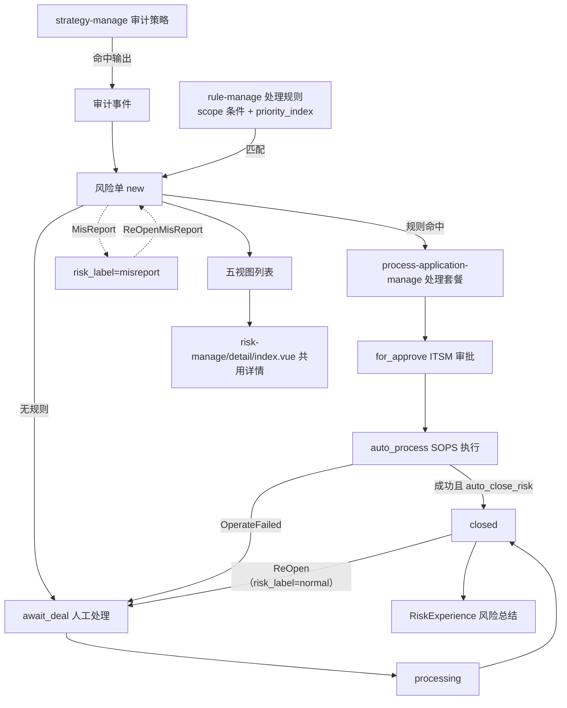
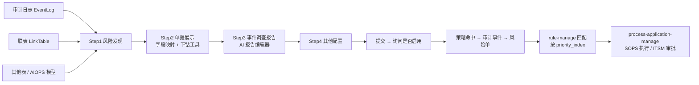
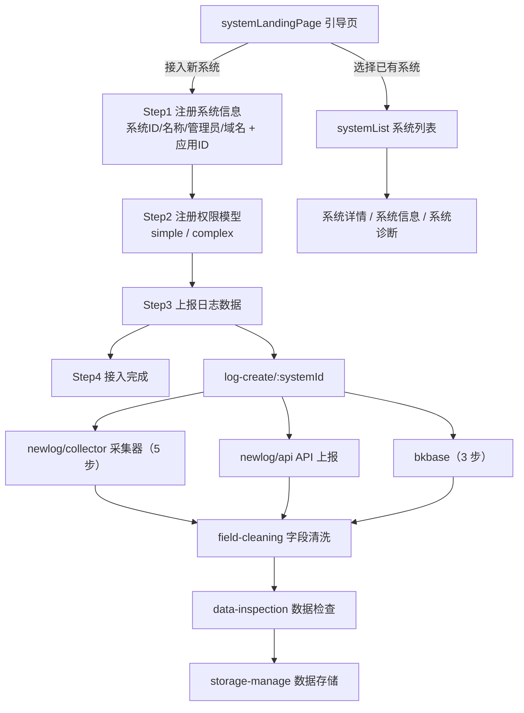
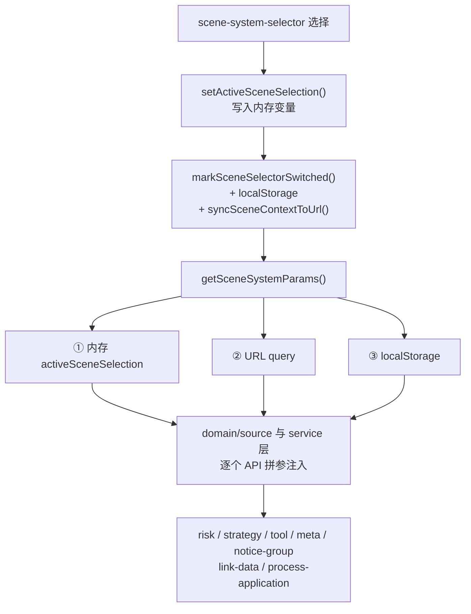
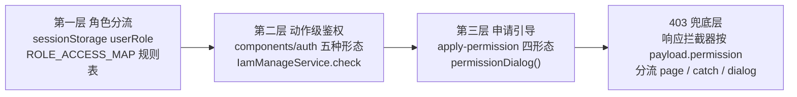
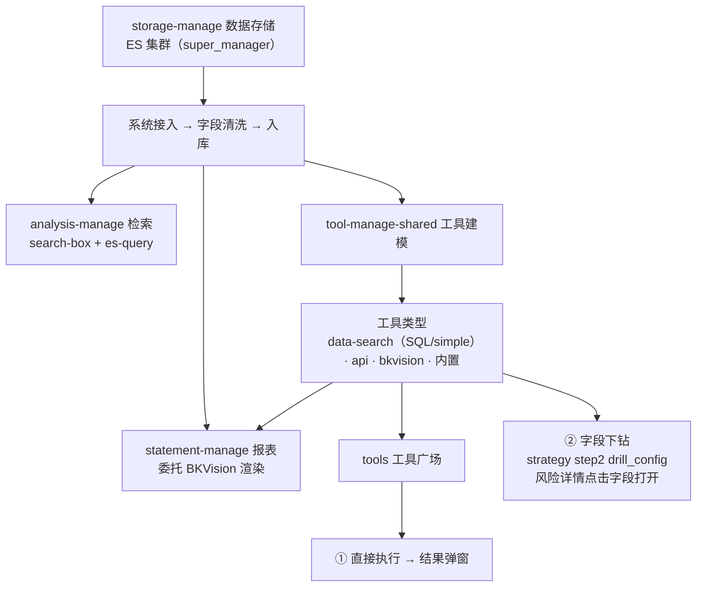

# 核心业务流程

> [← 文档索引](./README.md) ｜ 上一篇：[业务模块](./business-modules.md) ｜ 下一篇：[公共组件](./components.md)

## 风险主链路

`risk-manage` / `handle-manage` / `processed-manage` / `attention-manege` / `scene-risk-manage` 是**同一风险实体的五个视图**：`detail/:riskId` 全部复用 `@views/risk-manage/detail/index.vue`，差异仅在列表页的 `dataSource`。

| 模块 | 数据源 | 语义 |
| --- | --- | --- |
| risk-manage | `fetchRiskList` | 全量风险（唯一带 `permission: list_risk_v2`） |
| handle-manage | `fetchTodoRiskList` | 当前处理人是我 |
| processed-manage | `fetchProcessedRiskList` | 我处理过的 |
| attention-manege | `fetchWatchRiskList` | 我关注的 |
| scene-risk-manage | `fetchRiskList` + 场景参数 | 场景维度收窄 |

### 状态机

- **主状态**（`views/risk-manage/constants.ts`）：`new` → `await_deal` → `processing` / `for_approve` / `auto_process` → `closed`
- **正交标记** `risk_label`：`normal` / `misreport`（误报）
- **时间轴动作**：`NewRisk` · `await_deal` · `MisReport` · `ReOpenMisReport` · `ForApprove` · `AutoProcess` · `CustomProcess` · `OperateFailed` · `CloseRisk` · `ReOpen` · `RiskExperience`

### 关键文件

| 文件 | 作用 |
| --- | --- |
| `views/risk-manage/detail/index.vue` | 五视图共用详情 |
| `views/risk-manage/detail/components/risk-handle/` | 处置面板：await-deal / for-approve / closerisk / custom-process / misreport / reopen-misreport / risk-experience |
| `views/risk-manage/constants.ts` | 状态与动作枚举 |
| `views/risk-manage/table-columns/risk/use-columns.ts` | 列表列定义 |
| `domain/model/risk/risk.ts` | 风险模型（含 `ticket_history`） |
| `domain/service/risk-manage.ts` | 风险相关接口 |

## 策略 / 规则 / 联表

| 概念 | 定位 | 关键字段 |
| --- | --- | --- |
| 审计策略 `strategy-manage` | 风险**发现端**：定义什么算风险，产出事件与风险单 | `config_type`（EventLog / LinkTable / 其他表）、`rules`、`expected_results`、`drill_config` |
| 处理规则 `rule-manage` | 风险**处置端**：消费风险，绑定处理套餐 | `scope`（适用条件组）、`pa_id`（套餐）、`pa_params`、`auto_close_risk`、`priority_index` |
| 联表 `link-data-manage` | 策略的数据源之一 | 被 step1 以 `configs.data_source.link_table = { uid, version }` 引用 |
| 处理套餐 `process-application-manage` | 处置执行单元 | `sops_template_id`、`need_approve` |

- 策略提交时弹二次确认「立即开启检测并输出风险」，属高风险操作。
- 策略升级有独立向导：`strategy-create/upgrade/:strategyId/:controlId`。
- 联表与工具均带 `version` 字段，用于检测引用方是否落后于当前版本。

## 系统接入

`new-system-manage` 与 `system-manage` 是**职责拆分并存**，共享同一份 `sideMenus`，`navName` 均为 `nweSystemManage`。

- `new-system-manage`（`/nwe-system-manage/:id?`）：接入向导 + 系统信息 + 系统诊断 + 引导页
- `system-manage`（`/system-manage`）：系统列表 + 系统详情 + 日志上报 + 采集 + 字段清洗

- 日志上报编辑入口有两条路由，复用同一 `log-create/index.vue`：`log-edit/dataid/:bkDataId` 与 `log-edit/collector/:collectorConfigId`。
- 采集完成后跳转 `collector-complete/:systemId/:collectorConfigId/:taskIdList`。
- 相关服务：`collector-manage`、`dataid-manage`、`meta-manage`、`storage-manage`。

## 场景（Scene）上下文

场景是贯穿全项目的横切上下文，产生三元组 `{ scene_id, scope_id, scope_type }`，`scope_type` 取值：`scene` / `system` / `cross_scene`（全部场景）/ `cross_system`（全部系统）。

- 核心文件：`src/utils/assist/scene-system-params.ts`，提供 `getSceneSystemParams`、`getSceneContextQuery`、`syncSceneContextToUrl`、`setActiveSceneSelection`、`markSceneSelectorSwitched`、`resolveToolDetailScopeParams` 等。
- 取值优先级：内存 > URL query > localStorage。
- 路由守卫中的场景分流（`resolveSceneConfigSceneAccess`）：

| 条件 | 结果 |
| --- | --- |
| `manage_scene === true` | 放行并持久化该场景选择 |
| 仅 `view_scene` + 分享链接直开 | 跳转 `userLandingPage` 引导申请 |
| 仅 `view_scene` + 应用内跳转 | 自动改选第一个有管理权的场景并放行 |
| 无权限 / 接口拉取失败 | 跳转 `permissionsPage?role=manager` |

## 权限体系

路由守卫 `beforeEach` 判定顺序：

1. 白名单放行（场景角色访问报表/工具；系统管理员访问系统页；从 `systemLandingPage` 发起的跳转）
2. `ROLE_ACCESS_MAP` 按角色遍历（一个用户可命中多套规则）
3. `meta.permission` → `IamManageService.checkAny`，失败跳 `handleManage`
4. 场景级分流 `resolveSceneConfigSceneAccess`
5. `changeConfirm()` 未保存离开确认

组件级鉴权形态：`auth-button` · `auth-component`（tsx 通用包裹）· `auth-switch` · `auth-option` · `auth-router-link`，共享 `components/auth/use-base.ts`。

## 检索 / 报表 / 工具

- 工具创建有**两个入口、一套实现**：`platform-manage/tool-manage`（平台级）与 `scene-config/tool-manege`（场景级），共同实现收敛在 `views/tool-manage-shared`，通过 `context.ts` 的 `createPlatformToolManageContext()` / `createSceneToolManageContext()` 区分数据源、删除方法、路由名与文案。
- 工具有 `creating` / `Successful` / `failed` 三态（`tool-status/`）。
- 工具广场列表与详情共用组件，通过 `keepAliveKey: 'toolsSquarePage'` 缓存。

---

> [← 文档索引](./README.md) ｜ 上一篇：[业务模块](./business-modules.md) ｜ 下一篇：[公共组件](./components.md)
