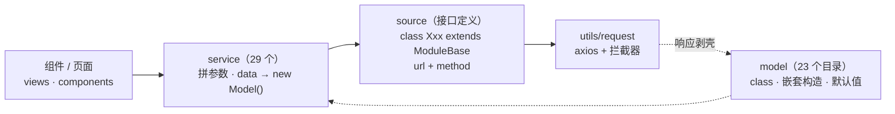

# 领域层 Domain

> [← 文档索引](./README.md) ｜ 上一篇：[Hooks 与工具函数](./hooks-and-utils.md) ｜ 下一篇：[开发约定](./conventions.md)

## 分层结构与调用链

```
组件 / 页面 (views, components)
   ↓ 调用（只 import @service/*）
service/   —— 业务语义层：拼参数，把后端 data 转成 Model 类实例
   ↓ 调用
source/    —— 接口定义层：继承 ModuleBase，声明 url + method，调 @utils/request
   ↓
axios → 后端 /api/v1/...
   ↓ 回程
model/     —— 领域模型：class，构造函数内 new 出嵌套模型，统一字段默认值
```



### 职责边界

| 层 | 职责 | 不要做 |
| --- | --- | --- |
| `source/` | 只描述「接口长什么样」（url + method） | 不做数据处理 |
| `service/` | 「数据变成什么对象」：拼参数、`new Model(data)` | 不被视图绕过 |
| `model/` | 「字段结构与默认值」：class 构造函数内 new 出嵌套模型 | 不含业务逻辑 |
| `utils/request/` | 「传输与错误」：CSRF、缓存、401/403、下载 | — |

`ModuleBase` 的 `path` getter 在 `window.PROJECT_CONFIG.NAMESPACE` 存在时输出 `/{module}/namespaces/{NAMESPACE}`，多租户隔离在此实现。

### 典型调用链示例（版本日志）

```
version-log/index.vue
  → useRequest(VersionManageService.fetchVersions)
  → service/version-manage.ts：fetchVersions() { return VersionManageSources.getVersions().then(({data}) => new VersionsModel(data)) }
  → source/version-manage.ts：class VersionManage extends ModuleBase { module='/api/v1/versions'; getVersions(){ return Request.get(`${this.module}/`) } }
  → utils/request → axios → 后端 GET /api/v1/versions/
  → 响应拦截器剥壳返回 data → new VersionsModel(data) → 组件渲染
```

## Service 清单（29 个）

| Service | 说明 |
| --- | --- |
| `account-manage` | 账号相关 |
| `biz-manage` | 业务（CMDB 业务） |
| `collector-manage` | 采集器配置 |
| `control-manage` | 控制版本 |
| `dataid-manage` | DataID 数据上报 |
| `entry-manage` | 入口配置（水印等） |
| `es-query` | ES 检索 |
| `event-manage` | 审计事件 |
| `iam-manage` | IAM 鉴权（`check` / `checkAny` / `getApplyData`） |
| `itsm-manage` | ITSM 审批 |
| `link-data-manage` | 联表 |
| `meta-manage` | 元数据（全局字典 / 用户 / 系统 / 资源类型 / 标准字段） |
| `notice-group` | 通知组 |
| `process-application-manage` | 处理套餐 |
| `report-config` | 报表配置 |
| `risk-experience-manage` | 风险经验 |
| `risk-manage` | 风险（含 `submitRiskExport`） |
| `risk-report` | 风险报告 |
| `root-manage` | 启动配置 `config()` 与 `getUserPermission()` |
| `rule-manage` | 处理规则 |
| `scene-manage` | 场景 |
| `scene-permission-application` | 场景权限申请 |
| `soap-manage` | SOPS 套餐执行 |
| `statement-manage` | 报表 |
| `storage-manage` | 数据存储 |
| `strategy-manage` | 审计策略 |
| `tool-manage` | 工具 |
| `upload-manage` | 图片上传（`UploadNewImage`） |
| `version-manage` | 版本日志 |

## Model 分组（23 个目录）

| 分组 | 代表模型 |
| --- | --- |
| account / application | `account` `application` `application-create` |
| biz | `biz` `topo` `template-topo` `host-instance-status` `node-instance-status` |
| collector（13 个） | `collector` `collector-detail` `collector-etl-field` `etl-preview` `join-data` `bcs-task-status` `task-status` |
| control / dataid | `control`；`dataid-detail` `dataid-tail` |
| es-query | `search` `field-map` `search_statistic` |
| event / risk | `event` `risk`（含 `ticket_history`）`strategy-info` |
| iam / itsm | `apply-data`（无权限申请数据）；`service-detail` `service-field` |
| link-data / meta | `link-data(-detail)`；`globals` `system` `user` `standard-field` `resource-type-schema` `system-action` `event-source-app` `data-sheet` `namespace` `app-info`（共 13 个） |
| notice / report-config | `notice-group`；`panel` |
| risk-rule / risk-experience | `risk-rule` `rule-create`；`experience` |
| root | `config`（含 `super_manager`）`platform-config` `user-permission` |
| scene / storage / strategy | `scene` `scene-permission-application`；`storage` `node-attr`；`strategy` `aiops-detail` `chart` `rt-meta` `strategy-field(-event)` `database-table-field`（共 12 个） |
| tool / version | `api` `parse-sql` `tool-detail` `tool-info`；`versions` |

## 新增接口的标准步骤

1. 在 `domain/model/<group>/` 定义模型 class（字段 + 默认值 + 嵌套模型）。
2. 在 `domain/source/<name>.ts` 新增 `class Xxx extends ModuleBase`，声明 `module` 与接口方法（url + method）。
3. 在 `domain/service/<name>.ts` 封装业务方法：拼参数（必要时注入场景参数）、请求、`new Model(data)` 返回。
4. 在组件中通过 `useRequest(Service.method)` 调用，不直接引用 `source` 或 `request`。

---

> [← 文档索引](./README.md) ｜ 上一篇：[Hooks 与工具函数](./hooks-and-utils.md) ｜ 下一篇：[开发约定](./conventions.md)
