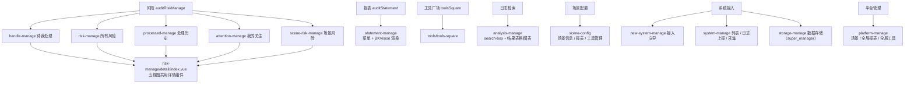

# 功能地图

> [← 文档索引](./README.md) ｜ 上一篇：[架构与目录](./architecture.md) ｜ 下一篇：[业务模块](./business-modules.md)

## 顶部导航

`layout.vue` 渲染 7 个顶部导航入口，按角色与功能开关控制显隐：

| 导航 | 主模块 | 可见条件 |
| --- | --- | --- |
| 风险 | `handle-manage`（根路由默认首页）、`risk-manage`、`processed-manage`、`attention-manege` | 全部角色 |
| 报表 | `statement-manage` | `hasBkvision` 开关 + 场景类角色 |
| 工具广场 | `tools` | 非 `risk_handler` |
| 日志检索 | `analysis-manage` | `show_log_search` |
| 场景配置 | `scene-config` | 全部（按权限分流到 `landingPage` / `userLandingPage`） |
| 系统接入 | `new-system-manage` + `system-manage` | 全部（按角色分流到 `systemLandingPage` / `systemList`） |
| 平台管理 | `platform-manage` | 仅 `saas_admin` |

配置域模块（`strategy-manage`、`rule-manage`、`link-data-manage`、`process-application-manage`、`notice-group`）不占独立顶部导航，挂在「风险」与「场景配置」的侧边菜单下。

## 导航与模块挂载图谱

## 导航的路由落点

「场景配置」与「系统接入」两个导航的 `:to` 目标会根据角色动态改写：

| 导航 | 目标路由 | 条件 |
| --- | --- | --- |
| 场景配置 | `sceneConfigRouterName`（`landingPage` 或 `userLandingPage`） | 由 `layout.vue` 按角色计算 |
| 系统接入 | `systemList` | 非 `saas_admin` / `system_admin` 时，或系统列表为空 |
| 系统接入 | `systemLandingPage` | `saas_admin` / `system_admin` 且系统列表非空 |

## 角色体系

角色由 `RootManageService.getUserPermission()` 返回的 5 个布尔字段在前端推导（唯一推导处：`domain/service/root-manage.ts`），结果写入 `sessionStorage['userRole']`。

| 推导条件 | 角色 | 可见导航 |
| --- | --- | --- |
| `manage_platform` | `saas_admin`（独占，命中即返回） | 全部，含平台管理 |
| 5 个字段全 false | `risk_handler`（兜底） | 风险 / 场景配置 / 系统接入 |
| `manage_scene` | `scene_admin` | + 报表 / 工具广场 |
| `view_scene` | `scene_user` | + 报表 / 工具广场 |
| `edit_system` 或 `view_system` | `system_admin` | 风险 / 场景配置 / 系统接入 |
| 来自 `config.super_manager` | `super_manager` | + 数据存储 |

- 角色可叠加：一个用户可同时持有多个角色，路由守卫会依次遍历每套规则。
- `super_manager` 不参与角色数组，仅用于动态注册 `storage-manage` 路由。
- 权限原始布尔值另存于 `sessionStorage['userScenePermission']`，供需要细粒度判断的页面读取。

---

> [← 文档索引](./README.md) ｜ 上一篇：[架构与目录](./architecture.md) ｜ 下一篇：[业务模块](./business-modules.md)
