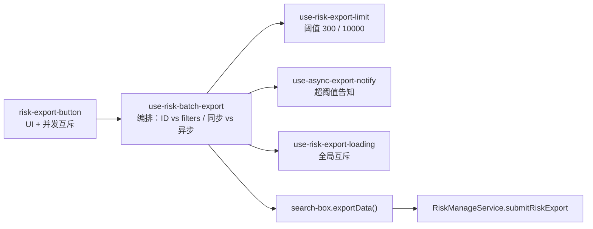

# Hooks 与工具函数

> [← 文档索引](./README.md) ｜ 上一篇：[公共组件](./components.md) ｜ 下一篇：[领域层](./domain-layer.md)

## 组合式函数（27 个）

### 请求与数据

| Hook | 作用 | 关键 API |
| --- | --- | --- |
| **use-request** | 请求状态机：loading / data / error / 竞态序号 / 取消 / 轮询 | `run(params)` `refresh()` `cancel()` `loop()` |
| **use-request/exec-request** | `Promise.race` 让 loading 延迟 300ms 再亮（`holdLoading`），避免闪屏 | 默认 300ms |

### URL 与状态

| Hook | 作用 | 关键 API |
| --- | --- | --- |
| **use-url-search** | URL query 读写（`history.replaceState`，防原型污染） | `getSearchParams` `getSearchParamsPost` `appendSearchParams` `replaceSearchParams` `mergeAndReplaceSearchParams` `removeSearchParam` |
| **use-record-page** | sessionStorage 记住列表分页/筛选，详情返回时恢复 | `recordPageParams(pageKey)` `getRecordPageParams` `removePageParams`，按 `pageKey` 隔离 |
| **use-table-settings** | 表格列设置的 localStorage 合并策略 | `useTableSettings(storageKey, defaultSettings)`；字段定义以代码为准，disabled 列强制选中 |
| **use-debounced-ref** | 带防抖的 ref（默认 200ms） | `useDebouncedRef(value, delay)` |
| **use-event-bus** | mitt 全局事件总线 | `emit` / `on` / `off` / `clearAll`；核心事件 `permission-page`、`permission-catch`、`show-notice` |

### 配置与能力

| Hook | 作用 | 关键 API |
| --- | --- | --- |
| **use-globals** | 全局字典（编码 / 分隔符 / ES 源类型 / 存储时长等） | `MetaManageService.fetchGlobals`，`manual: true` |
| **use-feature** | 按 `feature_id` 查询功能开关（如 `bknotice`） | 返回 `{ feature }`，读 `feature.enabled` |
| **use-platform-config** | 平台品牌配置（logo / 标题 / 页脚 / 版本） | 单例 `isInit` 防重复加载 |

### 布局与交互

| Hook | 作用 | 关键 API |
| --- | --- | --- |
| **use-router-back** | 注册/读取「返回」回调（模块级单例 ref） | 与 `router-back` 组件、`meta.routerBackName` 配合 |
| **use-page-header-slot** | 页头 Teleport 插槽的独占所有权管理 | `claim()` / `release()`；`HEADER_SLOT_IDS`：router-link / generate-report / nav-step |
| **use-skeleton** | 全局骨架屏开关（路由切换自动启用） | 传 `Ref<boolean>` 时跟随，5s 延迟关闭 |
| **use-full-screen** | screenfull 全屏 + 编辑器 `layout()` 重排 | 用于代码/编辑区全屏 |
| **use-popover** | `@popperjs/core` 浮层定位封装 | `create(reference, floating)` / `show` / `hide` |
| **use-model-provider** | 在组件树中递归查找 expose 了 `submit` 的子组件 | 供 `audit-sideslider` 自动触发提交 |
| **use-props** | 从 `$attrs` 剔除事件，得到纯 props | 用于 `inheritAttrs: false` |
| **use-listeners** | 从 `$attrs` 抽取事件监听 | 与 `use-props` 互补 |

### 导出链路

| Hook | 作用 | 关键 API |
| --- | --- | --- |
| **use-risk-batch-export** | 批量导出编排（选 ID 还是传 filters、同步还是异步） | `useRiskBatchExport({listRef, searchBoxRef, riskViewType, selectionMeta, isExportEnabled})` → `handleExport` |
| **use-risk-export-limit** | 导出阈值与禁用态/tooltip 计算 | `RISK_EXPORT_ASYNC_THRESHOLD = 300`、`RISK_EXPORT_MAX_COUNT = 10000` |
| **use-async-export-notify** | 首次超过阈值时提示「改为异步导出」 | `showAsyncExportNotifyIfNeeded()`；sessionStorage 只提示一次 |
| **use-risk-export-loading** | 导出全局 loading 单例 | `isRiskExportLoading` `withRiskExportLoading(fn)` |
| **use-risk-export-types** | 导出类型与参数规范化 | `RISK_LIST_FILTER_KEYS` `normalizeRiskListExportFilters()` |
| **use_export_excel** | 前端 xlsx 导出 | `exportExcelSheet`；sheet 名 31 字符截断、表头去重 |

### 工具页专用

| Hook | 作用 | 关键 API |
| --- | --- | --- |
| **use-tool-dialog** | 工具下钻弹窗开关与 ref 管理 | `openFieldDown` `handleOpenTool` `setDialogRef` |
| **use-tool-tabs** | 工具页多标签管理（打开/关闭/切换/回广场/清空） | `openedTools` `activeToolUid` `switchTab` `goHome` |
| **use-message** | `bkui-vue` Message 封装 | `messageSuccess` / `messageWarn` / `messageError` |

### 导出链路全景

## 网络层 `utils/request/`

| 文件 | 职责 |
| --- | --- |
| `index.ts` | 门面。对 get/delete/post/put/patch/download 六个方法用 `defineProperty` 生成 `handler[method](url, {params, payload})`；`download` 特化为 `downloadUrl(...)`。导出 `IRequestResponsePaginationData<T>` 与 `setCancelTokenSource` / `getCancelTokenSource` |
| `lib/request.ts` | `Request` 类。`baseURL = window.PROJECT_CONFIG.AJAX_URL_PREFIX`、60s 超时、`withCredentials`、自定义 `paramsSerializer`；CSRF（`bk-audit_csrftoken` 经 `csrfHashCode` 写入 `X-CSRFToken`）；GET 结果缓存；支持外部注入 `cancelToken` 以便批量取消 |
| `lib/cache.ts` | 基于 `taskKey = method_url_params` 的内存缓存，仅缓存带 `payload.cache` 的 GET |
| `lib/request-error.ts` | `RequestError extends Error`，携带 `code` / `message` / `response` |
| `lib/utils.ts` | `paramsSerializer`、`processedParams`（URLSearchParams 序列化） |
| `middleware/request.ts` | 请求拦截器 |
| `middleware/response.ts` | 响应拦截器 + 统一错误处理：`code 0/200` 直出 `response.data`，否则抛 `RequestError`；Blob 响应自动触发下载（解析 `content-disposition`）；401 → 登录弹窗；403 → `handlePermission` 按 `payload.permission` 分流 page / catch / dialog；409 与超时（`ECONNABORTED`）提示；`payload.catchError` 或 `payload.silent` 可跳过全局 toast |

## 其他工具 `utils/`

| 文件 | 作用 |
| --- | --- |
| `assist/scene-system-params.ts` | 场景/系统上下文核心：`getSceneSystemParams()`、`getSceneContextQuery()`、`syncSceneContextToUrl()`、`setActiveSceneSelection`、`markSceneSelectorSwitched`、工具作用域 `resolveToolDetailScopeParams` / `getToolDetailScopeQuery` / `isToolDetailScopeReady` 等 |
| `assist/change-confirm.ts` | `changeConfirm()`：基于 `window.changeConfirm` 的路由离开确认 |
| `assist/permission-dialog.tsx` | `permissionDialog(data, params)`：无权限申请弹窗 |
| `assist/timestamp-conversion.ts` | 时间格式化与互转：`formatDate` `convertGMTTimeToStandard` `convertToTimestamp` `convertToUnixTimestamp` `parseDateTimeToTimestamp` `compareValues` |
| `assist/dom.ts` | `getOffset` `getScrollParent` `scrollTopSmooth` `getParentByClass` |
| `assist/url.ts` | `parseURL` `buildURLParams` `isPageReload` |
| `assist/exec-copy.ts` | `execCopy(text, tip)` 剪贴板复制 |
| `assist/download-url.ts` | `downloadUrl(url)` 触发浏览器下载 |
| `assist/encode.ts` | `encodeRegexp`（正则转义）、`encodeMult` |
| `assist/make-map.ts` | `makeMap(list)` 生成 O(1) 存在性判断函数 |
| `assist/vue-helper.ts` | `attrsWithoutListener` / `attrsOnlyProp` |
| `assist/pinyin-sort.ts` | 中文按拼音排序 |
| `assist/filter-virtual-tags.ts` | 过滤「全部工具 / 我创建的 / 最近使用 / 我的收藏」等虚拟标签 ID |
| `assist/normalize-condition-filter.ts` | 条件筛选表达式归一化 |
| `assist/pa-param-field-ref.ts` | 参数字段引用解析 |
| `assist/split-and-merge.ts` | 数组与字符串的拆分与合并 |
| `assist/water-mark.ts` | 页面水印 |
| `assist/ping-agent.ts` | Agent 可达性探测（登录后预热） |
| `validator.ts` | 表单校验规则（`IPRule`：IPv4 正则 + 提示） |
| `getFieldTypeIcon.ts` | 用 `import.meta.glob` 预加载 `@images/field-type/*.png`，按字段类型返回图标 URL，缺省回落 `any.png` |
| `format-strategy-name.ts` | `formatStrategyNameWithId(name, id)` → 「名称 (id)」；`formatStrategyOptionLabel(item)` 适配 option 对象 |
| `sync-table-filter-fields.ts` | `applyTableFiltersToSearchModel`：把表格列筛选回写到检索 model（按 `fieldConfig.type` 做 string / select / user-selector 归一化，空值删除） |
| `sync-datetime-from-url.ts` | 相对时间处理：`isRelativeDatetimeOrigin`（`now-6M` 判定）、`syncDatetimeFromOrigin`、`applyDatetimeUrlParams`、`ensureDatetimeSynced` |
| `getAssetsFile.ts` | `getImageFile`：按文件名解析静态资源 URL |

> `assist/index.ts` 是桶文件，re-export 上述大部分子模块；`scene-system-params.ts` 因体量较大未纳入桶文件，需单独 import。

---

> [← 文档索引](./README.md) ｜ 上一篇：[公共组件](./components.md) ｜ 下一篇：[领域层](./domain-layer.md)
